# Agent 记忆系统技术设计方案

**一句话结论**：本方案采用「L0–L4 记忆分层 + 写入/读取/演化三链路 + Port/Adapter 解耦架构」实现 Agent 记忆系统。服务层只依赖 Port 契约，内存实现用于本地测试与降级，生产实现通过 Redis、PostgreSQL/pgvector、Neo4j 与 LLM Gateway Adapter 接入，确保模块边界清晰、外部依赖可替换、关键路径可控。

## 0.1 文档结构与阅读顺序

本版文档按「目标约束 → 解耦架构 → 数据模型 → 核心算法 → 接口契约 → 生产落地 → 治理评估」组织。开发团队应优先阅读第 0、2、3、6、7、9、10 章；算法与治理评审重点阅读第 4、5、11、12 章。

| 章节 | 主题 | 读者关注点 | 关键产出 |
|---|---|---|---|
| 0 | 修订摘要与架构全景 | 当前实现与生产目标如何对齐 | Port/Adapter 总图、模块解耦原则 |
| 一 | 人类记忆 → 工程映射 | 设计依据是否合理 | 五支点映射表 |
| 二 | 分层框架与组件抽象 | 系统如何拆层、拆 Port、拆 Adapter | L0–L4、三链路、类型分区、组件边界 |
| 三 | 各层模块技术规格 | 每层字段、触发、淘汰、接口 | L0–L4 字段级 schema |
| 四 | 核心计算公式 | F1–F5 取值与复用 | 公式、中文释义、依赖图 |
| 五 | 生命周期与五大机制 | 记忆怎么流转、巩固、遗忘 | 状态机、固化管线、配置中心 |
| 六 | 统一接口契约 | 业务方如何接入 | 六接口、四维度封装、Port/Adapter 诊断 |
| 七 | 工程落地与交付 | 容错、可观测、容量、运维 | 性能指标、控制面、生产依赖接入 |
| 八 | 符号与术语速查 | 快速查表 | 全量符号表 |
| 九 | 参考建库 DDL | 初始化外部存储 | Redis key、PG/pgvector、Neo4j、inbox |
| 十 | 端到端调用伪代码 | 实现参考 | 写/读/演化伪代码 |
| 十一 | 冲突检测与处理 | 一致性治理 | 冲突决策流程图与五档动作 |
| 十二 | 模块优缺点评估 | 取舍可追溯 | 模块问题来源、优缺点与量化权衡 |

## 0.2 生产依赖接入版架构全景

系统拆成四层依赖方向：**业务 API / AgentMemory 服务层 → Port 契约层 → Adapter 实现层 → 外部依赖层**。服务层不得直接 import Redis、PostgreSQL、Neo4j 或 LLM SDK；所有外部系统只能通过 Adapter 接入。当前代码对应 `mm/ports.py`、`mm/adapters.py`、`mm/production_adapters.py`、`mm/service.py`。

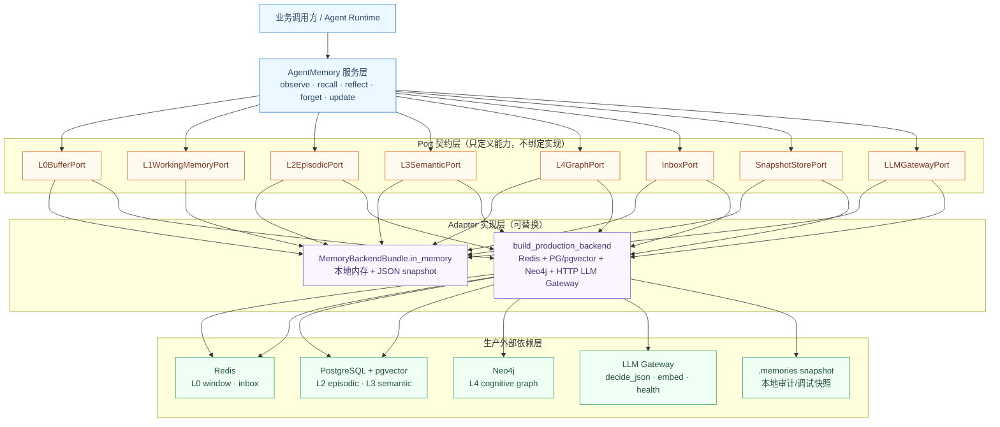
```mermaid
flowchart TB
    API["业务调用方 / Agent Runtime"]
    SVC["AgentMemory 服务层<br/>observe · recall · reflect · forget · update"]

    subgraph PORTS["Port 契约层（只定义能力，不绑定实现）"]
        P0["L0BufferPort"]
        P1["L1WorkingMemoryPort"]
        P2["L2EpisodicPort"]
        P3["L3SemanticPort"]
        P4["L4GraphPort"]
        PI["InboxPort"]
        PS["SnapshotStorePort"]
        PGW["LLMGatewayPort"]
    end

    subgraph ADAPTERS["Adapter 实现层（可替换）"]
        MEM["MemoryBackendBundle.in_memory<br/>本地内存 + JSON snapshot"]
        PROD["build_production_backend<br/>Redis + PG/pgvector + Neo4j + HTTP LLM Gateway"]
    end

    subgraph EXT["生产外部依赖层"]
        R["Redis<br/>L0 window · inbox"]
        DB["PostgreSQL + pgvector<br/>L2 episodic · L3 semantic"]
        G["Neo4j<br/>L4 cognitive graph"]
        LLM["LLM Gateway<br/>decide_json · embed · health"]
        FS[".memories snapshot<br/>本地审计/调试快照"]
    end

    API --> SVC
    SVC --> P0
    SVC --> P1
    SVC --> P2
    SVC --> P3
    SVC --> P4
    SVC --> PI
    SVC --> PS
    SVC --> PGW
    P0 --> MEM
    P1 --> MEM
    P2 --> MEM
    P3 --> MEM
    P4 --> MEM
    PI --> MEM
    PS --> MEM
    PGW --> MEM
    P0 --> PROD --> R
    PI --> PROD --> R
    P2 --> PROD --> DB
    P3 --> PROD --> DB
    P4 --> PROD --> G
    PGW --> PROD --> LLM
    PS --> PROD --> FS

    classDef svc fill:#ebf8ff,stroke:#3182ce,color:#2a4365
    classDef port fill:#fffaf0,stroke:#dd6b20,color:#7b341e
    classDef adapter fill:#faf5ff,stroke:#805ad5,color:#44337a
    classDef ext fill:#f0fff4,stroke:#38a169,color:#22543d
    class API,SVC svc
    class P0,P1,P2,P3,P4,PI,PS,PGW port
    class MEM,PROD adapter
    class R,DB,G,LLM,FS ext
```

## 0.3 模块解耦原则

1. **服务层只依赖 Port**：`AgentMemory` 不直接创建 L0–L4 具体实现，不感知 Redis/PG/Neo4j/HTTP SDK，通过 `MemoryBackendBundle` 注入依赖。
2. **Adapter 只做外部系统适配**：Adapter 可做 write-through、连接校验、序列化与降级，但不得承载业务规则；F1–F5、冲突治理、生命周期仍在领域模块内。
3. **层间通过服务编排，不横向穿透**：L2 不直接写 L3，L3 不直接改 L4，跨层级联统一由 `AgentMemory`、`RecallAgent`、`ConsolidationAgent` 编排。
4. **生产依赖显式配置**：`backend_mode="production"` 必须提供 `redis_url/postgres_dsn/neo4j_uri/neo4j_user/neo4j_password/llm_gateway_url`，缺失即 fail fast。
5. **关键路径可配置去快照化**：`persist_on_write=False` 时写链路只标记 dirty，不同步写整租户 JSON 快照；后台或运维命令再调用 `flush()`。
6. **本地与生产共享契约测试**：本地内存 Adapter 用于 deterministic 单测，生产 Adapter 通过 Port 契约、配置校验和健康诊断接入集成环境。

---

# 一、人类记忆机制 → 可工程映射特性

仅提取可技术映射的部分，剔除生理性、主观体验等不可工程化内容。

| 学术模型 | 核心机制 | 可映射工程特性 | 剔除部分 |
|---|---|---|---|
| Atkinson-Shiffrin 多存储模型 | 感觉→短期→长期，需复述转移 | 三级缓冲管线；转移需 rehearsal 信号 | 神经突触电位 |
| Baddeley 工作记忆 | 中央执行调度有限容量缓冲 | 短期记忆固定容量上限 + Context Manager | 语音环/视觉模板形态 |
| Tulving 情景/语义记忆 | episodic vs semantic | 长期记忆双库分离：事件流库 + 事实库 | 主观自我感知 |
| Levels of Processing | 加工越深记忆越牢 | importance_score 量化加工深度 | 质性语义深度 |
| Ebbinghaus 遗忘曲线 | 强度随时间指数衰减 | 直接作为遗忘衰减函数 | 个体生理参数 |
| 系统巩固（Consolidation） | 海马→新皮层，睡眠重放 | 离线 reflection 批量压缩抽象 | 睡眠生理过程 |
| Spacing Effect / 检索强化 | 被检索记忆强度回升 | 命中即强度回写 reinforcement | — |
| Schema / 语义网络 | 知识以关联网络组织 | 认知层知识图谱 + 实体归并 | 概念具身意义 |

## 1.1 五支点的工程映射详解

下表把抽象的人类记忆机制逐条翻译为本系统的具体技术动作，明确"映射到哪个模块、用什么数据结构承载"。

| 工程支点 | 人类原型 | 本系统落点（模块 + 数据结构） |
|---|---|---|
| ① 分级缓冲管线 | 感觉→短期→长期三级存储 | L0 环形缓冲 → L1 工作记忆 → L2 情景库，逐级加工、逐级落库 |
| ② 容量上限驱动淘汰 | 工作记忆 7±2 容量限制 | L1 设 C_wm token 硬上限，超限触发压缩与下沉 |
| ③ 重要性加权 | 深加工内容更牢固 | F1 importance 字段，贯穿检索 F2 与遗忘 F4 |
| ④ 指数遗忘 + 检索回写 | 遗忘曲线 + 间隔重复 | F3 retention 衰减 + reinforce 提升 stability |
| ⑤ 离线巩固/反思抽象 | 睡眠期系统巩固 | 异步 reflect 任务：压缩、抽象、写入 L3/L4 |

下图把「人类记忆原型 → 工程支点 → 系统落点」三段映射可视化,左列为生物学机制,中列为抽取出的可工程化支点,右列为本系统对应模块:

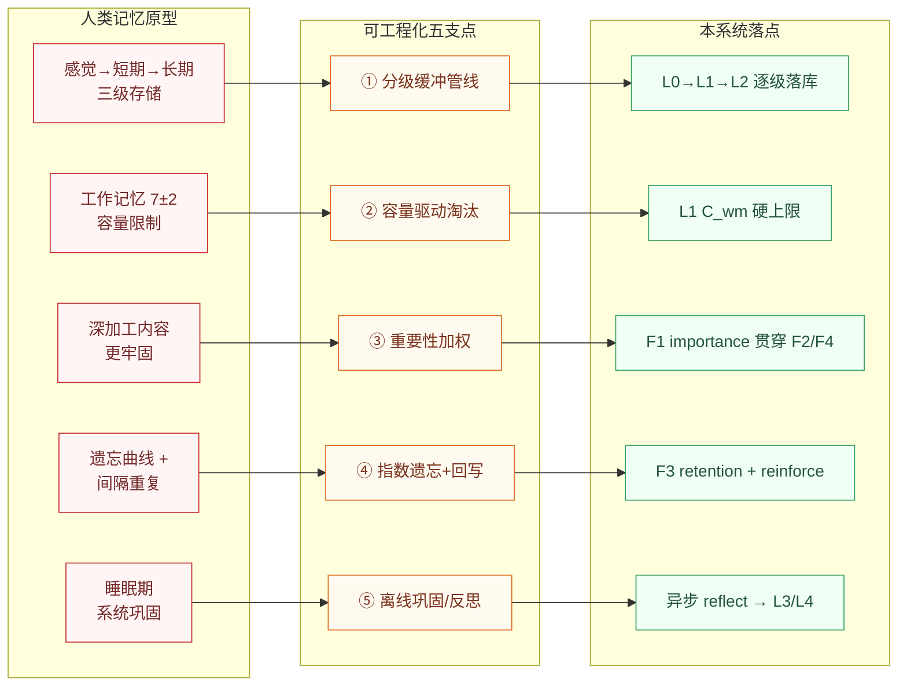
```mermaid
flowchart LR
    subgraph HUMAN["人类记忆原型"]
        H1["感觉→短期→长期<br/>三级存储"]
        H2["工作记忆 7±2<br/>容量限制"]
        H3["深加工内容<br/>更牢固"]
        H4["遗忘曲线 +<br/>间隔重复"]
        H5["睡眠期<br/>系统巩固"]
    end
    subgraph PILLAR["可工程化五支点"]
        P1["① 分级缓冲管线"]
        P2["② 容量驱动淘汰"]
        P3["③ 重要性加权"]
        P4["④ 指数遗忘+回写"]
        P5["⑤ 离线巩固/反思"]
    end
    subgraph SYS["本系统落点"]
        S1["L0→L1→L2 逐级落库"]
        S2["L1 C_wm 硬上限"]
        S3["F1 importance 贯穿 F2/F4"]
        S4["F3 retention + reinforce"]
        S5["异步 reflect → L3/L4"]
    end
    H1-->P1-->S1
    H2-->P2-->S2
    H3-->P3-->S3
    H4-->P4-->S4
    H5-->P5-->S5

    classDef h fill:#fff5f5,stroke:#c53030,color:#742a2a
    classDef p fill:#fffaf0,stroke:#dd6b20,color:#7b341e
    classDef s fill:#f0fff4,stroke:#38a169,color:#22543d
    class H1,H2,H3,H4,H5 h
    class P1,P2,P3,P4,P5 p
    class S1,S2,S3,S4,S5 s
```

## 1.2 明确剔除的不可工程化部分

以下内容仅作理论参考，**不纳入**本系统实现，避免把不可观测/不可量化的概念写进代码：神经突触电位与生理时限、语音环与视觉空间模板的感官形态、情景记忆的主观自我感知体验、概念的具身意义、个体生理差异参数、睡眠本身的生理过程。

剔除原则：凡是**无法被时间戳、计数器、向量或图结构量化承载**的机制，一律不进入工程实现，只保留其"行为效果"（如遗忘的衰减效果、巩固的抽象效果）。

**可工程化五支点**：① 分级缓冲管线 ② 容量上限驱动淘汰 ③ 重要性加权 ④ 指数遗忘 + 检索回写 ⑤ 离线巩固/反思抽象。

---

# 二、二维记忆分层框架

数据自左下向右上演化：原始对话（L0）→ 工作记忆（L1）→ 事件（L2）→ 事实（L3）→ 认知洞察与图谱（L4）。

二维框架以时间轴（短期 STM → 长期 LTM）与组织形态轴（非结构化 → 结构化 → 认知化）正交展开，落到 L0–L4 五层：

| 时间 \ 形态 | 非结构化 | 结构化 | 认知化 |
|---|---|---|---|
| **短期 STM** | L0 感觉/对话缓冲（token 原始流） | L1 工作记忆（摘要/slot） | — |
| **长期 LTM** | L2 情景记忆（事件向量流） | L3 语义记忆（事实 KV+向量） | L4 认知记忆（知识图谱+洞察） |

下图把五层放进「时间轴 × 组织形态轴」的二维坐标:横轴自左向右由非结构化走向认知化,纵轴自下向上由短期走向长期,数据整体沿左下→右上演化。

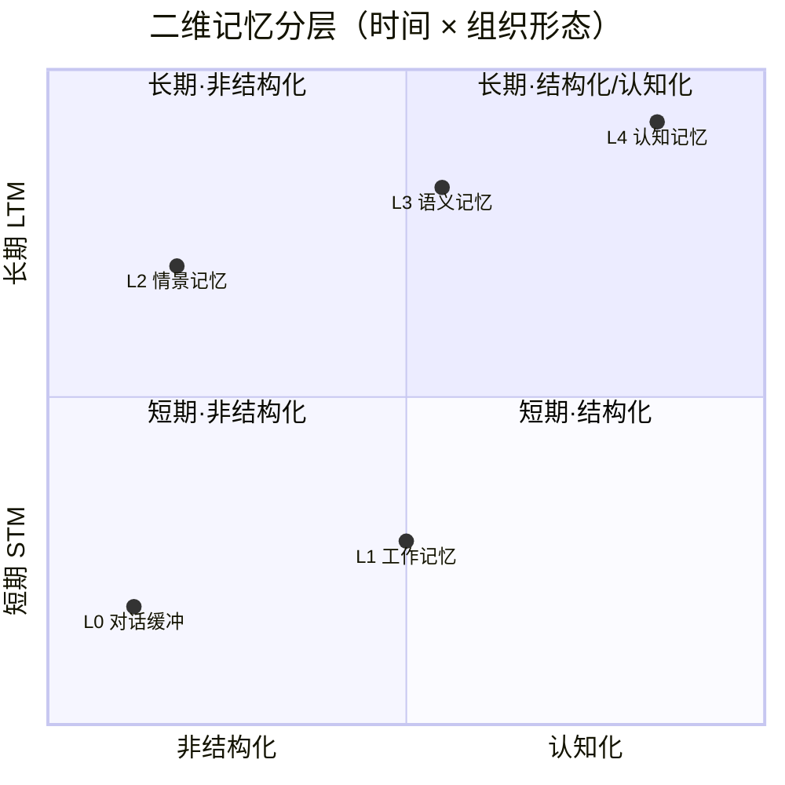
```mermaid
quadrantChart
    title 二维记忆分层（时间 × 组织形态）
    x-axis "非结构化" --> "认知化"
    y-axis "短期 STM" --> "长期 LTM"
    quadrant-1 "长期·结构化/认知化"
    quadrant-2 "长期·非结构化"
    quadrant-3 "短期·非结构化"
    quadrant-4 "短期·结构化"
    "L0 对话缓冲": [0.12, 0.18]
    "L1 工作记忆": [0.5, 0.28]
    "L2 情景记忆": [0.18, 0.7]
    "L3 语义记忆": [0.55, 0.82]
    "L4 认知记忆": [0.85, 0.92]
```

> 演化方向:数据自左下(L0 短期非结构化)向右上(L4 长期认知化)逐级加工——非结构化原文经结构化提炼,再经认知化抽象,时间维度同步由短期沉淀为长期。L1 处短期·结构化象限,是 L0 到长期记忆的加工中转。

## 2.1 三链路详解（写入 / 读取 / 演化）

五层之上跑三条链路：写入与读取同步、低延迟；演化全部异步，移出关键路径。三链路共享 F1 打分，一处计算、多处复用。

| 链路 | 步骤 | 执行方式 | 关键约束 |
|---|---|---|---|
| ① 写入 | observe → compress（L0→L1）→ promote（L1→L2，F1 打分） | 同步，低延迟 | promote 幂等（mem_id 由内容指纹派生）；超 C_wm 必压缩 |
| ② 读取 | recall → 分层路由 L3→L2→L4 三路召回 → RRF 融合 → F2 重排 → reinforce 回写 | 同步，关键路径 | P99<80ms；reinforce 可异步补偿 |
| ③ 演化 | reflect（抽象→L3/L4）→ consolidate（升维）→ forget_sweep（动态遗忘） | 异步，调度器 | reflect 先于 forget_sweep；staging 双写整批回滚 |

三链路闭环：写入沉淀 → 读取调用并强化 → 演化巩固与淘汰，强化（reinforce）把读路径与遗忘机制连成回路，被频繁命中的记忆抗遗忘、被冷落的记忆自然衰减。

## 2.2 L0–L4 数据流向流程图（Mermaid）

下图以 Mermaid `flowchart` 还原五层数据流、三链路依赖与组件面。**实线**=同步数据搬运(写/读链路),**虚线**=异步派生与回写(演化链路 / reinforce 强化回路 / 组件调用)。读侧由 **Recall Agent** 编排、写后固化由 **Consolidation Agent** 经 **inbox** 驱动,两者共享 **LLM Gateway**;**Memory CLI** 为控制面;长时记忆按 episodic/semantic/preference/procedural 四类型分区。

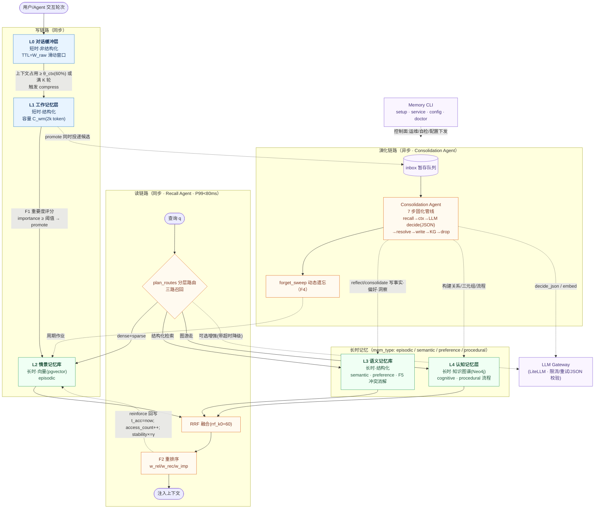
```mermaid
flowchart TB
    IN([用户/Agent 交互轮次])

    subgraph WRITE["写链路（同步）"]
        direction TB
        L0["<b>L0 对话缓冲层</b><br/>短时·非结构化<br/>TTL=W_raw 滑动窗口"]
        L0 -->|"上下文占用 ≥ θ_ctx(60%) 或满 K 轮<br/>触发 compress"| L1
        L1["<b>L1 工作记忆层</b><br/>短时·结构化<br/>容量 C_wm(2k token)"]
        L1 -->|"F1 重要度评分<br/>importance ≥ 阈值 → promote"| L2
    end

    IN --> L0

    subgraph LTM["长时记忆（mem_type: episodic / semantic / preference / procedural）"]
        direction LR
        L2["<b>L2 情景记忆库</b><br/>长时·向量(pgvector)<br/>episodic"]
        L3["<b>L3 语义记忆库</b><br/>长时·结构化<br/>semantic · preference · F5 冲突消解"]
        L4["<b>L4 认知记忆层</b><br/>长时·知识图谱(Neo4j)<br/>cognitive · procedural 流程"]
    end

    L1 -.->|"promote 同时投递候选"| INBOX[("inbox 暂存队列")]

    subgraph READ["读链路（同步 · Recall Agent · P99<80ms）"]
        direction TB
        Q([查询 q]) --> RECALL{"plan_routes 分层路由<br/>三路召回"}
        RECALL -->|dense+sparse| L2
        RECALL -->|结构化检索| L3
        RECALL -->|图游走| L4
        L2 --> RRF
        L3 --> RRF
        L4 --> RRF
        RRF["RRF 融合(rrf_k0=60)"] --> F2["F2 重排序<br/>w_rel/w_rec/w_imp"]
        F2 --> OUT([注入上下文])
        F2 -.->|"reinforce 回写<br/>t_acc=now; access_count++; stability×=γ"| L2
    end

    subgraph EVOLVE["演化链路（异步 · Consolidation Agent）"]
        direction TB
        INBOX --> CAGENT["Consolidation Agent<br/>7 步固化管线<br/>recall→ctx→LLM decide(JSON)<br/>→resolve→write→KG→drop"]
        CAGENT --> SWEEP["forget_sweep 动态遗忘（F4）"]
    end

    CAGENT -.->|"reflect/consolidate 写事实·偏好·洞察"| L3
    CAGENT -.->|"构建关系/三元组/流程"| L4
    SWEEP -.->|周期作业| L2

    GW["LLM Gateway<br/>(LiteLLM · 限流/重试/JSON 校验)"]
    RECALL -.->|"可选增强(带超时降级)"| GW
    CAGENT -.->|"decide_json / embed"| GW

    CLI["Memory CLI<br/>setup · service · config · doctor"]
    CLI -.->|"控制面:运维/自检/配置下发"| EVOLVE

    classDef stm fill:#e8f4ff,stroke:#3182ce,color:#1a365d
    classDef ltm fill:#f0fff4,stroke:#38a169,color:#22543d
    classDef proc fill:#fffaf0,stroke:#dd6b20,color:#7b341e
    classDef comp fill:#faf5ff,stroke:#805ad5,color:#44337a
    class L0,L1 stm
    class L2,L3,L4 ltm
    class RRF,F2,RECALL,CAGENT,SWEEP proc
    class GW,CLI,INBOX comp
```

## 2.3 记忆类型分区（正交于 L0–L4 分层）

L0–L4 是按「时间 × 组织形态」划分的**存储分层**,回答的是"记忆放在哪、活多久";而**记忆类型**是按「内容语义角色」划分的**逻辑分区**,回答的是"这条记忆是什么性质"。二者正交:同一条长期记忆在物理上落 L2/L3/L4,在逻辑上必归属某一类型分区。原方案只隐含了 episodic(事件)与 semantic(事实)两类,**遗漏了偏好(preference)与程序(procedural)两类高频且检索意图差异显著的记忆**,本节补齐为四分区。

| 类型分区 | 语义角色 | 典型内容 | 主要落层 | 检索意图 |
|---|---|---|---|---|
| **episodic（情景）** | 发生过什么 | 交互事件、任务过程、对话片段 | L2 | "上次我们怎么处理 X 的" |
| **semantic（语义）** | 稳定的事实是什么 | 用户画像、约束、领域事实 | L3 | "我的母语是什么" |
| **preference（偏好）** | 用户偏好怎样 | 风格/格式/语气/工具/默认选项偏好 | L3（独立 namespace） | "按我习惯的方式输出" |
| **procedural（程序）** | 该怎么做某事 | 可复用操作流程、SOP、解题套路、工具调用序列 | L3 + L4（流程图式） | "按既定流程执行 X" |

- **为什么单列 preference**:偏好是「弱事实、强个性化」,confidence 语义与普通事实不同(偏好可并存多个加权候选,而非互斥取一),且**几乎每轮输出都要读**。单列后可在 recall 时无条件优先注入,不与事件/事实争 top-k 名额。落层仍在 L3,但用独立 `partition=preference` namespace 隔离,冲突消解走"加权更新"而非"版本覆盖"。
- **为什么单列 procedural**:程序记忆是「带顺序与条件分支的可复用流程」,本质是小型有向图,天然适配 L4 图式表达(步骤=节点,依赖=边);同时其触发是"任务匹配"而非"语义相似",检索路径独立。
- **工程落地(轻量)**:不新增物理存储层,仅在 L2/L3/L4 既有表上增加 `mem_type ∈ {episodic, semantic, preference, procedural}` 分区字段 + 索引;recall 按意图路由到对应分区,reflect 在抽取时打 `mem_type` 标签。与 §3 各层、§9 DDL 完全兼容(仅增列)。

> 设计取舍:类型分区做成"逻辑标签 + namespace",而非新增物理层,避免破坏既有 L0–L4 五层架构与三链路;偏好/程序的差异化只体现在**冲突消解策略**与**检索路由**两处,其余复用既有管线。

### 2.3.1 分区数据流向（写入→升维→沉淀）

四分区并非各自独立的入口,而是**同源单向升维**:所有长期记忆都从 episodic(事件原料)出发,经演化链路 §5.2 的「inbox + 7 步固化管线」中的 **LLM decide** 唯一闸门判定 `mem_type`,再分流到 semantic / preference / procedural,procedural 与 semantic 进一步沉淀到 L4 图谱。下图实线=升维/前进,虚线=异步派生与遗忘回退。

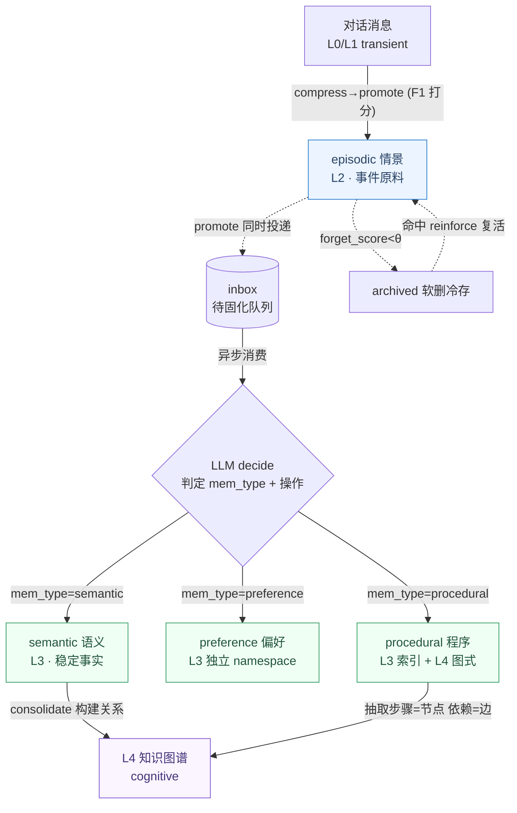
```mermaid
flowchart TD
    MSG["对话消息<br/>L0/L1 transient"]
    EP["episodic 情景<br/>L2 · 事件原料"]
    INBOX[("inbox<br/>待固化队列")]
    LLM{"LLM decide<br/>判定 mem_type + 操作"}
    SEM["semantic 语义<br/>L3 · 稳定事实"]
    PREF["preference 偏好<br/>L3 独立 namespace"]
    PROC["procedural 程序<br/>L3 索引 + L4 图式"]
    KG["L4 知识图谱<br/>cognitive"]
    ARC["archived 软删冷存"]

    MSG -->|"compress→promote (F1 打分)"| EP
    EP -.->|promote 同时投递| INBOX
    INBOX -->|异步消费| LLM
    LLM -->|mem_type=semantic| SEM
    LLM -->|mem_type=preference| PREF
    LLM -->|mem_type=procedural| PROC
    SEM -->|consolidate 构建关系| KG
    PROC -->|抽取步骤=节点 依赖=边| KG
    EP -.->|forget_score<θ| ARC
    ARC -.->|命中 reinforce 复活| EP

    classDef ep fill:#ebf4ff,stroke:#3182ce,color:#2a4365
    classDef l3 fill:#f0fff4,stroke:#38a169,color:#22543d
    classDef kg fill:#faf5ff,stroke:#805ad5,color:#44337a
    class EP ep
    class SEM,PREF,PROC l3
    class KG kg
```

**流转规则与触发条件**(逐段对应 §5.1 状态机与 §5.2 管线):

| 阶段 | 触发条件 | 流转规则 |
|---|---|---|
| ① transient → episodic | L0 累计 token>θ_ctx 或满 K 轮 | `compress→promote` 落 L2,F1 计算 importance;promote 同时投递候选到 inbox,写链路即返回 |
| ② episodic → LLM 决策 | 异步调度器从 inbox 拉取 | 管线第 1–3 步 Recall related→Build context→**LLM decide(JSON)**,这是**唯一分区分流点**,输出 `mem_type`/操作/`fact_key`/置信度 |
| ③ 决策 → L3 各分区 | 管线第 5 步 Embed+write | 按 `mem_type` 落分区,冲突消解(第 4 步)分流策略不同:semantic 走 F5 版本归档、低置信淘汰;preference 走**加权更新**(多候选并存);procedural 写 L3 索引 |
| ④ semantic/procedural → L4 | 管线第 6 步 Update KG | semantic 经 consolidate 构建实体关系;procedural 抽取「步骤=节点、依赖=边」沉淀流程图式;L4 内部 superseded/剪枝 |
| ⑤ episodic ⇄ archived | `forget_score<θ_forget` / 命中 reinforce | 唯一**可逆降维**:遗忘只作用于 episodic 热区,不直接作用于已升维分区;archived 命中即复活,长期未命中进 deleted |
| ⑥ Drop from inbox | 固化成功 | 第 7 步幂等收尾,重复投递不重复固化,失败留队重试 |

**三条流向不变式**:

1. **单向升维**:流向恒为 `事件(episodic) → 提炼物(semantic/preference/procedural) → 图谱(cognitive)`,无反向降级链;archived 复活是回到 episodic,而非降维到原料。
2. **唯一分流点**:分区归属只在 LLM decide 一处判定,杜绝分区间横向自发流动,保证决策可审计(每次落 conflict_log)。
3. **差异仅两处**:preference(加权更新 + 优先注入)与 procedural(图式表达 + 任务匹配检索)的特殊性只体现在**冲突消解策略**与**检索路由**,写入/巩固管线其余步骤四分区共用。

## 2.4 系统组件抽象（数据面之外的一等组件）

**生产依赖接入修订**：本节组件在实现中进一步拆成 **Port 契约** 与 **Adapter 实现** 两层。Port 定义服务层需要的能力，Adapter 负责把这些能力映射到内存、Redis、PostgreSQL/pgvector、Neo4j 或 HTTP LLM Gateway。服务层、编排 Agent 与领域模块不得直接 import 生产 SDK，所有外部依赖只能从 `mm/production_adapters.py` 接入。

**2.4.0 Port/Adapter 解耦矩阵**

| Port | 当前内存 Adapter | 生产 Adapter | 外部依赖 | 解耦收益 |
|---|---|---|---|---|
| `L0BufferPort` | `ConversationBuffer` | `RedisBackedConversationBuffer` | Redis LIST / SET | L0 可从进程内窗口升级为多副本共享窗口 |
| `L1WorkingMemoryPort` | `WorkingMemoryManager` | 默认仍为工作进程内状态，可后续替换为 Redis/PG | 可选 | L1 保持短期结构化语义，不绑定持久化实现 |
| `L2EpisodicPort` | `EpisodicStore` | `PostgresBackedEpisodicStore` | PostgreSQL + pgvector | 向量检索与状态回写可迁移到生产数据库 |
| `L3SemanticPort` | `SemanticStore` | `PostgresBackedSemanticStore` | PostgreSQL + pgvector | fact_key 版本链、分区索引、冲突日志统一落库 |
| `L4GraphPort` | `CognitiveGraph` | `Neo4jBackedCognitiveGraph` | Neo4j | 图谱节点/边与本地算法解耦 |
| `InboxPort` | `InMemoryInbox` | `RedisBackedInbox` | Redis HASH / LIST | 固化队列可被多 worker 消费与巡检 |
| `SnapshotStorePort` | `MemoryFileStore` | `MemoryFileStore` / 对象存储扩展 | `.memories` 或对象存储 | 快照从关键路径移出，保留审计能力 |
| `LLMGatewayPort` | `NoopLLMGateway` | `HttpLLMGateway` | HTTP LLM Gateway | 固化决策、embedding 与具体模型 SDK 解耦 |

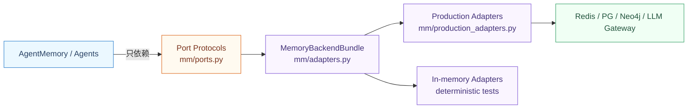
```mermaid
flowchart LR
    SVC["AgentMemory / Agents"]
    PORT["Port Protocols<br/>mm/ports.py"]
    BUNDLE["MemoryBackendBundle<br/>mm/adapters.py"]
    PROD["Production Adapters<br/>mm/production_adapters.py"]
    MEM["In-memory Adapters<br/>deterministic tests"]
    EXT["Redis / PG / Neo4j / LLM Gateway"]

    SVC -->|"只依赖"| PORT
    PORT --> BUNDLE
    BUNDLE --> MEM
    BUNDLE --> PROD
    PROD --> EXT

    classDef svc fill:#ebf8ff,stroke:#3182ce,color:#2a4365
    classDef port fill:#fffaf0,stroke:#dd6b20,color:#7b341e
    classDef adapter fill:#faf5ff,stroke:#805ad5,color:#44337a
    classDef ext fill:#f0fff4,stroke:#38a169,color:#22543d
    class SVC svc
    class PORT port
    class BUNDLE,PROD,MEM adapter
    class EXT ext
```

**依赖规则**：`mm/service.py`、`mm/agents.py` 只能面向 Port 或领域模块；生产 SDK import 只能出现在 `mm/production_adapters.py`；测试默认使用 `MemoryBackendBundle.in_memory()`，集成环境使用 `backend_mode="production"` 显式装配。

| 组件 | 角色定位 | 部署形态 | 关键约束 |
|---|---|---|---|
| **Memory CLI** | 控制面入口 | 命令行工具 / 运维 SDK，独立于在线读写进程 | 仅做受控运维,不进数据面关键路径 |
| **Recall Agent** | 读链路召回编排 | 在线常驻服务，处于关键路径 | **P99<80ms 硬约束**,LLM 仅可选且带超时降级 |
| **Consolidation Agent** | 固化决策智能体 | 异步常驻 worker，消费 inbox | LLM 驱动,关键路径外,可水平扩缩 |
| **LLM Gateway** | 统一模型接入层 | 可插拔网关(如 LiteLLM 模式) | 屏蔽模型差异,统一限流/重试/降级 |

**2.4.1 Memory CLI(控制面工具,对应 §7.7)**

把 §7.7 运维控制面抽象为单一 CLI 工具,四个子命令域即四类运维能力:

```text
memctl setup     # 建表/索引、初始化向量库与图库 schema、写默认配置
memctl service   # 启停调度器(evolve/forget_sweep/graph_audit)、查看 inbox 积压、手动触发
memctl config    # 查看/下发 §5.6 参数(三级覆盖)、灰度、回滚、热更新
memctl doctor    # 健康自检:连通性/一致性漂移/inbox 积压/调度心跳/水位/配置合法性
```

- **边界**:CLI 仅暴露只读诊断 + 受控写动作(带权限与审计),`doctor` 幂等只读、可高频调用,作为上线门禁与值班巡检入口。

**2.4.2 Recall Agent(召回编排智能体,对应 §5.5 / §6 recall)**

把读链路的「三路召回 → RRF 融合 → F2 重排 → reinforce 回写」从过程式 `recall()` 抽象为独立的召回编排组件。与 Consolidation Agent 是异步 worker 不同,**Recall Agent 处于在线关键路径,受 P99<80ms 硬约束**,因此它的"Agent 化"是**编排式而非自由推理式**——默认不在关键路径同步调用 LLM。

- **职责(编排,非自由推理)**:查询理解(实体/意图抽取)→ 分层路由(决定走哪几路:dense/sparse/graph)→ 三路并行召回 → RRF 融合 → F2 重排 → top-k 注入 → 异步 reinforce。
- **延迟预算(继承 §7.3)**:embed≈10ms + 三路并行召回≈40ms + RRF/F2≈10ms ≈ 60ms 同步段;reinforce 移出关键路径异步补偿。
- **LLM 使用纪律(关键)**:
  - 默认路径**零 LLM**,查询理解用轻量分类器/规则,保证 P99。
  - 复杂查询(需多跳改写/子问题分解)可选走 LLM 增强,但**必须带超时预算 + 降级**:超时即回退到无 LLM 的基础召回,绝不阻塞读路径。
  - 任何 LLM 调用统一经 §2.4.4 LLM Gateway,复用其限流/降级。
- **接口契约**:
  ```python
  class RecallAgent:
      def recall(tenant_id, query, k=8, entities=None)
          -> {facts, episodes, subgraph, reinforced}   # 同步段 P99<80ms
      def plan_routes(query) -> [route]                 # 分层路由决策(轻量)
  ```
- **与既有设计的衔接**:内核算法仍是 §5.5 混合检索 + §4.2 F2,本组件只是把"召回编排"显式化,便于独立优化(路由策略、并发、缓存)与独立监控(召回命中率、P99),不改变 §6 `recall` 对外契约。

> 双 Agent 对称设计:**Recall Agent(读·同步·延迟敏感·默认零 LLM)** 与 **Consolidation Agent(写后固化·异步·质量敏感·LLM 驱动)** 构成读写两侧的对称编排组件——一个在关键路径上"快而稳",一个在关键路径外"慢而准",共享 LLM Gateway 但纪律相反。

**2.4.3 Consolidation Agent(固化智能体,对应 §5.2)**

把 §5.2 的「inbox + 7 步固化管线」抽象为一个独立的异步智能体,而非散落在 `evolve` 里的过程式代码:

- **输入**:消费 `inbox` 中的待固化候选(promote 时投递)。
- **内核**:执行 7 步管线(Recall related → Build context → LLM decide(JSON) → Resolve conflicts → Embed+write → Update KG → Drop from inbox)。
- **接口契约**:
  ```python
  class ConsolidationAgent:
      def run_once(tenant_id) -> {processed, written, conflicts, skipped, dropped}
      def consolidate(item)   -> {op, mem_type, fact_key, confidence}   # 单条 7 步
  ```
- **伸缩性**:无状态 worker,按 inbox 积压水平扩缩;失败条目留 inbox 重试,保证幂等(Drop from inbox 为最终收尾)。

**2.4.4 LLM Gateway(统一模型接入,LiteLLM 模式)**

巩固管线第 3 步、reflect 抽取、F1 语义打分、Recall Agent 的可选查询增强等均依赖 LLM。把模型调用收敛到统一网关组件,而非各处直连:

- **职责**:统一鉴权、多模型路由与回退、限流与重试、结构化输出(JSON schema)校验、调用计量与审计。
- **价值**:① 屏蔽底层模型差异,Consolidation Agent / reflect 只面向稳定接口编程;② 集中做限流与降级,LLM 抖动时保护固化队列不雪崩(对应 §7.7 doctor 的"inbox 积压→LLM 限流"诊断);③ 统一成本与可观测口径。
- **接口契约**:
  ```python
  class LLMGateway:
      def decide_json(prompt, schema) -> dict        # 强制 JSON, 校验失败可重试/降级
      def embed(text)                 -> vector       # 统一 embedding 出口
  ```

**2.4.5 组件交互时序(读路径 / 写后固化路径)**

下图把两条核心链路落到组件级:**读路径**走 Recall Agent,默认零 LLM、严守 P99<80ms;**写后固化路径**走 inbox + Consolidation Agent,异步消费、LLM 驱动质量优先。两条链路在关键路径上解耦——固化随时可降级而不阻塞在线读写。

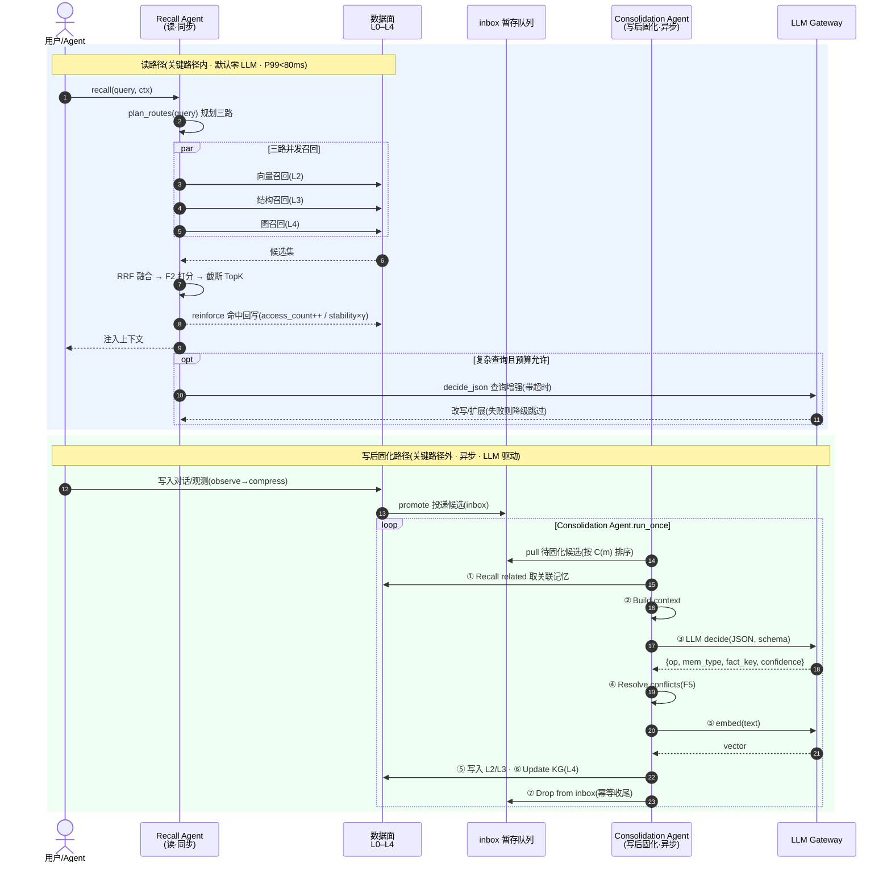
```mermaid
sequenceDiagram
    autonumber
    actor U as 用户/Agent
    participant RA as Recall Agent<br/>(读·同步)
    participant DP as 数据面<br/>L0–L4
    participant IB as inbox 暂存队列
    participant CA as Consolidation Agent<br/>(写后固化·异步)
    participant GW as LLM Gateway

    rect rgb(235,244,255)
    note over U,DP: 读路径(关键路径内 · 默认零 LLM · P99<80ms)
    U->>RA: recall(query, ctx)
    RA->>RA: plan_routes(query) 规划三路
    par 三路并发召回
        RA->>DP: 向量召回(L2)
        RA->>DP: 结构召回(L3)
        RA->>DP: 图召回(L4)
    end
    DP-->>RA: 候选集
    RA->>RA: RRF 融合 → F2 打分 → 截断 TopK
    RA-->>DP: reinforce 命中回写(access_count++ / stability×γ)
    RA-->>U: 注入上下文
    opt 复杂查询且预算允许
        RA->>GW: decide_json 查询增强(带超时)
        GW-->>RA: 改写/扩展(失败则降级跳过)
    end
    end

    rect rgb(240,255,244)
    note over U,GW: 写后固化路径(关键路径外 · 异步 · LLM 驱动)
    U->>DP: 写入对话/观测(observe→compress)
    DP->>IB: promote 投递候选(inbox)
    loop Consolidation Agent.run_once
        CA->>IB: pull 待固化候选(按 C(m) 排序)
        CA->>DP: ① Recall related 取关联记忆
        CA->>CA: ② Build context
        CA->>GW: ③ LLM decide(JSON, schema)
        GW-->>CA: {op, mem_type, fact_key, confidence}
        CA->>CA: ④ Resolve conflicts(F5)
        CA->>GW: ⑤ embed(text)
        GW-->>CA: vector
        CA->>DP: ⑤ 写入 L2/L3 · ⑥ Update KG(L4)
        CA->>IB: ⑦ Drop from inbox(幂等收尾)
    end
    end
```

> 组件面与数据面的关系:数据面(L0–L4 + 三链路)保证**在线读写 P99<80ms**;组件面(CLI / Recall Agent / Consolidation Agent / LLM Gateway)承载**运维、在线召回编排、异步固化、模型接入**。其中 Recall Agent 在关键路径内但默认零 LLM、严守延迟预算,其余组件均在关键路径之外,任一组件故障可独立降级而不阻断在线读写。

---

# 三、各层模块技术规格

每层明确触发条件、存储结构、淘汰规则、交互接口。

## 3.1 L0 感觉/对话缓冲（短期·非结构化）

- **触发**：每轮 message 即时写入，无加工
- **存储**：内存环形缓冲 + Redis LIST，`{role,content,ts,token_len}`，不落库，TTL=W_raw
- **淘汰**：FIFO，超窗口 W_raw 丢弃，丢弃前触发 L1 提炼
- **接口**：append / read_window / flush_to_L1

**存储结构（字段级）**：L0 为易失环形缓冲，不落库，字段如下。

| 字段 | 类型 | 约束 | 说明 / 关系 |
|---|---|---|---|
| turn_id | int | 自增，环内唯一 | 环形缓冲槽位序号，溢出回绕 |
| role | enum | user/assistant/tool/system | 消息来源角色 |
| content | text | 非空 | 原始文本，不做任何加工 |
| ts | float | epoch 秒 | 写入时刻，FIFO 与 TTL 依据 |
| token_len | int | ≥0 | 累加判断是否超 θ_ctx，触发 L1 压缩 |
| session_id | str | 非空，会话隔离键 | 会话归属键，跨会话不可见 |
| tenant_id | str | 非空，强制隔离键 | 租户/用户隔离键，从写入第一跳即落地，与 L2–L4 对齐 |
| user_id | str | 非空 | 消息所属用户，支撑同一用户跨会话近因聚合 |

| 维度 | 规格 |
|---|---|
| 触发条件 | 每轮 message 同步写入；累计 token > θ_ctx（默认 60%）或满 K 轮（默认 8）触发 flush_to_L1 |
| 淘汰规则 | FIFO + TTL=W_raw；出环前若未被 L1 吸收则触发一次强制 compress，避免信息直接丢失 |
| 容量约束 | 环大小 = 最近 W_raw 轮；内存 + Redis LIST 双写，Redis 故障降级纯内存（可用性优先，接受易失语义） |
| 交互接口 | `append(tenant_id, user_id, session_id, msg)` / `read_window(session_id, n)` / `flush_to_L1(session_id)` |

**3.1.0 message 与用户/会话的关联模型**

L0 本身不承载用户档案，仅通过隔离键把每条 message 挂接到「会话 → 用户 → 租户」三级归属，关联链路如下：

```
message ──(随消息写入)──> session_id ──┐
        ──(随消息写入)──> user_id    ──┼──> tenant_id（强制隔离键）
        ──(随消息写入)──> tenant_id  ──┘
```

- **message ↔ 会话**：每条消息写入即携带 `session_id`，`append(...)` 按会话隔离；同一会话的 message 构成一个环形窗口。
- **会话 ↔ 用户**：`user_id` 随消息一并写入 L0，不再依赖会话元数据二次反查；同一用户的多个会话可按 `user_id` 聚合做「跨会话近因窗口」。
- **用户 ↔ 租户**：`tenant_id` 自 L0 即作为强制隔离键存在，跨租户读取直接拒绝，与 §7.4 多租户隔离及 L2–L4 各层 `tenant_id` 语义完全一致，避免「隔离键到 L2 落库才出现」的断层。

**Redis key 设计**：缓冲键内嵌租户与会话双维度，天然支持按租户/用户前缀扫描与逐会话淘汰。

```text
l0:{tenant_id}:{session_id}            → LIST（该会话近因窗口）
l0:idx:{tenant_id}:{user_id}           → SET（该用户活跃 session_id 集合，支撑跨会话聚合）
```

- 写入：`LPUSH l0:{tenant}:{session} <msg>` + `SADD l0:idx:{tenant}:{user} <session>`，并对 LIST 设 `TTL=W_raw` 对应的过期/裁剪策略。
- 隔离：所有 `read_window` / `flush_to_L1` 均以 `{tenant_id}` 为前缀，跨租户 key 物理不可达，杜绝邻居污染。
- 降级：Redis 故障时降级纯内存环形缓冲，键结构保持一致，仅丢失持久性（接受易失语义）。

**3.1.1 W_raw 按对话类型动态调整**

原方案中 `W_raw` 为静态标量配置，不区分对话类型——短期咨询与长期任务共用同一窗口，前者浪费驻留、后者过早淘汰早期约束。本版将其升级为「基线 + 类型系数 + 负载系数 + clamp」的复合定义：

$$W_{raw}(session) = \mathrm{clip}\big(W_{base}\cdot type\_factor(dialog\_type)\cdot load\_factor,\ W_{min},\ W_{max}\big)$$

$$\text{动态窗口} = \mathrm{截断}\big(\text{基线窗口}\times\text{类型系数}\times\text{负载系数},\ \text{窗口下限},\ \text{窗口上限}\big)$$

> 中文释义：会话的实际缓冲窗口 = 基线窗口先按"对话类型系数"放大或缩小，再乘"负载系数"随上下文压力收窄，最后用上下限截断兜底，防止窗口塌缩或无限增长。

$$load\_factor = 1 - \beta\cdot \frac{ctx\_used}{C_{ctx}}$$

$$\text{负载系数} = 1 - \text{收缩系数}\times \frac{\text{已用上下文}}{\text{上下文总容量}}$$

> 中文释义:上下文占用越高,负载系数越小,缓冲窗口主动收窄,为关键内容腾出空间。

其中类型系数 $type\_factor$ 取值：consult（短期咨询）=0.6、task（长期任务）=1.8、chitchat（闲聊）=0.4、unknown（默认）=1.0；$load\_factor$ 在上下文吃紧时主动收窄窗口，$\beta$ 为收缩系数。默认参数：$W_{base}$=最近 8 轮、$W_{min}$=4 轮、$W_{max}$=32 轮、$\beta=0.3$。

- **分类信号**：对话轮次密度、L1 中 `open_slots` 是否含 plan/goal/todo 类实体、用户显式标注（"帮我做个方案"→task）、是否存在跨轮引用。`dialog_type` 由会话级轻量分类器在建会话与意图漂移时输出。
- **运行期升档**：TTL 非一次性设定。当短期咨询升级为多步任务（检测到 plan 实体生成）时，`type_factor` 由 0.6 升至 1.8，避免早期上下文被过早淘汰；**降档采用滑动淘汰而非立即清空**，保留 `T_grace` 宽限期。
- **配置三级覆盖**：`全局默认 → 租户(tenant) → 会话(session)`，与 §5.6 配置中心约定一致，支持灰度与运营调参。
- **边界保护**：`W_min/W_max` 兜底，防止分类误判导致窗口塌缩或无限增长。

## 3.2 L1 工作记忆（短期·结构化）

- **触发**：L0 token 超 θ_ctx（60%）或每 K 轮压缩
- **存储**：结构化对象 `{rolling_summary, open_slots, mentioned_entities}`，容量上限 C_wm（默认 2k token）
- **淘汰**：超 C_wm → 闭合 slot 下沉 L2；摘要二次压缩
- **接口**：compress / get_active_context / promote

**存储结构（字段级）**：L1 是结构化工作上下文对象，容量硬上限 C_wm。

| 字段 | 类型 | 约束 | 说明 / 关系 |
|---|---|---|---|
| rolling_summary | text | ≤ C_wm 的一定占比 | 滚动摘要，超限二次压缩 |
| open_slots | json | 键值对数组 | 未闭合任务槽：意图、待办、约束 |
| mentioned_entities | json | 实体列表 | 本会话提及实体，供 L4 图谱归并 |
| token_used | int | ≤ C_wm（默认 2k） | 实时占用，超限触发下沉 |
| last_compress_ts | float | epoch 秒 | 上次压缩时刻 |

| 维度 | 规格 |
|---|---|
| 触发条件 | L0 token 超 θ_ctx 或每 K 轮；闭合 slot 立即 promote 至 L2 |
| 淘汰规则 | token_used > C_wm → 已闭合 slot 下沉 L2，rolling_summary 二次压缩保留主干；若压缩后仍超限，按 slot 创建时间 FIFO 强制下沉最旧的已闭合 slot，开放 slot 受保护不被截断 |
| 容量约束 | C_wm 硬上限（对应工作记忆 7±2 的工程化），超限必压缩，绝不溢出污染上下文 |
| 交互接口 | `compress()` / `get_active_context()` / `promote(slot)` |

## 3.3 L2 情景记忆库（长期·向量）

- **触发**：会话结束 / 任务闭合 / L1 下沉
- **存储**：向量库，字段 mem_id, embedding, text, ts_create, ts_last_access, importance, access_count, stability, status, source_ids, tenant_id
- **淘汰**：forget_score < θ_forget 软删归档；超容按 forget_score 升序逐出
- **接口**：retrieve / reinforce / decay_sweep

**存储结构（字段级）**：L2 为向量库，是遗忘与检索强化的主战场。

| 字段 | 类型 | 约束 | 说明 / 关系 |
|---|---|---|---|
| mem_id | str(hash) | 主键，内容指纹派生，幂等 | 全局唯一，promote 由内容指纹生成（非随机 UUID） |
| embedding | vector(d) | L2 归一化 | dense 召回依据；F2 的 cos 项 |
| text | text | 非空 | 记忆正文 |
| importance | int | F1 输出，0–10 | 一处计算，F2/F4 复用 |
| ts_create | float | 不可改 | 创建时刻 |
| ts_last_access | float | reinforce 更新，初始=ts_create | F3 衰减起点 |
| access_count | int | ≥0 | 命中累加，F4 与 stability 输入 |
| stability | float | ≥ S0 | 稳定度，reinforce 增益（间隔重复） |
| status | enum | active/archived/deleted | 软删状态，archived 可被复活 |
| source_ids | json | 外键数组 | 溯源到 L0/L1 原始片段 |
| tenant_id | str | 非空，强制隔离键 | 多租户隔离，跨租户检索拒绝 |

| 维度 | 规格 |
|---|---|
| 触发条件 | 会话闭合 / 任务完成 / L1 超容下沉；写入即调 F1 打分 |
| 淘汰规则 | forget_score < θ_forget^dyn 软删为 archived；占用超 C_epi 按 forget_score 升序逐出；importance≥9 豁免；**新记忆设保护期 T_grace（默认 24h）内不参与 forget_sweep** |
| 容量约束 | C_epi（默认 1e5）；动态阈值随占用率 u 上升而收紧（κ 压力系数） |
| 交互接口 | `retrieve(q,k)` / `reinforce(mem_id)` / `decay_sweep()` |

**L2 双力博弈图**:L2 是「检索强化(升)」与「时间遗忘(降)」两股力的主战场,下图展示一条记忆在两力作用下的状态走向——命中则 reinforce 拉高 stability、延缓遗忘;久未命中则 retention 衰减、forget_score 跌破阈值而软删归档,归档后仍可被命中复活。

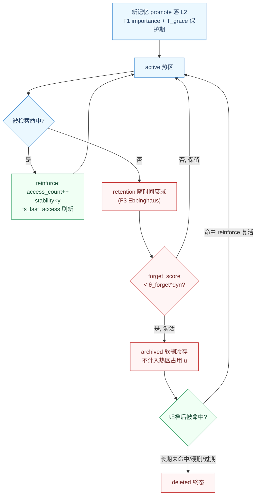
```mermaid
flowchart TD
    NEW["新记忆 promote 落 L2<br/>F1 importance + T_grace 保护期"]
    ACT["active 热区"]
    HIT{"被检索命中?"}
    REIN["reinforce:<br/>access_count++<br/>stability×γ<br/>ts_last_access 刷新"]
    DECAY["retention 随时间衰减<br/>(F3 Ebbinghaus)"]
    FS{"forget_score<br/>< θ_forget^dyn?"}
    ARC["archived 软删冷存<br/>不计入热区占用 u"]
    REVIVE{"归档后被命中?"}
    DEL["deleted 终态"]

    NEW --> ACT --> HIT
    HIT -->|是| REIN --> ACT
    HIT -->|否| DECAY --> FS
    FS -->|否, 保留| ACT
    FS -->|是, 淘汰| ARC
    ARC --> REVIVE
    REVIVE -->|命中 reinforce 复活| ACT
    REVIVE -->|长期未命中/硬删/过期| DEL

    classDef up fill:#f0fff4,stroke:#38a169,color:#22543d
    classDef down fill:#fff5f5,stroke:#c53030,color:#742a2a
    classDef neu fill:#ebf8ff,stroke:#3182ce,color:#2a4365
    class REIN,REVIVE up
    class DECAY,FS,ARC,DEL down
    class NEW,ACT,HIT neu
```

**3.3.1 forget_score 是否考虑内容重要性与高频提及**

是。F4 已将「内容重要性」直接计入、「高频提及」间接计入:

$$forget\_score(m) = \underbrace{retention(m)}_{\text{时间衰减}}\cdot \underbrace{\left(0.5 + 0.5\frac{importance}{10}\right)}_{\text{重要性因子}}\cdot \underbrace{\big(\ln(1+access\_count)+1\big)}_{\text{访问频次因子}}$$

$$\text{遗忘分数} = \underbrace{\text{保持率}}_{\text{时间衰减}}\times \underbrace{\left(0.5 + 0.5\times\frac{\text{重要性}}{10}\right)}_{\text{重要性因子}}\times \underbrace{\big(\ln(1+\text{命中次数})+1\big)}_{\text{访问频次因子}}$$

> 中文释义：遗忘分数越小越该遗忘;它由三项相乘——时间越久"保持率"越低、内容越重要"重要性因子"越大、被命中越频繁"访问频次因子"越大,后两项共同保护重要且高频的记忆不被清理。

- **内容重要性 → 直接体现**：重要性因子 $\left(0.5 + 0.5\frac{importance}{10}\right)$。$importance$ 由 F1 在 promote 时打分（语义价值、是否含决策/约束/用户画像），重要度越高越不易清理；下限系数 0.5 保证 $importance=0$ 也不会"出生即死"。
- **高频提及 → 间接体现（两条通路）**：① $access\_count$——每次读链路命中触发 reinforce（$access\_count{+}{+}$），$\big(\ln(1+access\_count)+1\big)$ 随之增大；② $stability$——$stability'(m)=S_0\,\gamma^{access\_count}\left(1+\lambda\frac{importance}{10}\right)$，高频访问拉长稳定期，使 $retention=\exp(-\Delta t/stability)$ 衰减更慢，二阶强化抗遗忘。
- **口径差异（增强点）**：此处"高频"指**被检索命中**的频率（被动召回），而非**用户输入中重复提及**的频率（主动提及）。为精确捕捉后者，建议在 observe/compress 阶段对同语义条目维护 $mention\_count$，并入 F1 的 importance 估计，使"用户反复强调但尚未被检索"的信息在首次入库即获更高 importance。

## 3.4 L3 语义记忆库（长期·结构化）

- **触发**：reflection 提炼稳定事实/偏好/约束
- **存储**：KV/文档表 `{fact_key,value,confidence,evidence_ids,version,ts_update,embedding}` + 向量索引
- **淘汰**：冲突消解（F5）+ 置信度，confidence < θ_conf 淘汰
- **接口**：upsert / query / semantic_search / resolve_conflict

**存储结构（字段级）**：L3 是稳定事实/偏好/约束的权威库，写入强制经 F5 冲突消解。

| 字段 | 类型 | 约束 | 说明 / 关系 |
|---|---|---|---|
| fact_key | str | 主键（与 tenant_id+version 联合），规范化 | 事实键，如 user.lang_pref |
| value | json | 非空 | 事实值 |
| confidence | float | 0–1 | < θ_conf 淘汰；F5 仲裁依据 |
| evidence_ids | json | 外键数组 | 支撑证据（L2 mem_id） |
| version | int | ≥1 | F5 归档时 version++ |
| ts_update | float | epoch 秒 | 近似置信度时取新者依据 |
| is_temporal | bool | 默认 false | 状态型 key 标记，时序冲突识别用（见 §11.2） |
| valid_from / valid_until | float | 可空 | 状态时间线区间，时序归档时写入 |
| embedding | vector(d) | 可选 | 语义检索索引 |
| tenant_id | str | 非空，强制隔离键 | 多租户隔离 |

| 维度 | 规格 |
|---|---|
| 触发条件 | reflect 从 L2 提炼稳定事实/偏好/约束时 upsert；写入前强制经 detect_conflict 闸门 |
| 淘汰规则 | F5：新值 confidence 高→替换；近似→取 ts_update 晚者；否则旧值 version++ 归档；长期无证据且 confidence<θ_conf→整条淘汰 |
| 容量约束 | 按 fact_key 去重，天然有界；冲突链通过 version 保留可追溯 |
| 交互接口 | `upsert(fact)` / `query(key)` / `semantic_search(q)` / `resolve_conflict()` |

**F5 冲突消解决策图**:L3 每次 upsert 前强制经 detect_conflict 闸门,按「新旧置信度差 / 时间新旧 / 是否时序键」选择五档动作,全程留 conflict_log 可追溯。preference 分区不走此图,改走加权更新(见 §2.3)。

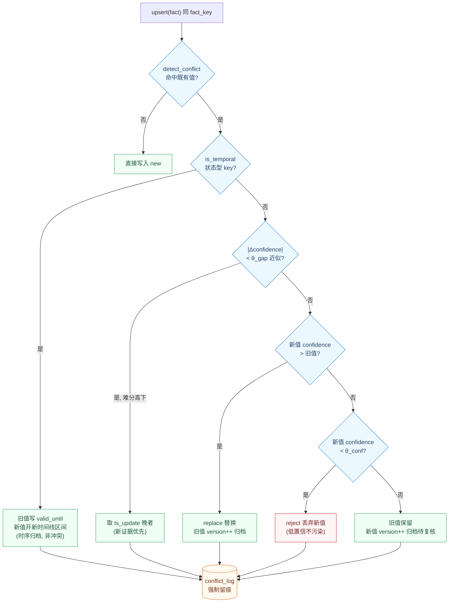
```mermaid
flowchart TD
    UP["upsert(fact) 同 fact_key"] --> DET{"detect_conflict<br/>命中既有值?"}
    DET -->|否| NEW["直接写入 new"]
    DET -->|是| TMP{"is_temporal<br/>状态型 key?"}
    TMP -->|是| TL["旧值写 valid_until<br/>新值开新时间线区间<br/>(时序归档, 非冲突)"]
    TMP -->|否| GAP{"|Δconfidence|<br/>< θ_gap 近似?"}
    GAP -->|是, 难分高下| TS["取 ts_update 晚者<br/>(新证据优先)"]
    GAP -->|否| CMP{"新值 confidence<br/>> 旧值?"}
    CMP -->|是| REP["replace 替换<br/>旧值 version++ 归档"]
    CMP -->|否| KEEP{"新值 confidence<br/>< θ_conf?"}
    KEEP -->|是| REJ["reject 丢弃新值<br/>(低置信不污染)"]
    KEEP -->|否| VER["旧值保留<br/>新值 version++ 归档待复核"]
    REP --> LOG[("conflict_log<br/>强制留痕")]
    TS --> LOG
    TL --> LOG
    VER --> LOG
    REJ --> LOG

    classDef gate fill:#ebf8ff,stroke:#3182ce,color:#2a4365
    classDef act fill:#f0fff4,stroke:#38a169,color:#22543d
    classDef drop fill:#fff5f5,stroke:#c53030,color:#742a2a
    classDef log fill:#fffaf0,stroke:#dd6b20,color:#7b341e
    class DET,TMP,GAP,CMP,KEEP gate
    class NEW,REP,TS,TL,VER act
    class REJ drop
    class LOG log
```

## 3.5 L4 认知记忆（长期·图式）

- **触发**：reflection 累计重要性达阈值，抽象归纳
- **存储**：知识图谱（Neo4j），节点=实体/概念/洞察，边=因果/归属/时序/相似，带 salience 与 evidence_ids
- **淘汰**：低 salience 孤立节点剪枝；旧洞察标记 superseded
- **接口**：add_insight / graph_query / subgraph_for_context / prune

**存储结构（图模型）**：L4 为知识图谱，沉淀跨会话的概念关联与洞察。

| 元素 / 字段 | 类型 | 约束 | 说明 / 关系 |
|---|---|---|---|
| node.id | str(hash) | 主键，内容指纹派生 | 实体 / 概念 / 洞察节点 |
| node.type | enum | entity/concept/insight | 节点类别 |
| node.salience | float | 0–1，衰减 | 显著度，低且孤立→剪枝 |
| node.evidence_ids | json | 外键数组 | 溯源 L2/L3 |
| node.tenant_id | str | 非空，强制隔离键 | 多租户隔离 |
| edge.type | enum | 因果/归属/时序/相似 | 关系语义 |
| edge.weight | float | 0–1 | 关联强度，子图召回排序 |
| insight.status | enum | active/superseded | 旧洞察被新洞察取代时标记 |

| 维度 | 规格 |
|---|---|
| 触发条件 | reflect 时累计重要性达阈值，对反复出现的实体/关系抽象归纳为洞察；写入前强制经 detect_conflict 闸门 |
| 淘汰规则 | salience 随时间衰减（μ 系数），低 salience 且无入边的孤立节点剪枝；旧洞察标记 superseded 不硬删 |
| 容量约束 | 按实体归并去重（同名/近义合并），边数受 weight 阈值控制，图规模可控 |
| 交互接口 | `add_insight()` / `graph_query()` / `subgraph_for_context()` / `prune()` |

**3.5.1 知识图谱的定期冲突检测与更新**

需要。现有设计已具备**事件驱动**的局部冲突治理（写入门控 `detect_conflict`、互斥边校验、L3 变更级联失效 cascade invalidation、salience 衰减与孤立节点剪枝、五类冲突 + severity 分级写 conflict_log，详见 §11.3）。但事件驱动只能发现**单次写入触达的局部冲突**，无法覆盖**存量关系随时间累积的全局不一致**，故需补「定期全量巡检」:

- **多跳一致性**：A→B、B→C、C→¬A 这类跨多跳的环路矛盾，仅在写入时无法发现，需周期性子图扫描。
- **时序关系重评**：`is_temporal` 类关系（如"任职于 X 公司"）需按 `valid_until` 定时复检，过期者降级或 version 化。

**graph_audit 周期作业**（挂载于演化链路 `consolidate` 阶段）：

1. 按调度周期（默认 `T_audit=24h`）对高 salience 子图做多跳环路 / 互斥一致性检测；
2. 对 temporal 关系按 `valid_until` 重评，过期者降级或 version 化；
3. 冲突命中走既有 F5 / §11 治理动作（replace/merge/version/pending/reject），产出写 conflict_log；
4. 巡检范围按 `salience` 与 `ref_count` 采样优先核心子图，控制开销（全量代价过高）。

**L4 知识图谱结构示意**:下图示意三类节点(实体/概念/洞察)与四类边(因果/归属/时序/相似)的组织形态——洞察由多个实体经反思抽象而来,节点带 salience、边带 weight,旧洞察被新洞察 superseded,低 salience 孤立节点被剪枝。

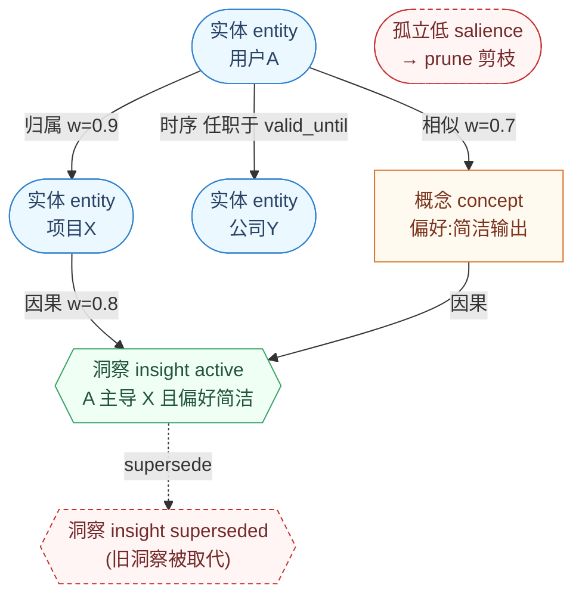
```mermaid
flowchart TD
    E1(["实体 entity<br/>用户A"])
    E2(["实体 entity<br/>项目X"])
    E3(["实体 entity<br/>公司Y"])
    C1["概念 concept<br/>偏好:简洁输出"]
    I1{{"洞察 insight active<br/>A 主导 X 且偏好简洁"}}
    I0{{"洞察 insight superseded<br/>(旧洞察被取代)"}}
    ORPHAN(["孤立低 salience<br/>→ prune 剪枝"]):::dead

    E1 -->|归属 w=0.9| E2
    E1 -->|时序 任职于 valid_until| E3
    E1 -->|相似 w=0.7| C1
    E2 -->|因果 w=0.8| I1
    C1 -->|因果| I1
    I1 -.->|supersede| I0

    classDef ent fill:#ebf8ff,stroke:#3182ce,color:#2a4365
    classDef con fill:#fffaf0,stroke:#dd6b20,color:#7b341e
    classDef ins fill:#f0fff4,stroke:#38a169,color:#22543d
    classDef dead fill:#fff5f5,stroke:#c53030,color:#742a2a,stroke-dasharray: 4 3
    class E1,E2,E3 ent
    class C1 con
    class I1 ins
    class I0 dead
```

---

# 四、核心计算公式

F1–F5 贯穿三链路，importance 一处计算、三处复用。

**公式总览**:五条核心公式 + 若干辅助公式的定位、所在链路与复用关系如下。

| 公式 | 名称 | 所在链路 | 作用 | 被谁复用 |
|---|---|---|---|---|
| F1 | 重要性打分 importance | 写入(promote) | 量化记忆价值 | F2、F4、C(m) |
| F2 | 综合检索打分 score | 读取(recall) | L2 召回排序 | — |
| F3 | 保持率 retention | 演化(遗忘) | 时间衰减 | F4 |
| F4 | 综合遗忘分 forget_score | 演化(遗忘) | 软删判定 | forget_sweep |
| F5 | L3 冲突消解 | 演化(固化) | 事实仲裁 | §11 治理 |

**F1–F5 依赖关系**:importance 在写入时一次计算,向读取与遗忘两侧扩散复用,reinforce 把读路径反馈回稳定度,形成闭环。

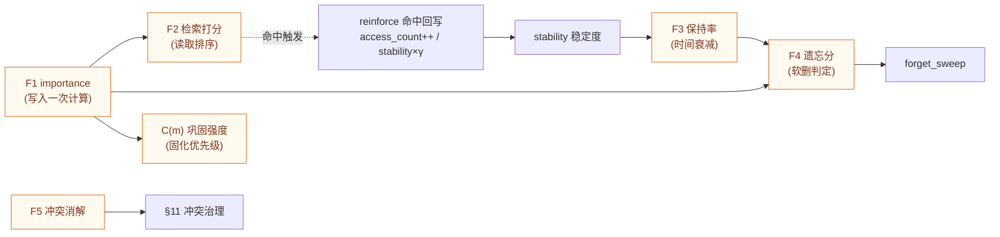
```mermaid
flowchart LR
    F1["F1 importance<br/>(写入一次计算)"] --> F2["F2 检索打分<br/>(读取排序)"]
    F1 --> F4["F4 遗忘分<br/>(软删判定)"]
    F1 --> CM["C(m) 巩固强度<br/>(固化优先级)"]
    F3["F3 保持率<br/>(时间衰减)"] --> F4
    STAB["stability 稳定度"] --> F3
    REIN["reinforce 命中回写<br/>access_count++ / stability×γ"] --> STAB
    F2 -.->|命中触发| REIN
    F4 --> SWEEP["forget_sweep"]
    F5["F5 冲突消解"] --> CONF["§11 冲突治理"]

    classDef calc fill:#fffaf0,stroke:#dd6b20,color:#7b341e
    class F1,F2,F3,F4,F5,CM calc
```

**4.1 F1 重要性打分**（promote 写入时一次性计算，结果被 F2、F4 复用）：

$$importance = \mathrm{clip}\big(\mathrm{round}(0.4\, s_{llm} + 0.3\, s_{rule} + 0.3\, s_{user}),\ 0,\ 10\big)$$

$$\text{重要性} = \mathrm{截断}\big(\mathrm{四舍五入}(0.4\times\text{模型判分} + 0.3\times\text{规则判分} + 0.3\times\text{用户强调分}),\ 0,\ 10\big)$$

> 中文释义：重要性由 LLM 判分、规则信号判分、用户显式强调分三源加权求和（权重 0.4/0.3/0.3），四舍五入后截断到 0–10 整数;三者均归一化到 [0,10]。该分在 promote 写入时一次性计算，供 F2 检索与 F4 遗忘复用。

**4.2 F2 综合检索打分**（L2 召回排序）：

$$score(m,q) = w_{rel}\cos(e_q,e_m) + w_{rec}\, decay_{rec}^{\,(now-t_{acc})/3600} + w_{imp}\frac{importance}{10}$$

$$\text{检索得分} = \text{相关性权重}\times\cos(\text{查询向量},\text{记忆向量}) + \text{近因权重}\times\text{近因衰减}^{\,(\text{当前时刻}-\text{上次访问时刻})/3600} + \text{重要性权重}\times\frac{\text{重要性}}{10}$$

> 中文释义：检索得分综合三项——语义相关性(向量余弦)、近因(越久未访问衰减越多)、重要性。指数项 $(now-t_{acc})/3600$ 把"秒"换算为"小时",配合 $decay_{rec}=0.99/\text{小时}$ 使用;三项权重默认 0.55/0.20/0.25。

**4.3 F3 保持率（Ebbinghaus）**：

$$retention(m) = \exp\left(-\frac{now - t_{acc}}{stability}\right)$$

$$\text{保持率} = \exp\left(-\frac{\text{当前时刻} - \text{上次访问时刻}}{\text{稳定度}}\right)$$

> 中文释义:遵循艾宾浩斯遗忘曲线,距上次访问越久保持率越低;稳定度越大衰减越慢。分子"当前时刻−上次访问时刻"与分母"稳定度"同为秒,量纲一致。

**4.4 F4 综合遗忘分数**（值越小越该忘）：

$$forget\_score(m) = retention(m)\cdot\left(0.5 + 0.5\frac{importance}{10}\right)\cdot\big(\ln(1+access\_count)+1\big)$$

$$\text{遗忘分数} = \text{保持率}\times\left(0.5 + 0.5\times\frac{\text{重要性}}{10}\right)\times\big(\ln(1+\text{命中次数})+1\big)$$

> 中文释义:遗忘分数越小越该遗忘,由"保持率×重要性因子×访问频次因子"三项相乘。末项采用 $\ln(1+\text{命中次数})+1$ 而非 $\ln(1+\text{命中次数})$,保证新记忆(命中次数=0)分数不恒为 0,配合 T_grace 保护期消除"出生即死"。

**4.5 F5 L3 冲突消解（覆盖式遗忘）**：

> 新值置信度高 → 替换；置信度近似（$|\Delta conf| < \theta_{gap}$）则取更新时间晚者；否则旧值 version++ 归档。长期无证据且 confidence < θ_conf → 整条淘汰。

检索强化：命中即 `t_acc=now; access_count++; stability×=γ`（间隔重复抗遗忘），把读路径与遗忘机制连成闭环。F5 的完整裁决优先级见 §11.4（本版已将 F5 提升为独立的冲突治理能力）。

## 4.6 公式输入来源与取值

每条公式的输入从何而来、默认取值、被谁消费，逐条对齐，确保公式不悬空。

| 公式 | 输入来源 | 默认参数 | 消费方 |
|---|---|---|---|
| F1 重要性 | s_llm=LLM 打分 / s_rule=规则信号（决策/约束/数字/情感）/ s_user=用户显式强调 | 权重 0.4/0.3/0.3，clip 0–10 | promote 写入，F2/F4 复用 |
| F2 检索打分 | cos=query 与 mem 向量余弦；decay^Δt=近因（Δt 单位小时）；importance=F1 | w_rel/w_rec/w_imp=0.55/0.20/0.25，decay_rec=0.99/h | L2 召回排序 |
| F3 保持率 | now−ts_last_access（秒）；stability（reinforce 增益，秒） | S0=86400 秒（24h） | F4 输入 |
| F4 遗忘分 | F3 retention；importance；access_count | 0.5+0.5·imp，ln(1+access)+1 | forget_sweep 软删判定 |
| F5 冲突消解 | 新旧 confidence；ts_update；evidence | θ_conf=0.3，θ_gap=0.2 | L3 upsert 仲裁 |

稳定度与动态阈值：

$$stability'(m)=S_0\,\gamma^{access\_count}\left(1+\lambda\cdot \frac{importance}{10}\right),\qquad \theta_{forget}^{dyn}=\theta_{forget}\big(1+\kappa(u-u_0)\big)$$

$$\text{新稳定度}=\text{初始稳定度}\times\text{增益系数}^{\,\text{命中次数}}\times\left(1+\text{重要性系数}\times\frac{\text{重要性}}{10}\right),\qquad \text{动态遗忘阈值}=\text{基线阈值}\times\big(1+\text{压力系数}\times(\text{占用率}-\text{占用基线})\big)$$

> 中文释义：左式——每次命中按"增益系数的命中次数次方"拉长稳定度,重要记忆额外加成(间隔重复抗遗忘);右式——L2 占用率越高,遗忘阈值越严,实现随负载自适应淘汰。参数 γ=1.5、λ=0.5、κ=0.5、u0=0.8。

## 4.7 数值算例（一条记忆走完全链路）

为消除公式的抽象感，下面取一条**具体记忆**，固定全部输入，逐步代入 F1→F2→F3→stability'→F4→C(m)→F5，算出每一步的真实数值，并给出遗忘判定与冲突仲裁结论。所有参数取 §4.6 默认值。

**输入设定**（一条用户偏好类记忆 m）：

| 量 | 取值 | 含义 |
|---|---|---|
| s_llm / s_rule / s_user | 8 / 6 / 10 | LLM 打 8 分；规则命中"约束+情感"6 分；用户显式强调满分 |
| cos(e_q, e_m) | 0.82 | 本次 query 与该记忆向量余弦 |
| now − t_acc | 7200 s（2 h） | 距上次访问 2 小时 |
| access_count | 3 | 历史命中 3 次 |
| stability（当前） | 86400 s | 尚未叠加本轮增益 |
| u（L2 占用率） | 0.90 | 当前分片占用 90% |

**Step 1 — F1 重要性**

$$importance = clip\big(round(0.4\times8 + 0.3\times6 + 0.3\times10),\,0,\,10\big) = round(3.2+1.8+3.0) = \mathbf{8}$$

**Step 2 — F2 检索打分**（Δt 以小时计，decay_rec=0.99）

$$decay_{rec}^{\Delta t} = 0.99^{2} = 0.9801$$
$$score = 0.55\times0.82 + 0.20\times0.9801 + 0.25\times\frac{8}{10} = 0.451 + 0.196 + 0.200 = \mathbf{0.847}$$

> 0.847 远高于常用召回阈值（≈0.5），该记忆本轮会被召回并进入 TopK。

**Step 3 — 命中后强化 + stability'**（召回命中 → access_count 3→4，叠加增益）

$$stability' = 86400 \times 1.5^{4} \times \left(1 + 0.5\times\frac{8}{10}\right) = 86400 \times 5.0625 \times 1.4 \approx \mathbf{612{,}360\ s}\;(\approx7.1\ \text{天})$$

> 间隔重复效应：4 次命中 + 高重要性，把稳定度从 1 天拉长到约 7 天。

**Step 4 — F3 保持率**（用强化后的 stability'，距下次评估仍按 now−t_acc=7200 s 估算）

$$retention = \exp\!\left(-\frac{7200}{612360}\right) = \exp(-0.01176) \approx \mathbf{0.988}$$

**Step 5 — F4 遗忘分**（access_count 取强化后 4）

$$forget\_score = 0.988 \times \left(0.5 + 0.5\times\frac{8}{10}\right) \times \big(\ln(1+4)+1\big) = 0.988 \times 0.9 \times 2.609 \approx \mathbf{2.32}$$

**Step 6 — 动态遗忘阈值 + 判定**（θ_forget=0.15，κ=0.5，u0=0.8，u=0.90）

$$\theta_{forget}^{dyn} = 0.15\times\big(1 + 0.5\times(0.90-0.80)\big) = 0.15\times1.05 = \mathbf{0.1575}$$

> 判定：forget_score=2.32 ≫ θ=0.1575 → **保留**。即便占用率 90% 抬高了阈值，这条高频高重要记忆依然安全；只有 forget_score 跌破 0.1575 的低价值记忆才会在高负载下被优先淘汰。

**Step 7 — C(m) 巩固强度**（α/β/δ=0.4/0.3/0.3，设 A_max=50，density=0.6）

$$C(m) = 0.4\times\frac{8}{10} + 0.3\times\frac{\ln(1+4)}{\ln(1+50)} + 0.3\times0.6 = 0.320 + 0.3\times\frac{1.609}{3.932} + 0.180 = 0.320+0.123+0.180 = \mathbf{0.623}$$

> C(m)=0.623 超过常用升维门槛（≈0.6），该记忆具备从 L2 情景升维到 L3 语义的资格，进入巩固管线。

**Step 8 — F5 冲突仲裁**（θ_conf=0.3，θ_gap=0.2）

设巩固时发现 L3 已有同主语旧事实，触发三种典型情形：

| 情形 | 新 conf | 旧 conf | \|Δconf\| | 裁决 |
|---|---|---|---|---|
| A 新值更可信 | 0.85 | 0.55 | 0.30 > 0.20 | **替换**，旧值 version++ 归档 |
| B 置信度接近 | 0.70 | 0.62 | 0.08 < 0.20 | **取更新时间晚者**（ts_update 较新的胜出） |
| C 旧值长期无证据 | — | 0.25 | — | 0.25 < θ_conf=0.3 → **整条淘汰** |

> 本例落入情形 A：新偏好置信 0.85、旧值 0.55，Δconf=0.30 超过 θ_gap → 新值替换、旧值归档可回溯。

**算例小结**：一条 importance=8 的偏好记忆，本轮召回打分 0.847 → 命中强化后稳定度拉长至约 7 天 → 遗忘分 2.32 远高于动态阈值 0.1575（保留）→ 巩固强度 0.623 达标升维 → 冲突仲裁走"高置信替换 + 旧值归档"。全链路数值自洽，验证了各公式的量纲与阈值设定的合理性。

**对照样本——一条低价值记忆被淘汰**：

取另一条记忆 m'（一句无人再提及的闲聊），输入 importance 仅 2、access_count=0、now−t_acc=2,592,000 s（30 天未访问）、stability 仍为初始 S0=86400、L2 占用率 u=0.95。

| 步骤 | 代入 | 结果 |
|---|---|---|
| F3 保持率 | exp(−2592000/86400) = exp(−30) | **≈9.4e-14**（近乎归零）|
| stability'（无命中） | 86400×1.5⁰×(1+0.5×0.2) | 95040 s（几乎无增益）|
| F4 遗忘分 | 9.4e-14 × (0.5+0.5×0.2) × (ln(1+0)+1) = 9.4e-14×0.6×1 | **≈5.6e-14** |
| θ_forget^dyn | 0.15×(1+0.5×(0.95−0.80)) | **0.1613** |
| 判定 | forget_score 5.6e-14 ≪ θ=0.1613 | **软删（archived）** |

> 与主算例形成镜像对比：同样的公式，**高频高重要**记忆 forget_score=2.32 远超阈值被牢牢保留，**低频低重要且久未访问**记忆 forget_score≈0 被淘汰；且占用率 0.95 把阈值进一步抬到 0.1613，加速了高水位下的清理。验证了 F3/F4 + 动态阈值"价值越低、越旧、负载越高 → 越优先遗忘"的设计意图。注意它只是 status=archived（软删），日后若被命中仍可复活。

---
# 五、记忆生命周期与五大机制

生命周期为总纲，巩固（升维）与动态遗忘（淘汰）反向竞争，知识图谱为沉淀形态，混合检索为统一读出口。

生命周期是总纲（记忆从写入到删除的状态机）；巩固与动态遗忘是两个相反方向的驱动力；知识图谱是巩固的沉淀形态；混合检索是统一读出口。五者构成「沉淀—淘汰—组织—调用」闭环。

## 5.1 生命周期状态机（总纲）

每条记忆从写入到删除经历统一状态流转，巩固（升维）与遗忘（淘汰）是其上的反向力。

| 状态 | 进入条件 | 驱动机制 | 退出去向 |
|---|---|---|---|
| transient（L0/L1） | 消息写入 | observe/compress | promote → episodic |
| episodic（L2） | promote 落库 | F1 打分 + reinforce | 巩固→semantic/cognitive；遗忘→archived |
| semantic（L3） | reflect 提炼事实 | F5 冲突消解 | 低置信淘汰 / version 归档 |
| cognitive（L4） | 重要性累积抽象 | salience 维护 | 剪枝 / superseded |
| archived | forget_score<θ | 检索命中可复活 | reinforce→active 或长期 deleted |
| deleted | 硬删/过期 | forget(hard/expire) | 终态 |

下图把上表的状态流转可视化:**实线**=升维/前进(巩固),**虚线**=降维/回退(遗忘与复活),体现「巩固升维」与「遗忘降维」双向流动、archived 可经命中复活的可逆设计。

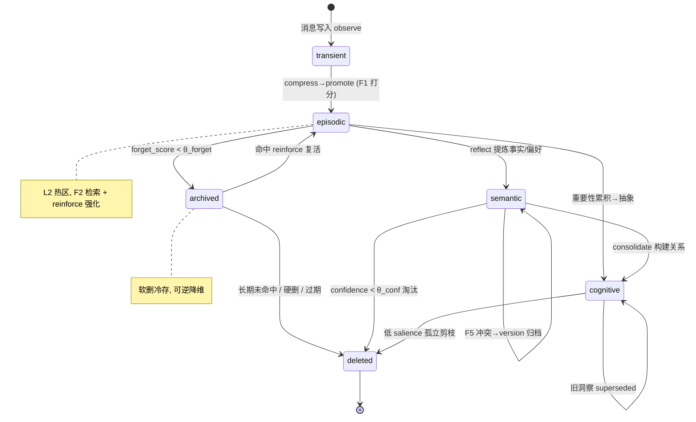
```mermaid
stateDiagram-v2
    [*] --> transient: 消息写入 observe
    transient --> episodic: compress→promote (F1 打分)
    episodic --> semantic: reflect 提炼事实/偏好
    episodic --> cognitive: 重要性累积→抽象
    semantic --> cognitive: consolidate 构建关系
    episodic --> archived: forget_score < θ_forget
    archived --> episodic: 命中 reinforce 复活
    semantic --> semantic: F5 冲突→version 归档
    cognitive --> cognitive: 旧洞察 superseded
    archived --> deleted: 长期未命中 / 硬删 / 过期
    semantic --> deleted: confidence < θ_conf 淘汰
    cognitive --> deleted: 低 salience 孤立剪枝
    deleted --> [*]

    note right of episodic
        L2 热区, F2 检索 + reinforce 强化
    end note
    note right of archived
        软删冷存, 可逆降维
    end note
```

## 5.2 记忆巩固（升维力）

巩固是演化链路的核心算子,把零散事件升维为稳定事实/偏好/流程/洞察。原方案的"压缩→抽象→关联"三步偏粗,缺少**结构化决策**与**幂等收尾**,本版将其细化为「inbox 暂存 + LLM 驱动的 7 步固化管线」,实现写入与固化解耦、决策可审计。

**inbox 暂存队列(写入与固化解耦)**:promote 落 L2 时,同时把待固化的候选条目投递到 `inbox`(轻量队列,可复用 Redis LIST 或 L2 中 `status=pending_consolidation` 标记)。写链路只管快速入队即返回,**固化交给异步调度器批量处理**,关键路径不被 LLM 调用阻塞。固化成功后从 inbox 移除(`Drop from inbox`),保证幂等——重复投递不会重复固化。

**LLM 驱动的 7 步固化管线**(挂载演化链路 `consolidate` 阶段,逐条 inbox 条目执行):

| 步 | 算子 | 动作 | 产出 |
|---|---|---|---|
| 1 | **Recall related** | 以候选条目为 query,召回 L2/L3/L4 中相关既有记忆 | 相关记忆集 |
| 2 | **Build context** | 把候选 + 相关记忆拼成结构化上下文 | LLM 决策输入 |
| 3 | **LLM decide (JSON)** | LLM 输出结构化决策:`mem_type`、操作(new/update/merge/skip)、目标 `fact_key`、置信度 | 决策 JSON |
| 4 | **Resolve conflicts** | 决策触达既有记忆时走 F5/§11 冲突治理(replace/merge/version/pending) | 冲突裁定 + conflict_log |
| 5 | **Embed + write** | 按 `mem_type` 写入对应分区(L3 事实/偏好、含 embedding) | 落库记忆 |
| 6 | **Update knowledge graph** | 抽取实体/关系/流程,更新 L4 图谱(salience 维护) | 图谱增量 |
| 7 | **Drop from inbox** | 从 inbox 移除已固化条目,幂等收尾 | 队列回收 |

> 关键约束:第 3 步强制要求 LLM 输出**严格 JSON**(schema 校验失败则降级为 skip 并记日志,不污染库);第 4 步任何写操作前必过冲突闸门,杜绝静默覆盖;第 7 步与前序在同一 staging 事务内,部分失败整批回滚后条目仍留 inbox 待重试。

**巩固强度(决定优先固化哪些条目)**:

$$C(m) = \alpha\frac{importance}{10} + \beta\frac{\ln(1+access\_count)}{\ln(1+A_{max})} + \delta\, density(m)$$

$$\text{巩固强度} = \text{权重}_\alpha\times\frac{\text{重要性}}{10} + \text{权重}_\beta\times\frac{\ln(1+\text{命中次数})}{\ln(1+\text{命中次数基准})} + \text{权重}_\delta\times\text{关联密度}$$

> 中文释义:巩固强度由重要性、归一化命中频次、图谱关联密度三项加权,权重和为 1(默认 0.4/0.3/0.3)。$A_{max}$ 为归一化基准(默认取租户内命中次数的 P95),关联密度归一到 [0,1]。强度越高的 inbox 条目越优先进入 7 步管线。

**7 步固化管线泳道图**:下图把 7 步拆到 Consolidation Agent / 数据面 / LLM Gateway / inbox 四个泳道,展示一条候选从出队到固化收尾的完整流转,以及 JSON 校验失败的 skip 旁路与同事务回滚。

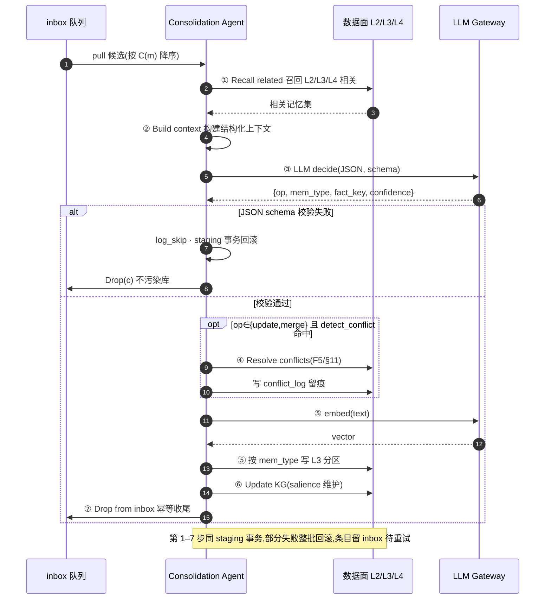
```mermaid
sequenceDiagram
    autonumber
    participant IB as inbox 队列
    participant CA as Consolidation Agent
    participant DP as 数据面 L2/L3/L4
    participant GW as LLM Gateway

    IB->>CA: pull 候选(按 C(m) 降序)
    CA->>DP: ① Recall related 召回 L2/L3/L4 相关
    DP-->>CA: 相关记忆集
    CA->>CA: ② Build context 构建结构化上下文
    CA->>GW: ③ LLM decide(JSON, schema)
    GW-->>CA: {op, mem_type, fact_key, confidence}
    alt JSON schema 校验失败
        CA->>CA: log_skip · staging 事务回滚
        CA->>IB: Drop(c) 不污染库
    else 校验通过
        opt op∈{update,merge} 且 detect_conflict 命中
            CA->>DP: ④ Resolve conflicts(F5/§11)
            CA->>DP: 写 conflict_log 留痕
        end
        CA->>GW: ⑤ embed(text)
        GW-->>CA: vector
        CA->>DP: ⑤ 按 mem_type 写 L3 分区
        CA->>DP: ⑥ Update KG(salience 维护)
        CA->>IB: ⑦ Drop from inbox 幂等收尾
    end
    note over CA,DP: 第 1–7 步同 staging 事务,部分失败整批回滚,条目留 inbox 待重试
```

## 5.3 动态遗忘（淘汰力）

稳定度与动态阈值随访问与系统压力自适应：

$$stability'(m) = S_0\,\gamma^{access\_count}\left(1+\lambda\frac{importance}{10}\right)$$

$$\text{新稳定度} = \text{初始稳定度}\times\text{增益系数}^{\,\text{命中次数}}\times\left(1+\text{重要性系数}\times\frac{\text{重要性}}{10}\right)$$

> 中文释义:每次被命中,稳定度按"增益系数的命中次数次方"增长,重要记忆再获额外加成,体现间隔重复的抗遗忘效应。

$$\theta_{forget}^{dyn} = \theta_{forget}\big(1+\kappa(u-u_0)\big),\quad u=\frac{|L2_{active}|}{C_{epi}}$$

$$\text{动态遗忘阈值} = \text{基线阈值}\times\big(1+\text{压力系数}\times(\text{占用率}-\text{占用基线})\big),\quad \text{占用率}=\frac{\text{L2 活跃记忆数}}{\text{L2 容量上限}}$$

> 中文释义:占用率越高,遗忘阈值越严,高水位加速清理、低水位宽松保留。占用率仅统计 active 记忆(archived 已下沉冷存,不计入热区压力)。归档态可被检索命中经 reinforce 复活,故遗忘为可逆降维,与巩固升维双向流动。

## 5.4 知识图谱（沉淀形态）

节点显著度更新：

$$salience'(n) = \mu\, salience(n) + (1-\mu)\cdot \mathrm{norm}\Big(ref\_count(n) + \sum_{e}weight(e)\Big)$$

$$\text{新显著度} = \text{衰减系数}\times\text{原显著度} + (1-\text{衰减系数})\times\mathrm{归一化}\Big(\text{引用数} + \sum\text{边权重}\Big)$$

> 中文释义:节点显著度按"衰减系数"做指数平滑——旧值保留一部分,新值由"引用数 + 边权之和"经归一化贡献。衰减系数默认 0.8;归一化算子(min-max 或 sigmoid)保证显著度始终落在 [0,1],避免迭代后越界。

## 5.5 混合检索（统一读出口）

三路召回（dense + sparse + graph）RRF 融合再叠加 F2：

$$score_{hybrid}(m) = \sum_{r\in\{dense,sparse,graph\}}\frac{1}{k_0 + rank_r(m)} + w_h\, score_{F2}(m)$$

$$\text{混合得分} = \sum_{\text{路}\in\{\text{向量},\text{关键词},\text{图谱}\}}\frac{1}{\text{抑制常数} + \text{该路排名}} + \text{叠加权重}\times\text{F2 得分}$$

> 中文释义:采用 RRF(倒数排名融合)——每条记忆在三路召回中各取"1/(抑制常数+排名)"求和,再叠加 F2 得分。排名从 1 起;未被某路召回则该项记 0。抑制常数 $k_0$=60,叠加权重默认 1.0。按排名而非原始分融合,对各路打分尺度差异更鲁棒。

**混合检索读路径图**:一次 recall 由 Recall Agent 编排,三路并发召回后经 RRF 融合、F2 重排、命中回写,全程默认零 LLM 以守住 P99<80ms。

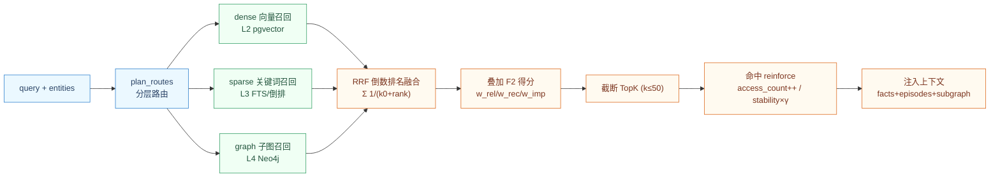
```mermaid
flowchart LR
    Q["query + entities"] --> RT["plan_routes<br/>分层路由"]
    RT --> D["dense 向量召回<br/>L2 pgvector"]
    RT --> S["sparse 关键词召回<br/>L3 FTS/倒排"]
    RT --> G["graph 子图召回<br/>L4 Neo4j"]
    D --> RRF["RRF 倒数排名融合<br/>Σ 1/(k0+rank)"]
    S --> RRF
    G --> RRF
    RRF --> F2["叠加 F2 得分<br/>w_rel/w_rec/w_imp"]
    F2 --> TOPK["截断 TopK (k≤50)"]
    TOPK --> REIN["命中 reinforce<br/>access_count++ / stability×γ"]
    REIN --> CTX["注入上下文<br/>facts+episodes+subgraph"]

    classDef route fill:#ebf8ff,stroke:#3182ce,color:#2a4365
    classDef recall fill:#f0fff4,stroke:#38a169,color:#22543d
    classDef fuse fill:#fffaf0,stroke:#dd6b20,color:#7b341e
    class Q,RT route
    class D,S,G recall
    class RRF,F2,TOPK,REIN,CTX fuse
```

## 5.6 配置中心（关键参数）

所有阈值集中配置，支持「全局默认 → 租户 → 会话」三级覆盖，热更新生效，便于自调优阶段按指标反馈调参。

| 参数 | 含义 | 默认值 | 作用域 / 影响 |
|---|---|---|---|
| θ_ctx | L0 压缩触发占比 | 60% | 会话级，越低越早压缩 |
| K | 每 K 轮强制压缩 | 8 轮 | 会话级 |
| C_wm | L1 容量上限 | 2k token | 会话级，工作记忆硬上限 |
| θ_reflect | reflect 触发的重要性累积 | 150 | 租户级，演化频率 |
| C_epi | L2 容量上限 | 1e5 条 | 租户级，逐出压力 |
| θ_forget | 遗忘软删基线阈值 | 0.15 | 全局，配 κ 动态收紧 |
| θ_conf | L3 置信度淘汰阈值 | 0.3 | 全局，F5 |
| θ_gap | F5 置信度近似带宽 | 0.2 | 全局，F5 仲裁 |
| decay_rec | F2 近因衰减/小时 | 0.99 | 全局 |
| S0 | 初始稳定度 | 86400 秒（24h） | 全局，F3 |
| γ | reinforce 稳定度增益 | 1.5 | 全局，间隔重复强度 |
| w_rel/w_rec/w_imp | F2 三项权重 | 0.55/0.20/0.25 | 全局，检索倾向 |
| rrf_k0 | RRF 抑制常数 | 60 | 全局，混合融合平滑 |
| T_grace | 新记忆遗忘保护期 | 24h | 全局，防新记忆误删 |
| θ_merge | 巩固压缩合并相似度 | 0.92 | 全局，§5.2 |
| θ_conflict_sim | 冲突检测语义相似阈值 | 0.85 | 全局，§11 |
| backend_mode | 后端装配模式 | memory | 全局，memory / production |
| persist_on_write | 写链路是否同步写整租户快照 | true | 生产建议 false，降低 observe/memorize 关键路径开销 |
| retrieval_candidate_hard_limit | L2 检索候选硬上限 | 1000 | 租户级，避免无 sparse 命中时全量扫描 |
| redis_url/postgres_dsn/neo4j_uri | 生产外部依赖连接配置 | 无 | production 模式必填 |
| llm_gateway_url | 统一 LLM Gateway 地址 | 无 | production 模式必填，用于 decide_json/embed |

调参建议：召回命中率偏低→提 w_rel 或降 θ_forget；遗忘误删率偏高→提 θ_conf/降 κ/提 T_grace；巩固转化率异常→调 θ_reflect。配置改动经灰度后再全量。

---
# 六、统一接口契约

基础六接口 + 搜索/记忆/遗忘/更新四维度封装。

## 6.1 基础六接口

```python
observe(msg)         -> {mem_id, compress_triggered}   # 写, MEMORY_WRITE
recall(query, k=8)   -> {facts, episodes, subgraph, reinforced}  # 读, MEMORY_READ, 自动 reinforce
get_context()        -> str                            # 读, 拼装 L1 + 召回
upsert_fact(fact)    -> {fact_key, version, action}    # 写 L3, 触发 F5
reflect(force=False) -> {n_facts, n_insights, promoted_l4}  # 演化, 异步/ADMIN
forget_sweep()       -> {checked, archived, deleted, theta_dyn, occupancy}  # 演化, 异步/ADMIN
backend_diagnostics() -> {profile, adapters, external_services}  # 诊断, READ/ADMIN
```

> 实现约束：基础接口对外保持稳定，后端切换不改变调用方契约。`AgentMemory(config, backend=None)` 默认按 `MemoryConfig.backend_mode` 构建后端；测试可显式传入 `MemoryBackendBundle`，生产通过 `build_production_backend(config)` 组装 Redis/PG/Neo4j/LLM Gateway Adapter。

## 6.2 四维度封装（复用既有链路，不引入新业务逻辑）

| 维度 | 功能定义 | 触发逻辑 | 边界说明 |
|---|---|---|---|
| 搜索 search | 跨层混合检索，封装分层路由+F2 | recall/Agent 主动调用，命中即 reinforce | 仅 active；跨 tenant 拒绝；k≤50；无命中返回空 |
| 记忆 memorize | 显式写入，封装 observe→compress→promote | 主动记忆或"记住"指令 | importance 越界 clip；mem_id 幂等；超 C_wm 二次压缩 |
| 遗忘 forget | 封装 forget_sweep，decay/hard/expire 三模式 | 每日 decay；用户删除 hard；过期 expire | 豁免保护：importance≥9 或被 L4 引用需 ADMIN 二次确认 |
| 更新 update | 字段级修改，改 L3 走 F5，改 L2 可 re_embed | reflect 新证据/reinforce/用户修正 | mem_id、ts_create 不可改；L3 强制经 F5；re_embed 失败回滚 |
| 后端诊断 backend_diagnostics | 暴露 Port/Adapter 组合与外部依赖健康 | 上线自检、运维巡检、集成测试 | 不返回密钥；连接串必须脱敏；不进入业务关键路径 |

权限分级：`MEMORY_READ < MEMORY_WRITE < MEMORY_ADMIN`（高权限继承低权限能力）。

**接口分层图**:四维度封装(搜索/记忆/遗忘/更新)不引入新业务逻辑,而是对基础六接口的语义聚合,基础接口再落到 L0–L4 数据面与三链路。下图自上而下展示「业务维度 → 基础接口 → 数据面」三层依赖与权限边界。

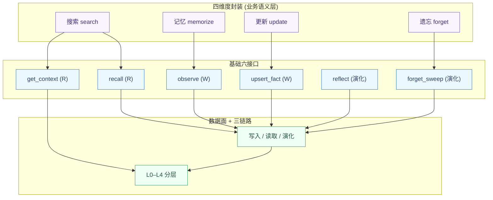
```mermaid
flowchart TD
    subgraph DIM["四维度封装 (业务语义层)"]
        SE["搜索 search"]
        ME["记忆 memorize"]
        FO["遗忘 forget"]
        UP["更新 update"]
    end
    subgraph API["基础六接口"]
        OB["observe (W)"]
        RE["recall (R)"]
        GC["get_context (R)"]
        UF["upsert_fact (W)"]
        RF["reflect (演化)"]
        FW["forget_sweep (演化)"]
    end
    subgraph DATA["数据面 + 三链路"]
        L["L0–L4 分层"]
        CH["写入 / 读取 / 演化"]
    end
    SE --> RE
    SE --> GC
    ME --> OB
    FO --> FW
    UP --> UF
    RE --> CH
    OB --> CH
    UF --> CH
    RF --> CH
    FW --> CH
    GC --> L
    CH --> L

    classDef dim fill:#faf5ff,stroke:#805ad5,color:#44337a
    classDef api fill:#ebf8ff,stroke:#3182ce,color:#2a4365
    classDef data fill:#f0fff4,stroke:#38a169,color:#22543d
    class SE,ME,FO,UP dim
    class OB,RE,GC,UF,RF,FW api
    class L,CH data
```

> 权限自上而下收紧:search/get_context 属 READ;memorize/update 属 WRITE;forget/reflect/forget_sweep 含 ADMIN 受控动作。维度层只做聚合与边界校验,真正的状态变更全部下沉到基础接口与三链路,避免逻辑重复。

## 6.3 关键接口请求/响应契约

核心读写接口的请求体、响应体、权限与时序定位，供工程直接对接。

**observe**：

```json
// request
{"session_id": "s1", "msg": {"role": "user", "content": "...", "ts": 1719000000.0}}
// response
{"mem_id": null, "compress_triggered": true, "l1_token_used": 1840}
```

**recall**：

```json
// request
{"session_id": "s1", "query": "记忆系统 分层", "k": 8, "entities": ["记忆系统"]}
// response
{
  "facts": [{"key": "...", "value": "...", "confidence": 0.9}],
  "episodes": [{"mem_id": "u-1", "text": "...", "score": 0.83}],
  "subgraph": {"nodes": [], "edges": []},
  "reinforced": ["u-1"]
}
```

**upsert_fact**：

```json
// request
{"fact_key": "user.lang_pref", "value": "zh", "confidence": 0.95, "evidence_ids": ["u-1"]}
// response
{"fact_key": "user.lang_pref", "version": 2, "action": "replaced"}  // action ∈ replaced/kept/archived
```

**reflect / forget_sweep**：

```json
// reflect response
{"n_facts": 3, "n_insights": 1, "promoted_l4": ["concept:memory"]}
// forget_sweep response
{"checked": 120, "archived": 7, "deleted": 0, "theta_dyn": 0.162, "occupancy": 0.74}
```

| 接口 | 权限 | 时序 | 幂等 / 容错 |
|---|---|---|---|
| observe | WRITE | 同步关键路径 | Redis 降级纯内存 |
| recall | READ | 同步 P99<80ms | reinforce 可丢失，下次补偿 |
| upsert_fact | WRITE | 同步 | fact_key 幂等，F5 仲裁 |
| reflect | ADMIN | 异步调度 | staging 双写，整批回滚 |
| forget_sweep | ADMIN | 异步（reflect 之后） | 软删可复活，豁免 imp≥9 |

**接口调用时序图**:下图串起一轮交互中六接口的典型调用顺序——同步段(observe/recall/get_context/upsert_fact)在关键路径内即时返回,演化段(reflect/forget_sweep)由调度器在关键路径外异步触发。

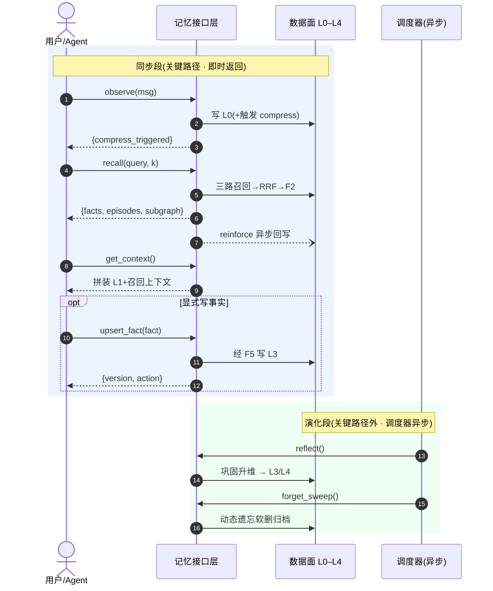
```mermaid
sequenceDiagram
    autonumber
    actor U as 用户/Agent
    participant API as 记忆接口层
    participant DP as 数据面 L0–L4
    participant SCH as 调度器(异步)

    rect rgb(235,244,255)
    note over U,DP: 同步段(关键路径 · 即时返回)
    U->>API: observe(msg)
    API->>DP: 写 L0(+触发 compress)
    API-->>U: {compress_triggered}
    U->>API: recall(query, k)
    API->>DP: 三路召回→RRF→F2
    API-->>U: {facts, episodes, subgraph}
    API--)DP: reinforce 异步回写
    U->>API: get_context()
    API-->>U: 拼装 L1+召回上下文
    opt 显式写事实
        U->>API: upsert_fact(fact)
        API->>DP: 经 F5 写 L3
        API-->>U: {version, action}
    end
    end

    rect rgb(240,255,244)
    note over SCH,DP: 演化段(关键路径外 · 调度器异步)
    SCH->>API: reflect()
    API->>DP: 巩固升维 → L3/L4
    SCH->>API: forget_sweep()
    API->>DP: 动态遗忘软删归档
    end
```

---
# 七、工程落地与交付

端到端时序、一致性容错、可观测性、容量性能、分阶段交付。

读写同步、演化异步。observe/recall 在关键路径（目标 P99 < 80ms）；compress/promote/reflect/forget_sweep 移出关键路径走调度器。

## 7.1 一致性与容错

| 操作 | 一致性 | 补偿 |
|---|---|---|
| observe→L0 | 可用性优先（内存+Redis，降级纯内存） | Redis 故障降级纯内存 |
| promote→L2 | 幂等写（mem_id 内容指纹） | PG 权威源 + 向量库最终对齐 + 重试队列 |
| reflect→L3/L4 | 最终一致 | staging 双写，部分失败整批回滚 |
| reinforce | 可丢失（幂等累加） | 下次命中补偿 |

**故障降级图**:下图展示各存储后端故障时的降级路径——核心原则是「在线读写永不被阻断」,异步链路可暂缓但保证最终一致,所有降级动作对应 §7.7 doctor 的诊断项。

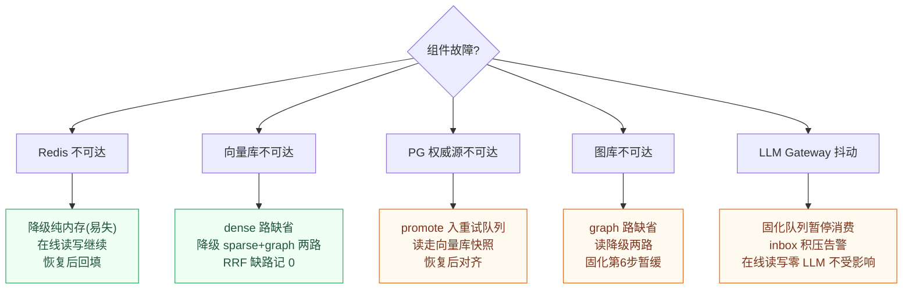
```mermaid
flowchart TD
    START{"组件故障?"}
    REDIS["Redis 不可达"]
    VEC["向量库不可达"]
    PG["PG 权威源不可达"]
    GRAPH["图库不可达"]
    LLM["LLM Gateway 抖动"]

    START --> REDIS --> RD["降级纯内存(易失)<br/>在线读写继续<br/>恢复后回填"]
    START --> VEC --> VD["dense 路缺省<br/>降级 sparse+graph 两路<br/>RRF 缺路记 0"]
    START --> PG --> PD["promote 入重试队列<br/>读走向量库快照<br/>恢复后对齐"]
    START --> GRAPH --> GD["graph 路缺省<br/>读降级两路<br/>固化第6步暂缓"]
    START --> LLM --> LD["固化队列暂停消费<br/>inbox 积压告警<br/>在线读写零 LLM 不受影响"]

    classDef online fill:#f0fff4,stroke:#38a169,color:#22543d
    classDef async fill:#fffaf0,stroke:#dd6b20,color:#7b341e
    class RD,VD online
    class PD,GD,LD async
```

> 降级分层:**在线读写(L0 缓冲 + 三路召回)永不阻断**——任一存储缺失只削减召回路数或转易失模式;**异步链路(promote 对齐 / 固化 / 图更新)可暂缓**,靠重试队列与 inbox 保证最终一致。每条降级路径均被 doctor 健康自检覆盖(§7.7)。

## 7.2 可观测性指标

| 指标 | 健康基线 | 采集口径 | 关联模块 |
|---|---|---|---|
| 召回命中率 | > 0.6 | 标注集上 top-k 命中相关项占比 | 混合检索/F2 |
| 巩固转化率 | 0.1–0.3 | reflect 产出事实/洞察数 ÷ 候选事件数 | 巩固/C(m) |
| 遗忘误删率 | < 0.05 | 被软删后又经 reinforce 复活的占比 | 动态遗忘/F4 |
| 检索 P99 | < 80ms | recall 同步段端到端延迟 | 关键路径 |
| 冲突误判率 | < 0.05 | conflict_log 中被人工/回滚纠正占比 | 冲突治理/§11 |

## 7.3 容量与性能估算

关键路径只读 L1 + 召回结果，演化全部离线，保证 recall P99<80ms。本节给出**可复算的估算模型**:先固定一组基准假设,再逐层推导存储、延迟、吞吐与规模化成本,所有数字均可按实际参数代入重算。

**基准假设(估算输入)**:

| 符号 | 含义 | 基准取值 | 来源 |
|---|---|---|---|
| d | embedding 维度 | 768 | §5.6 |
| C_epi | 单用户 L2 容量上限 | 1e5 条 | §5.6 |
| C_wm | L1 工作记忆上限 | 2k token | §5.6 |
| W_raw | L0 窗口轮数 | 8 轮 | §5.6 (K) |
| L_text | 单条记忆正文均长 | 200 token ≈ 800 B | 假设 |
| occ | 典型用户实际占用率 | 10%(典型) / 100%(满载) | 假设 |
| QPS_u | 单用户峰值 recall QPS | 0.2(对话间隔~5s) | 假设 |

### 7.3.1 存储容量分层估算

单条 L2 记忆的物理开销 = 向量 + 正文 + 元数据:

$$size_{L2}(1) = \underbrace{d\times 4\text{B}}_{\text{向量}=3072\text{B}} + \underbrace{L_{text}}_{\approx 800\text{B}} + \underbrace{meta}_{\approx 200\text{B}} \approx 4.0\text{ KB}$$

| 层 | 单位规模 | 单用户满载 | 单用户典型(occ=10%) | 说明 |
|---|---|---|---|---|
| L0 | W_raw×单轮~0.5KB | ~4 KB / 会话 | 易失 | Redis,不计长期容量 |
| L1 | C_wm=2k token | ~8 KB / 会话 | 易失 | 内存,会话级 |
| L2 | 4.0KB × C_epi | **≈ 400 MB** | ≈ 40 MB | 向量占 307MB,主成本 |
| L3 | 4.0KB × ~5e3 fact | ≈ 20 MB | ≈ 2–5 MB | fact_key 去重天然有界 |
| L4 | ~1e3 节点+5e3 边 | ≈ 10–30 MB | ≈ 数 MB | 实体归并,规模可控 |
| **合计** | — | **≈ 440 MB / 用户(满载)** | **≈ 50 MB / 用户(典型)** | L2 主导 |

> 关键结论:**L2 向量是存储主成本**(占满载的 ~70%)。降本三杠杆:① 降维(d=768→384 向量减半);② 标量量化(float32→int8 向量再减 75%);③ archived 下沉廉价存储(冷热分层,§7.4)。

### 7.3.2 recall 延迟逐段拆解

recall 同步段延迟由各阶段串/并行组合而成。三路召回**并行**,取最慢路;reinforce 与 L3 取数移出关键路径:

| 阶段 | 耗时 | 串/并行 | 计入同步段 |
|---|---|---|---|
| embed(query) | ~10 ms | 串行起点 | ✅ |
| dense ANN(L2) | ~20 ms | 三路并行 | ✅(取 max) |
| sparse 关键词(L2) | ~10 ms | 三路并行 | (被覆盖) |
| graph 子图(L4) | ~40 ms | 三路并行 | ✅(取 max=瓶颈) |
| RRF 融合 + F2 重排 | ~10 ms | 串行 | ✅ |
| reinforce 回写 | ~5 ms | **异步** | ❌ |
| L3 权威事实取数 | ~15 ms | **与三路并行** | (被覆盖) |

$$T_{recall} \approx T_{embed} + \max(T_{dense}, T_{sparse}, T_{graph}) + T_{rrf+f2} = 10 + 40 + 10 = \mathbf{60\text{ ms}}$$

> P99 预算 80ms,推导值 60ms 留 **20ms 余量**(~25%)吸收抖动。瓶颈在 graph 子图召回(40ms);若 L4 规模增长致 graph 超时,降级为 dense+sparse 两路(§7.1),延迟降至 ~40ms,保命优先。

### 7.3.3 写入与演化吞吐

| 链路 | 单次成本 | 执行方式 | 吞吐约束 |
|---|---|---|---|
| observe→L0 | ~1 ms(内存+Redis) | 同步 | 不成瓶颈,QPS 可达数千 |
| compress(L0→L1) | 每 K=8 轮或超 θ_ctx 触发 | 同步 | 摊销后每轮 <2ms |
| promote(L1→L2) | F1 打分 + 幂等写 ~10ms | 同步 | 任务闭合时触发,低频 |
| consolidate(7步) | **LLM 主导 ~1–3s/条** | 异步 | inbox 积压取决于 LLM 并发 |
| forget_sweep | O(active) 全扫 ~占用×0.5μs | 异步(日级) | 1e5 条扫描 ~50ms |

> 演化吞吐瓶颈在 **LLM 调用**(consolidate 单条 1–3s)。设计应对:① inbox 按 C(m) 排序优先固化高价值条目;② LLM Gateway 限流 + 批处理;③ 积压超阈值由 doctor 告警(§7.7)。在线读写不含 LLM,不受此瓶颈影响。

### 7.3.4 规模化成本测算

按租户规模线性外推(满载上界 / 典型值双口径):

| 规模 N(用户) | 向量存储(满载) | 向量存储(典型 occ=10%) | 峰值 recall QPS | 备注 |
|---|---|---|---|---|
| 1e3 | ~440 GB | ~50 GB | ~200 | 单机向量库可承载 |
| 1e4 | ~4.4 TB | ~500 GB | ~2,000 | 需分片 + 量化 |
| 1e5 | ~44 TB | ~5 TB | ~20,000 | 必须 int8 量化 + 冷热分层 |

> 峰值 QPS = N × QPS_u × 峰值系数。规模化关键:**典型占用仅满载 10%**,叠加 int8 量化(再降 75%),1e4 用户实际向量存储可压到 ~125GB 量级;recall 无状态可水平扩,瓶颈回到向量库分片与 LLM 固化并发,而非在线读路径。

## 7.4 冷启动与多租户隔离

- **冷启动**：新用户 L2/L3/L4 为空，recall 返回空集，Agent 退化为纯 L0/L1 上下文，随交互逐步积累，无需预热。
- **租户隔离**：session_id / tenant_id 贯穿所有层为强制过滤键，跨租户检索直接拒绝；向量库按租户分区，避免邻居污染。
- **冷热分层**：archived 记忆下沉廉价存储，active 留热区；命中 archived 经 reinforce 复活回热区。

## 7.5 测试与验收策略

| 测试类型 | 验证点 | 通过标准 |
|---|---|---|
| 单元 | F1–F5 公式取值、clip 边界、access_count=0 边界、F5 仲裁分支 | 覆盖率>85% |
| 检索质量 | 标注集上混合检索 vs 单路 | 召回命中率>0.6 |
| 遗忘安全 | 重放衰减、新记忆 T_grace 保护、豁免与软删可复活 | 误删率<0.05 |
| 性能 | recall 压测 | P99<80ms |
| 一致性 | promote 幂等、reflect 回滚、状态机并发 | 无脏写/无重复 |
| 冲突治理 | detect/resolve 分支、conflict_log 留痕与回滚 | 误判率<0.05，无静默覆盖 |

## 7.6 分阶段交付（四阶段）

| 阶段 | 目标 | 范围（层 / 机制 / 接口） | 退出标准 |
|---|---|---|---|
| 阶段 1 · MVP（止血） | 跑通读写主链路 | L0/L1/L2；F1/F2/F3/F4；observe/recall/forget_sweep；F5 拆为显式 detect→resolve，仅 L3 同 key 值冲突，强制落 conflict_log | recall P99<80ms；无静默覆盖 |
| 阶段 2 · 演化 | 长期记忆沉淀 | 加 L3 + reflect + 巩固；冲突扩至语义相似+时序；动作扩 merge/pending/reject | 巩固转化率 0.1–0.3 |
| 阶段 3 · 认知 | 关系与跨层一致 | 加 L4 知识图谱 + 混合检索第三路；L2↔L3↔L4 跨层冲突检测与级联 | 召回命中率>0.6 |
| 阶段 4 · 自调优 | 指标驱动调参 | 基于 log 统计误判率/回滚率反馈调参；置信度自校准；高风险冲突自动升级人工 | 遗忘/冲突误判率<0.05 |

**收口**：5 类表结构、10 个接口、配置中心全部参数、8 条公式、多张流程图逻辑连贯、相互引用、无孤立概念，可直接进入工程实现。

**四阶段交付路线图**:能力逐阶叠加,每阶以可量化退出标准为门禁,前阶不达标不进下一阶。

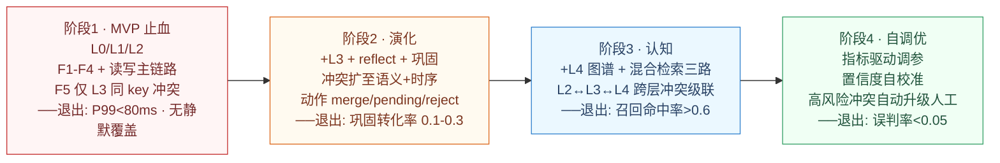
```mermaid
flowchart LR
    A["阶段1 · MVP 止血<br/>L0/L1/L2<br/>F1-F4 + 读写主链路<br/>F5 仅 L3 同 key 冲突<br/>──退出: P99<80ms · 无静默覆盖"]
    B["阶段2 · 演化<br/>+L3 + reflect + 巩固<br/>冲突扩至语义+时序<br/>动作 merge/pending/reject<br/>──退出: 巩固转化率 0.1-0.3"]
    C["阶段3 · 认知<br/>+L4 图谱 + 混合检索三路<br/>L2↔L3↔L4 跨层冲突级联<br/>──退出: 召回命中率>0.6"]
    D["阶段4 · 自调优<br/>指标驱动调参<br/>置信度自校准<br/>高风险冲突自动升级人工<br/>──退出: 误判率<0.05"]
    A --> B --> C --> D

    classDef s1 fill:#fff5f5,stroke:#c53030,color:#742a2a
    classDef s2 fill:#fffaf0,stroke:#dd6b20,color:#7b341e
    classDef s3 fill:#ebf8ff,stroke:#3182ce,color:#2a4365
    classDef s4 fill:#f0fff4,stroke:#38a169,color:#22543d
    class A s1
    class B s2
    class C s3
    class D s4
```

## 7.7 运维控制面（Control Plane）

记忆系统是有状态、含异步调度与多存储后端(Redis / 向量库 / 图库)的服务,必须配套独立于业务读写链路的**运维控制面**,负责安装、服务管理、配置下发与健康自检。控制面与数据面(三链路)解耦,故障排查不影响在线读写。

| 命令域 | 职责 | 典型动作 |
|---|---|---|
| **setup** | 初始化 | 建表/索引(§9 DDL)、初始化向量库与图库 schema、写入默认配置、校验依赖版本 |
| **service** | 服务管理 | 启停调度器(evolve/forget_sweep/graph_audit)、查看作业队列与 inbox 积压、手动触发一次固化/遗忘 |
| **config** | 配置管理 | 查看/下发 §5.6 参数(三级覆盖)、灰度发布、回滚、热更新生效校验 |
| **doctor** | 健康自检 | 一键体检各组件连通性与一致性,输出红黄绿诊断报告 |

**doctor 健康自检项**(对应 §7.2 可观测性,做"主动巡检"而非"被动监控"):

| 检查项 | 判定 | 异常处置建议 |
|---|---|---|
| 存储连通性 | Redis / 向量库 / 图库 / PG 是否可达 | Redis 不可达→提示已降级纯内存(易失) |
| 一致性漂移 | PG 权威源与向量库条数/指纹是否对齐 | 漂移→触发重建对齐队列 |
| inbox 积压 | 待固化条目数是否超阈值 | 积压→提示调度器停摆或 LLM 限流 |
| 调度器心跳 | evolve/forget_sweep/graph_audit 上次成功时间 | 超期→重启对应作业 |
| 容量水位 | L2 占用率 u、图谱规模 | 高水位→提示收紧 θ_forget 或扩容 |
| 配置合法性 | 各阈值是否在合理域、权重和是否为 1 | 非法→拒绝下发并定位项 |

> 落地约束:控制面仅暴露**只读诊断 + 受控运维动作**,所有写动作(config 下发、手动触发)须带租户/权限校验并留审计;doctor 设计为幂等只读,可安全高频调用,作为上线前置门禁与值班巡检入口。

---
# 八、符号与术语速查表

全文公式与配置使用的符号、单位、来源集中索引，便于评审与实现时快速对照。

| 符号 / 术语 | 含义 | 单位 / 取值 | 出处 |
|---|---|---|---|
| importance | 记忆重要性 | 整数 0–10 | F1 |
| e_q, e_m | query / 记忆向量 | 归一化向量 | F2 |
| decay_rec | 近因衰减/小时 | 0.99 | F2 / 配置 |
| t_acc | 上次访问时刻 | epoch 秒 | F2 / F3 |
| stability | 稳定度 | ≥ S0，秒 | F3 / reinforce |
| retention | 保持率 | 0–1 | F3 |
| access_count | 累计命中次数 | 整数 ≥0 | F4 / 稳定度 |
| forget_score | 综合遗忘分（越小越该忘） | 实数 ≥0 | F4 |
| confidence | L3 事实置信度 | 0–1 | F5 |
| θ_gap | F5 置信度近似带宽 | 0.2 | F5 |
| u, u0 | L2 active 占用率 / 基线 | 0–1 / 0.8 | 动态阈值 |
| γ, λ, κ | 稳定度增益 / 重要性系数 / 压力系数 | 1.5 / 0.5 / 0.5 | 动态遗忘 |
| μ | salience 衰减系数 | 0.8 | §5.4 |
| α, β, δ | 巩固强度权重 | 0.4 / 0.3 / 0.3 | §5.2 |
| T_grace | 新记忆遗忘保护期 | 24h | §3.3 / 配置 |
| θ_merge | 巩固合并相似度 | 0.92 | §5.2 |
| θ_conflict_sim | 冲突检测相似阈值 | 0.85 | §11 |
| rrf_k0 | RRF 抑制常数 | 60 | 混合检索 |

# 九、参考建库 DDL

把第三章字段级 schema 翻译为可执行建表语句，L2/L3 以 PostgreSQL + pgvector 为例，L4 给出 Neo4j 约束，可直接用于工程初始化。

```sql
CREATE TABLE l2_episodic (
  mem_id          TEXT PRIMARY KEY,                    -- 内容指纹派生，幂等
  embedding       VECTOR(768) NOT NULL,
  text            TEXT NOT NULL,
  importance      SMALLINT NOT NULL CHECK (importance BETWEEN 0 AND 10),
  ts_create       DOUBLE PRECISION NOT NULL,
  ts_last_access  DOUBLE PRECISION NOT NULL,           -- 初始 = ts_create
  access_count    INT NOT NULL DEFAULT 0,
  stability       DOUBLE PRECISION NOT NULL DEFAULT 86400,
  status          TEXT NOT NULL DEFAULT 'active'
                  CHECK (status IN ('active','archived','deleted')),
  source_ids      JSONB DEFAULT '[]',
  tenant_id       TEXT NOT NULL
);
CREATE INDEX idx_l2_vec  ON l2_episodic USING ivfflat (embedding vector_cosine_ops);
CREATE INDEX idx_l2_scan ON l2_episodic (tenant_id, status, importance);
```

```sql
CREATE TABLE l3_semantic (
  fact_key      TEXT NOT NULL,
  tenant_id     TEXT NOT NULL,
  value         JSONB NOT NULL,
  confidence    REAL NOT NULL CHECK (confidence BETWEEN 0 AND 1),
  evidence_ids  JSONB DEFAULT '[]',
  version       INT NOT NULL DEFAULT 1,
  ts_update     DOUBLE PRECISION NOT NULL,
  is_temporal   BOOLEAN NOT NULL DEFAULT FALSE,
  valid_from    DOUBLE PRECISION,
  valid_until   DOUBLE PRECISION,
  embedding     VECTOR(768),
  PRIMARY KEY (tenant_id, fact_key, version)
);
CREATE INDEX idx_l3_active ON l3_semantic (tenant_id, fact_key, version DESC);
```

```text
CREATE CONSTRAINT node_id IF NOT EXISTS
  FOR (n:MemNode) REQUIRE n.id IS UNIQUE;
// node: {id, type∈[entity,concept,insight], salience, evidence_ids, tenant_id, status}
// edge: [:REL {type∈[cause,belong,temporal,similar], weight}]
CREATE INDEX node_salience IF NOT EXISTS FOR (n:MemNode) ON (n.tenant_id, n.salience);
```

说明：向量维度 768 按实际 embedding 模型调整；L0/L1 为易失态走内存 + Redis，不建持久表；所有表以 tenant_id 为强制隔离键，与 §7.4 多租户隔离一致。

---
# 十、端到端调用时序伪代码

三链路的可读伪代码，标注同步/异步边界与关键路径耗时分配，与 §2.1 三链路、§六 接口契约逐一对应。

```python
def on_message(tenant_id, user_id, session_id, msg):   # 每轮消息入口
    # 隔离键(tenant_id/user_id)随消息第一跳即落地, 不依赖会话元数据二次反查
    L0.append(tenant_id, user_id, session_id, msg)      # 同步, 内存+Redis
    if L0.token(session_id) > THETA_CTX or L0.turns(session_id) % K == 0:
        wm = L1.compress(session_id)              # L0→L1 滚动摘要
        for slot in wm.closed_slots():            # 闭合任务槽下沉
            imp = f1_importance(slot.text, slot.user_emphasis)   # F1 一次计算
            mem_id = content_fingerprint(tenant_id, session_id,
                                         slot.source_ids, normalize(slot.text))  # 幂等键
            L2.promote(mem_id=mem_id, text=slot.text,
                       importance=imp, ts_create=now(), ts_last_access=now(),
                       tenant_id=tenant_id)       # 幂等写, 已存在则跳过
    return {"compress_triggered": True}
```

```python
def recall(session_id, query, k=8, entities=None):
    q_emb = embed(query)                          # ~10ms
    # 分层路由 + 三路召回(并行)
    dense  = L2.ann_search(q_emb, k*2, tenant=ctx.tenant, status='active')   # 向量
    sparse = L2.keyword_search(query, k*2, tenant=ctx.tenant)               # 关键词
    graph  = L4.subgraph_for_context(entities, k*2, tenant=ctx.tenant)       # ~40ms 合计
    fused  = rrf_merge([dense, sparse, graph], k0=RRF_K0)   # RRF 融合, 缺路记 0
    ranked = sorted(fused, key=lambda m: f2_score(m, q_emb, now()), reverse=True)  # F2 重排 ~10ms
    top    = ranked[:k]
    async_enqueue(reinforce, [m.mem_id for m in top])   # 回写移出关键路径
    facts  = L3.query_relevant(query, tenant=ctx.tenant)  # 同步取权威事实
    return {"facts": facts, "episodes": top,
            "subgraph": graph, "reinforced": [m.mem_id for m in top]}
```

```python
@scheduler.periodic                               # 离线, 不阻塞关键路径
def evolve(tenant_id):
    if importance_accum(tenant_id) >= THETA_REFLECT:
        # 取 inbox 待固化条目, 按巩固强度 C(m) 降序优先处理
        candidates = sorted(inbox.pull(tenant_id),
                            key=lambda c: consolidation_strength(c), reverse=True)
        for c in candidates:
            with staging_txn() as tx:             # 7 步与收尾同事务, 失败整批回滚, 条目留 inbox 待重试
                related = recall_related(c, scope=['L2','L3','L4'])   # 1 召回相关
                context = build_context(c, related)                  # 2 构建上下文
                decision = llm_decide(context)                      # 3 LLM 结构化决策(JSON)
                if not valid_schema(decision):                      # JSON 校验失败→跳过, 不污染库
                    log_skip(c); tx.rollback(); inbox.drop(c); continue
                if decision.op in ('update','merge') and \
                   detect_conflict(decision, scope=['L2','L3','L4']).has_conflict:
                    resolve_conflict(decision)     # 4 冲突治理(F5/§11), 强制写 conflict_log
                L3.write(decision, mem_type=decision.mem_type, embed=True)  # 5 嵌入+写分区
                L4.update_graph(decision)          # 6 更新知识图谱(salience)
                inbox.drop(c)                      # 7 幂等收尾, 出队
    forget_sweep(tenant_id)                        # 巩固之后再遗忘

def forget_sweep(tenant_id):
    u = L2.occupancy(tenant_id)                    # 仅统计 active
    theta = THETA_FORGET * (1 + KAPPA*(u - U0))    # 动态阈值
    for m in L2.active(tenant_id):
        if m.importance >= 9: continue            # 豁免保护
        if now() - m.ts_create < T_GRACE: continue  # 新记忆保护期
        if f4_forget_score(m, now()) < theta:
            if is_sole_evidence_of_l3(m.mem_id):  # 唯一证据→不删, 降置信复核
                downgrade_l3_confidence(m.mem_id)
            else:
                m.status = "archived"             # 软删, 可被命中复活
```

关键路径只含 recall 同步段（embed + 三路召回 + RRF + F2 ≈ 60ms），reinforce、compress、reflect、forget_sweep 全部异步；命中后的 reinforce 即便丢失，下次命中会自然补偿，保证读延迟稳定在 P99<80ms。

---
# 十一、记忆冲突检测与处理

本章补齐方案此前的薄弱环节：原 F5 仅是埋在 L3 `upsert` 中的隐式置信度覆盖，既无独立的冲突检测前置，也不覆盖 L2/L4 跨层，更缺留痕与回滚。本章把冲突治理提为横切能力，与 F5、§六接口、§九 DDL 衔接成闭环。

下图给出冲突治理的端到端决策流:**检测闸门 → 类型分类 → 严重度分级 → 固定优先级裁决 → 五档动作 → 级联 + 留痕**,后续 §11.1–§11.5 逐段展开。

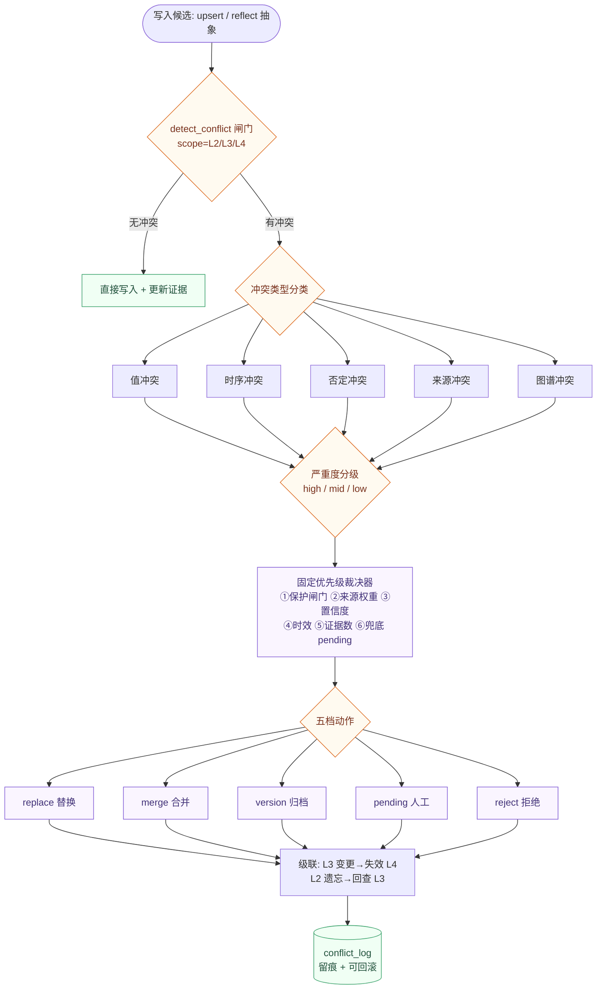
```mermaid
flowchart TB
    W([写入候选: upsert / reflect 抽象]) --> GATE{"detect_conflict 闸门<br/>scope=L2/L3/L4"}
    GATE -->|无冲突| WRITE["直接写入 + 更新证据"]
    GATE -->|有冲突| TYPE{"冲突类型分类"}
    TYPE --> V["值冲突"]
    TYPE --> T["时序冲突"]
    TYPE --> N["否定冲突"]
    TYPE --> S["来源冲突"]
    TYPE --> G["图谱冲突"]
    V & T & N & S & G --> SEV{"严重度分级<br/>high / mid / low"}
    SEV --> POLICY["固定优先级裁决器<br/>①保护闸门 ②来源权重 ③置信度<br/>④时效 ⑤证据数 ⑥兜底 pending"]
    POLICY --> ACT{"五档动作"}
    ACT --> R1["replace 替换"]
    ACT --> R2["merge 合并"]
    ACT --> R3["version 归档"]
    ACT --> R4["pending 人工"]
    ACT --> R5["reject 拒绝"]
    R1 & R2 & R3 & R4 & R5 --> CASCADE["级联: L3 变更→失效 L4<br/>L2 遗忘→回查 L3"]
    CASCADE --> LOG[("conflict_log<br/>留痕 + 可回滚")]

    classDef gate fill:#fffaf0,stroke:#dd6b20,color:#7b341e
    classDef act fill:#faf5ff,stroke:#805ad5,color:#44337a
    classDef store fill:#f0fff4,stroke:#38a169,color:#22543d
    class GATE,TYPE,SEV,ACT gate
    class POLICY,R1,R2,R3,R4,R5 act
    class LOG,WRITE store
```

## 11.1 缺失风险与冲突类型

冲突的本质是「语义矛盾」而非「内容重复」。仅靠置信度数值一刀切，会同时导致漏检、错杀/错留与无审计。

| 风险 | 具体表现 | 触发场景 |
|---|---|---|
| 事实污染 | 新旧矛盾事实同时存活，检索同时召回互斥信息 | 用户改用安卓，旧"iOS"未失效 |
| 答案漂移 | 同一问题不同轮给相反答案 | L2 残留过期偏好，近因权重不足 |
| 静默错误 | 无检测日志，冲突被悄悄吞掉或误覆盖且不可追溯 | 高置信旧值被低质新值误覆盖 |
| 图谱腐化 | L4 出现互斥边，洞察自相矛盾 | reflect 抽象未做一致性校验 |
| 跨层不一致 | L2 事件与 L3 事实说法不一，L4 基于过期事实 | 各层独立写入无统一闸门 |
| 遗忘误伤 | 把"冲突"误判为"重复"直接软删，丢掉对立证据 | 冲突与去重逻辑混用 |

冲突类型枚举：**值冲突**（同 key 不同 value）、**时序冲突**（状态随时间合法变更）、**否定冲突**（"是 X" vs "非 X"）、**来源冲突**（不同来源互斥）、**图谱冲突**（L4 互斥边）。检测环节输出 `conflict_type` 与冲突强度 `severity∈{high,mid,low}`，供处理分级响应。

## 11.2 时序冲突的识别与处理

时序冲突的关键是区分「状态合法变更」（旧值过期而非错误）与「值冲突」（一方为错）。

**识别**：

- **状态型 key 标记**：为 `device.os`、`location.city`、`job.title` 等可随时间变更的 key 置 `is_temporal=true`（见 §3.4 字段表）；静态 key（如 `birth.date`）差异直接判值冲突。
- **三信号联合判定**：① 时间差 $t_{update}^{new} - t_{update}^{old} > \Delta t_{min}$（超合理变更周期）；② 语义关系——新旧 embedding 相似度低但同属该 key 取值域，倾向"变更"；③ 变更信号词——证据含"改成/换了/现在/不再/已经"等迁移信号强化判定。

**处理**：

- **不删旧值，只降级**：旧值 `version++` 归档，新值置 active 当前值，既保证检索拿到最新状态，又保留历史轨迹支持"我之前用什么"类追问。
- **写时间有效区间**：归档旧值补 `valid_until = ts_update^new`，新值 `valid_from = ts_update^new`，形成状态时间线。
- **置信度不惩罚**：时序变更不降旧值置信度（它当时为真），新值按来源权重正常计算。
- **联动 L2**：旧值对应 L2 记忆不软删，由既有 `decay_rec` 近因衰减自然弱化其影响，避免过期事件干扰当前判断。

与值冲突分流：若两值时间相近、变更信号缺失、且语义互斥，则判为 value/negation 冲突，走置信度仲裁而非归档。

## 11.3 跨层冲突检测与一致性保障

核心是确立 **L3 为事实权威源**，L2 为证据、L4 为基于事实的抽象，建立「单向校验链 + 反向溯源」。

**检测机制**：

- **写入前置闸门**：任何进入 L3/L4 的写（upsert、reflect 抽象）必须先过 `detect_conflict()`，禁止各层独立直写——这是一致性总开关。
- **新事实 vs L2 证据**：upsert 时反查 `evidence_ids` 指向的 L2 记忆。多数支持→通过；证据互相矛盾→标 source 冲突挂起；无证据支撑（凭空抽象）→降低初始 confidence，不得覆盖高置信旧值。
- **新洞察 vs L4 既有边**：reflect 写入 `A -belong-> X` 前，检测图中是否已有互斥边 `A -belong-> Y`（单值关系）→ 判 graph 冲突。
- **一致性指纹**：每条 L3 事实维护 `evidence_hash`（证据集快照）；被引用的 L2 记忆遗忘/修改时触发该事实重校验，防止"事实还在、证据已没"的悬空。

**裁决后的级联与保障**：

- **L3 变更 → 级联失效 L4**：事实被替换/归档，自动定位 L4 中 evidence_ids 含该事实的节点/边，标 stale 触发重抽象或 superseded。
- **L2 遗忘 → 回查 L3**：forget_sweep 软删 L2 前，检查是否为某 L3 事实唯一证据，是则该事实 confidence 下调并进入复核，而非悬空。
- **最终一致而非强一致**：跨层级联走异步演化链路（对齐 §7 reflect→L3/L4 最终一致），staging 双写 + 整批回滚，避免中间态。
- **方向约束**：仅允许 L2→L3→L4 单向沉淀校验，禁止 L4 反写 L3 事实（洞察不能凭空造事实），从结构上杜绝循环不一致。

## 11.4 按类型 × 严重程度选择处理动作

采用二维决策：冲突类型决定可选动作集合，严重程度决定集合内取哪一档。处理动作分五档：replace / merge / version 归档 / pending（人工）/ reject。

| 严重等级 | 判定依据 | 含义 |
|---|---|---|
| 强 high | 语义直接互斥，或涉 importance≥9 / 被 L4 引用的关键事实 | 必须裁决，错判代价高 |
| 中 mid | 同 key 不同值，置信度接近（\|Δconf\|<θ_gap=0.2） | 需仲裁，风险可控 |
| 弱 low | 语义相近的细微差异，可共存维度 | 可合并或并存 |

| 冲突类型 | 强 high | 中 mid | 弱 low |
|---|---|---|---|
| 值冲突 | 高置信 replace，低质 reject；双高→pending | 置信优先 replace，旧值归档 | merge 保留并标注 |
| 时序冲突 | 旧值归档+valid_until，新值 active | 同左，正常状态迁移 | 同义更新，直接取新 |
| 否定冲突 | 强制 pending 二次确认 | 证据数+来源权重仲裁 | — |
| 来源冲突 | 用户显式>推断，低权 reject | 按来源权重取胜 | merge 记录多来源 |
| 图谱冲突 | 旧边 superseded+新边入图+子图重校验 | 按 edge.weight 取强 | 双边并存，标注条件 |

**裁决器固定优先级**（可配置 `conflict_policy`，按序命中即止）：① 保护闸门（importance≥9 或被 L4 引用→pending，禁自动覆盖，对齐 §5.3 forget 豁免）② 来源权重（用户显式>reflect 推断>单条证据）③ 置信度（\|Δconf\|≥θ_gap 高者 replace）④ 时效（接近时取 ts_update 新者）⑤ 证据数量（取 evidence_ids 多者）⑥ 兜底（全平→pending，绝不随机覆盖）。

## 11.5 分阶段补全与数据结构

与 §7.6 四阶段交付对齐，先止血、再精细、后智能。

| 阶段 | 能力 | 对齐交付（§7.6） |
|---|---|---|
| 1 止血 | F5 拆为显式 detect→resolve 两段；仅 L3 同 key 值冲突；强制落 conflict_log；新增 θ_conflict_sim / conflict_policy 配置 | 阶段 1 · MVP |
| 2 精细化 | 扩展语义相似冲突+时序冲突；动作扩至 merge/pending/reject；reflect 入库前过闸门；log 支持版本回滚 | 阶段 2 · 演化 |
| 3 跨层一致 | L2↔L3↔L4 跨层检测；裁决触发级联更新；图谱互斥边剪除 | 阶段 3 · 认知 |
| 4 自调优 | 基于 log 统计误判率/回滚率反馈调参；置信度自校准；高风险冲突自动升级人工 | 阶段 4 · 自调优 |

```sql
CREATE TABLE conflict_log (
  conflict_id   UUID PRIMARY KEY,
  tenant_id     TEXT NOT NULL,
  fact_key      TEXT,
  conflict_type TEXT NOT NULL
                CHECK (conflict_type IN ('value','temporal','negation','source','graph')),
  severity      TEXT NOT NULL CHECK (severity IN ('high','mid','low')),
  old_value     JSONB,
  new_value     JSONB,
  policy_hit    TEXT NOT NULL,         -- 命中的仲裁策略
  action        TEXT NOT NULL          -- replace/merge/archive/pending/reject
                CHECK (action IN ('replace','merge','archive','pending','reject')),
  resolved_to   JSONB,                 -- 裁决结果, 支持回滚
  ts            DOUBLE PRECISION NOT NULL
);
CREATE INDEX idx_cflog ON conflict_log (tenant_id, fact_key, ts DESC);
```

```python
detect_conflict(candidate, scope=['L3','L2','L4'])
  -> {has_conflict, conflict_type, severity, rivals: [...], evidence_check}   # 读, MEMORY_READ
resolve_conflict(conflict)
  -> {action, resolved_to, version, log_id}                                   # 写, MEMORY_WRITE/ADMIN
     # 强制写 conflict_log; replace/merge 走 version++ 可回滚
```

最小可落地动作：先把 F5 拆成「检测 + 处理」两段并强制写 conflict_log，改动小、立即消除静默覆盖风险，后续按阶段叠加语义/时序/跨层能力。

---
# 十二、各设计模块问题来源与优缺点评估

本章对方案中每一个设计模块做「问题来源 + 优点 + 缺点」三段式评估，作为设计决策的可追溯依据与后续迭代的取舍清单。**问题来源**统一标注三要素：触发背景（为何要做）、提出方（谁提出）、发现场景（在何处暴露）；**优点 / 缺点**逐点罗列，每点附「实际依据」或「影响」，不做笼统判断。

阅读约定：优点回答「该设计带来什么确定性收益」，缺点回答「该设计在什么条件下会失效或付出代价」，二者共同界定模块的适用边界。

下表先给出全部 13 个模块的「定位 + 核心权衡」总览，便于在阅读各模块详评前建立全局取舍认知。

| 编号 | 模块 | 核心收益（一句话） | 主要代价 / 失效条件 |
|---|---|---|---|
| 12.1 | L0 感觉缓冲 | 削峰隔离 + 零维护易失态 | 容量误配即丢前文，无语义筛选 |
| 12.2 | L1 工作记忆 | 结构化焦点 + 容量受控 | 压缩有损，槽闭合可能误判 |
| 12.3 | L2 情景记忆 | 语义召回 + 软删可复活 | ANN 漏召回，容量膨胀 |
| 12.4 | L3 语义记忆 | 事实权威源 + 可溯源回滚 | 抽象引错，强依赖冲突闸门 |
| 12.5 | L4 认知记忆 | 关系一等公民 + 洞察沉淀 | 图谱腐化，异构存储成本高 |
| 12.6 | 框架与三链路 | 关注点分离 + 关键路径瘦身 | 最终一致窗口期，编排复杂 |
| 12.7 | F1 重要性 | 三源加权可解释 | 权重静态，LLM 分项不稳 |
| 12.8 | 记忆巩固 | 遗忘前先沉淀价值 | 抽象误差累积，阈值敏感 |
| 12.9 | 动态遗忘 | 阈值随负载自适应 | 易与去重混淆，唯一证据误删 |
| 12.10 | 知识图谱 | 关联检索 + salience 优先 | 一致性维护重，查询随规模降速 |
| 12.11 | 混合检索 | 三路互补 + RRF 鲁棒 | 并行成本，参数耦合 |
| 12.12 | 接口契约 | 分层透明 + 权限分级 | 抽象层开销，契约演进需兼容 |
| 12.13 | 冲突治理 | 检测前置 + 全程留痕回滚 | 实现复杂，pending 引入人工 |

## 12.1 L0 感觉缓冲层

**问题来源**

- **触发背景**：原始对话流逐字进入处理链会瞬间撑爆上下文窗口，且绝大多数 token（寒暄、重复、口语填充）无长期价值。
- **提出方**：架构分层设计阶段，由记忆链路负责人提出，对齐人脑「感觉记忆只暂存、秒级衰减」特性。
- **发现场景**：压测长会话时发现，不设缓冲层会导致每轮都把全量历史塞入 L1 压缩，触发重复摘要与 token 浪费。

**优点**

| 优点 | 依据 | 影响 |
|---|---|---|
| 削峰与隔离 | 固定容量环形结构写入 O(1)，天然丢弃最旧；Redis 承接突发洪峰 | 上层压缩频率与负载可预测 |
| 易失态零维护 | 感觉缓冲数据本无归档价值，不建持久表 | 省去落库 I/O 与清理任务，降低运维面 |
| 近因完整性 | 保留最近 N 轮原文供 L1 无损滚动摘要 | 摘要质量不因过早丢字而下降 |

**缺点**

| 缺点 | 依据 / 触发条件 | 影响 |
|---|---|---|
| 容量误配即丢信息 | N 过小，环形覆盖不区分语义重要性 | 需与 L1 阈值 θ_ctx 联调，否则长任务上下文断裂 |
| Redis 单点风险 | 缓冲依赖 Redis，实例抖动丢未下沉窗口 | 须接受「易失」语义，关键信息尽快经 L1 下沉 L2 |
| 无语义筛选 | 本层定位为缓冲而非记忆，仅按时间/容量淘汰 | 价值判断全部压到 F1，F1 负担加重 |

## 12.2 L1 工作记忆层

**问题来源**

- **触发背景**：需要一个「当前任务焦点」的中间态，把零散对话压缩成结构化摘要 + 任务槽，避免直接在原始流上做推理。
- **提出方**：分层框架设计阶段提出，映射人脑工作记忆「容量有限、保持当前焦点」特性。
- **发现场景**：多任务交错会话中，发现无工作记忆层时模型反复在不同任务间丢失中间结论，需要显式槽位承载。

**优点**

| 优点 | 依据 | 影响 |
|---|---|---|
| 结构化焦点 | rolling_summary + 任务槽带开闭状态 | 闭合槽精准触发下沉 L2，开放槽持续维护焦点 |
| 容量受控 | 摘要长度上限 C_wm 强约束，模拟有限容量 | 推理输入规模可控，延迟稳定 |
| 下沉判定清晰 | 以「槽闭合」而非定时为下沉信号 | 只把有结论的内容入库，减少噪声 |

**缺点**

| 缺点 | 依据 / 触发条件 | 影响 |
|---|---|---|
| 压缩有损 | 滚动摘要是有损编码，必丢细节 | 细粒度追问需回查 L0/L2，两者皆失则不可恢复 |
| 摘要质量依赖模型 | 压缩由 LLM 完成，受模型波动影响 | 需 prompt 固化 + 关键字段抽取兜底，否则语义漂移 |
| 槽闭合可能误判 | 任务边界模糊，过早或长期不闭合 | 过早→不完整入库；不闭合→超 C_wm 截断（已补 FIFO 兜底，§3.2）|

## 12.3 L2 情景记忆库

**问题来源**

- **触发背景**：需要可长期检索的「发生过什么」事件记忆，支持基于语义相似的回忆，而非精确 key 命中。
- **提出方**：分层框架设计阶段提出，映射人脑情景记忆「带时空上下文的事件」特性。
- **发现场景**：实现个性化召回时发现，纯关键词检索无法命中「换了表述但同义」的历史事件，必须引入向量检索。

**优点**

| 优点 | 依据 | 影响 |
|---|---|---|
| 语义召回 | pgvector/Milvus 向量近邻，embedding 余弦相似 | 用户换措辞仍能命中历史 |
| 字段支撑多机制 | importance/ts/access_count/stability 一应俱全 | F2 重排、F3 留存、F4 遗忘直接取数 |
| 软删可复活 | status 三态(active/archived/deleted)而非物理删 | 遗忘可逆，降低误删代价 |

**缺点**

| 缺点 | 依据 / 触发条件 | 影响 |
|---|---|---|
| 召回非精确 | ivfflat 等 ANN 以精度换速度，存在漏召回 | 高精度场景需提探测参数或与关键词并用(故有混合检索)|
| 容量膨胀 | 写入远多于删除，逼近 C_epi | 必须靠动态遗忘+巩固压缩，否则延迟与存储双恶化 |
| embedding 维度锁定 | 768 维与模型强绑定 | 换 embedding 模型需重建全量向量与索引，迁移成本高 |

## 12.4 L3 语义记忆库

**问题来源**

- **触发背景**：情景事件无法直接当「事实」用，需要把反复出现的事件抽象为稳定、可权威引用的结构化事实（如用户长期偏好）。
- **提出方**：分层框架设计阶段提出，映射人脑语义记忆「去情景化的稳定知识」特性。
- **发现场景**：跨会话个性化时发现，把偏好散落在 L2 事件里每次都要重新归纳，需提升为单一权威事实源。

**优点**

| 优点 | 依据 | 影响 |
|---|---|---|
| 事实权威源 | (tenant,key,version) 主键，同 key 唯一当前值+confidence | 被冲突治理确立为 L2 证据、L4 抽象的校验基准 |
| 带证据可溯源 | evidence_ids 关联 L2 来源 | 支撑「事实还在、证据已没」的悬空检测 |
| 版本化可回滚 | version 递增 + 旧值归档 | 支持「我之前用什么」类追问与误判回滚 |

**缺点**

| 缺点 | 依据 / 触发条件 | 影响 |
|---|---|---|
| 抽象引入错误 | 少量证据即抽象，易过度概括 | 需 confidence 降权+证据数门槛，否则污染权威源 |
| 冲突治理依赖度高 | 所有写入须过 detect_conflict 闸门 | 闸门缺失/弱则 L3 被静默覆盖(原 F5 问题来源)|
| key 设计敏感 | key 粒度过粗/过细都影响命中与冲突判定 | 需 is_temporal 等约定，治理成本前移到建模阶段 |

## 12.5 L4 认知记忆层

**问题来源**

- **触发背景**：孤立事实之间的关系（因果、归属、相似）无法用 KV 表达，需要图结构承载跨事实的洞察。
- **提出方**：分层框架设计阶段提出，映射人脑「概念网络与洞察」高阶认知特性。
- **发现场景**：做关联推理（由多个事实推出结论）时发现，关系型查询在 KV/向量库中难以高效表达，引入知识图谱（Neo4j）。

**优点**

| 优点 | 依据 | 影响 |
|---|---|---|
| 关系一等公民 | 边带类型(cause/belong/temporal/similar)与 weight | 子图检索为上下文提供结构化关联，支撑推理 |
| 洞察可沉淀 | insight 节点带 salience 与 evidence_ids | 高价值洞察长期保留并被检索强化 |
| 支撑混合检索第三路 | subgraph_for_context 与向量/关键词并行 | 补齐纯文本检索缺失的关系维度 |

**缺点**

| 缺点 | 依据 / 触发条件 | 影响 |
|---|---|---|
| 图谱腐化 | reflect 抽象无一致性校验，产生互斥边(A→X 与 A→Y)| 洞察自相矛盾，需图谱冲突检测+子图重校验 |
| 维护复杂度高 | 节点/边随洞察增长，salience 与失效需持续维护 | 级联失效(L3 变更→L4 stale)逻辑不可省，工程量大 |
| 异构存储成本 | 引入 Neo4j 与 L2/L3 的 PG 形成多存储栈 | 运维、事务一致性、跨库查询更复杂(故用最终一致)|

## 12.6 二维记忆分层框架与三链路

**问题来源**

- **触发背景**：单一记忆池无法兼顾「快而易失」与「慢而持久」，需要一套既分层（L0–L4）又分链路（读/写/演化）的总体框架统领各模块。
- **提出方**：总体架构设计阶段提出，作为整套方案的骨架。
- **发现场景**：在拼接各层模块时发现，缺少明确的链路划分会导致同步关键路径与异步后台任务耦合，读延迟不可控。

**优点**

| 优点 | 依据 | 影响 |
|---|---|---|
| 关注点分离 | 层=存储形态、链路=数据流向，二维正交 | 每个模块职责单一，可独立演进与测试 |
| 关键路径瘦身 | 读链路只留同步召回段，其余全异步(§十时序)| 读延迟稳定在 P99<80ms |
| 演化先 reflect 后 forget | 固定次序避免「未抽象先遗忘」 | 有价值事件被遗忘前先沉淀为 L3/L4 |

**缺点**

| 缺点 | 依据 / 触发条件 | 影响 |
|---|---|---|
| 最终一致窗口期 | 演化异步，跨层级联走异步链路 | 短时可能读到尚未沉淀状态，需业务容忍 |
| 链路编排复杂 | 同步/异步边界、触发阈值众多 | 阈值联调成本高，配置中心成必需(§5.6)|
| 跨层调试困难 | 一条信息流经多层多链路 | 需全链路 trace 可观测性兜底，否则定位耗时 |

## 12.7 F1 重要性评分公式

**问题来源**

- **触发背景**：决定哪些内容值得下沉/长期保留，需要一个可解释、可调的统一重要性度量，而非让模型黑盒决定。
- **提出方**：公式体系设计阶段提出，作为写入与遗忘的共同输入。
- **发现场景**：实现下沉与遗忘时发现，缺少统一评分会导致两处各用一套标准，出现「该留的删了、该删的留了」。

**优点**

| 优点 | 依据 | 影响 |
|---|---|---|
| 三源加权可解释 | LLM 判分+规则分+用户强调，权重 0.4/0.3/0.3 | 每分可拆解归因，便于调参 |
| 用户信号直达 | user_emphasis 单独成项 | 用户显式强调内容不被模型低估 |
| 离散有界 | 输出 0–10 整数 | 便于阈值比较(如 imp≥9 豁免遗忘)与存储 |

**缺点**

| 缺点 | 依据 / 触发条件 | 影响 |
|---|---|---|
| 权重静态 | 0.4/0.3/0.3 为经验值，未随场景自适应 | 不同业务最优权重不同，需 4 阶段自调优校准 |
| LLM 分项不稳 | 同文本多次判分可能不同 | 需规则分兜底，降低单点依赖 |
| 一次性评分 | 下沉时算定，后续不重估 | 事后变重要不被追溯提分(由 access_count 间接补偿)|

## 12.8 记忆巩固机制

**问题来源**

- **触发背景**：L2 事件无限增长且高度冗余，需要把反复出现的相似事件压缩、并升华为 L3 事实 / L4 洞察。
- **提出方**：生命周期机制设计阶段提出，映射人脑睡眠期记忆巩固。
- **发现场景**：容量逼近 C_epi 时发现，单纯遗忘会丢信息，需先「提炼再压缩」保住价值。

**优点**

| 优点 | 依据 | 影响 |
|---|---|---|
| 价值不随容量流失 | 遗忘前先 reflect 沉淀 | 重要规律以事实/洞察长存，即便原始事件淘汰 |
| 降冗余 | 相似事件合并 | 存储与检索噪声同步下降 |
| 异步不阻塞 | 由调度器离线执行(演化链路)| 不影响读写关键路径延迟 |

**缺点**

| 缺点 | 依据 / 触发条件 | 影响 |
|---|---|---|
| 抽象误差累积 | 多次巩固可能逐步偏离原意 | 需 evidence_ids 溯源+冲突闸门校验 |
| 触发阈值敏感 | θ_reflect 过高积压、过低空跑 | 需按租户负载调参 |
| 批处理双写风险 | reflect 同写 L3/L4，部分失败需整批回滚(staging_txn)| 实现复杂度上升，但避免中间态不一致 |

## 12.9 动态遗忘机制

**问题来源**

- **触发背景**：不遗忘则容量无界、检索被陈旧信息污染；固定阈值遗忘又无法适应负载波动。
- **提出方**：生命周期机制设计阶段提出，映射人脑遗忘曲线。
- **发现场景**：容量高水位时发现固定阈值要么删太狠要么删不动，需引入随占用率自适应的动态阈值。

**优点**

| 优点 | 依据 | 影响 |
|---|---|---|
| 阈值随负载自适应 | θ=θ_forget·(1+κ·(u−u0))，占用越高阈值越严 | 高水位加速清理，低水位宽松保留 |
| 重要性豁免 | importance≥9 直接跳过 | 关键事实不被误删，与冲突治理保护一致 |
| 软删可复活 | 仅置 archived | 被命中可复活，遗忘错误可逆 |

**缺点**

| 缺点 | 依据 / 触发条件 | 影响 |
|---|---|---|
| 遗忘/去重易混淆 | 把语义冲突误判为重复直接软删(§11.1)| 丢对立证据，必须与冲突检测解耦 |
| 唯一证据误删 | 软删 L2 使某 L3 事实证据悬空 | forget_sweep 回查 L3，唯一证据则降置信而非删(§11.3/§10)|
| 评分依赖参数多 | F4 涉及 stability/decay 等多参 | 调参面大，误配会系统性误删或不删 |
| 新记忆边界 | 原 F4 在 access_count=0 时恒为 0 | 新记忆出生即误删；已由 T_grace+公式加常数修复(§3.3/§4.4)|

## 12.10 知识图谱机制

**问题来源**

- **触发背景**：需要在 L4 上持续构建与维护实体—关系网络，支撑关联检索与洞察生成。
- **提出方**：生命周期机制设计阶段提出，作为 L4 的运行时机制。
- **发现场景**：洞察生成与子图召回联调时发现，图需要 salience 维护与失效传播才能保持新鲜。

**优点**

| 优点 | 依据 | 影响 |
|---|---|---|
| 关联检索能力 | 子图召回补齐文本检索缺失的关系维度 | 混合检索第三路得以成立 |
| salience 驱动优先级 | 高显著度节点优先保留/召回 | 图不被低价值节点淹没 |
| 级联失效保新鲜 | L3 变更→L4 节点标 stale 重抽象 | 洞察跟随事实更新，避免基于过期事实 |

**缺点**

| 缺点 | 依据 / 触发条件 | 影响 |
|---|---|---|
| 一致性维护重 | 互斥边检测、子图重校验、级联失效都需实现 | 工程量与运行开销显著 |
| 抽象质量决定图质量 | reflect 偏差直接写进图结构 | 错误边清理成本高于预防，需入图前闸门 |
| 查询性能随规模降速 | 深度遍历开销大 | 需限制子图召回深度/广度(k*2 等约束)|

## 12.11 混合检索机制

**问题来源**

- **触发背景**：单一检索路各有盲区——向量漏精确词、关键词漏同义、二者均无关系维度，需多路融合。
- **提出方**：读链路设计阶段提出，作为 recall 的核心。
- **发现场景**：召回评测发现任一单路召回率都不达标，且各路 Top 结果互补。

**优点**

| 优点 | 依据 | 影响 |
|---|---|---|
| 三路互补 | dense+sparse+graph 并行召回 | 覆盖同义/精确/关系三类命中，召回率显著提升 |
| RRF 无量纲融合 | 按排名而非分数融合(rrf_k0=60)| 免跨路分数归一，对打分尺度差异鲁棒 |
| F2 二次重排 | 融合后按相关/近因/重要性重排 | 最终顺序兼顾语义与时效价值 |

**缺点**

| 缺点 | 依据 / 触发条件 | 影响 |
|---|---|---|
| 多路并行成本 | 三路检索+融合，关键路径约 60ms | 需严控各路 k 与超时，否则拖累 P99 |
| RRF 忽略绝对分 | 仅用排名，丢失强弱信息 | 某路高置信结果可能被稀释，需 F2 重排补偿 |
| 参数耦合 | k0、各路 k、w_rel/w_rec/w_imp 相互影响 | 调优需整体评测，不能单参孤立调 |

## 12.12 统一接口契约

**问题来源**

- **触发背景**：各层若各自暴露 API，调用方需感知分层细节，耦合严重且难以演进。
- **提出方**：接口设计阶段提出，目标是「对外屏蔽分层、对内统一治理」。
- **发现场景**：对接业务方时发现，直接暴露 L2/L3/L4 会让业务写死存储细节，后续重构受阻。

**优点**

| 优点 | 依据 | 影响 |
|---|---|---|
| 分层透明 | 基础六接口+四维度封装统一入口 | 调用方无需知道数据落哪层，内部可自由重构 |
| 权限分级内建 | MEMORY_READ/WRITE/ADMIN 区分 | 写与裁决等高危操作受控，降低误操作面 |
| 契约明确 | JSON 请求/响应 schema 固定 | 多语言对接成本低，易做契约测试 |

**缺点**

| 缺点 | 依据 / 触发条件 | 影响 |
|---|---|---|
| 抽象层开销 | 统一封装增加一层转发 | 极致延迟场景需评估封装成本 |
| 通用接口难覆盖长尾 | 特殊查询可能需穿透到具体层 | 需预留扩展点，否则通用性与性能二选一 |
| 契约演进需兼容 | schema 变更影响所有调用方 | 必须版本化+向后兼容，治理流程加重 |

## 12.13 冲突检测与处理（冲突治理）

**问题来源**

- **触发背景**：原 F5 仅是埋在 L3 upsert 中的隐式置信度覆盖，无独立检测、不覆盖跨层、无留痕回滚，导致事实污染与静默错误。
- **提出方**：冲突治理专项评审提出，将其从公式内隐式逻辑提升为横切能力。
- **发现场景**：用户改用安卓而旧「iOS」未失效、高置信旧值被低质新值误覆盖等线上漂移场景集中暴露。

**优点**

| 优点 | 依据 | 影响 |
|---|---|---|
| 检测前置闸门 | 写 L3/L4 必先 detect_conflict | 从结构上杜绝各层直写的静默覆盖 |
| 类型×严重度二维决策 | 动作分 replace/merge/version/pending/reject 五档(§11.4)| 既不一刀切误杀，也不放任共存 |
| 全程留痕可回滚 | 强制写 conflict_log + version++ | 裁决可审计、可回滚，消除静默错误 |
| 跨层单向校验 | 仅 L2→L3→L4 沉淀，禁 L4 反写 L3 | 从结构上杜绝循环不一致 |

**缺点**

| 缺点 | 依据 / 触发条件 | 影响 |
|---|---|---|
| 实现复杂度高 | 涉及检测、裁决、级联、日志多环节 | 需分 4 阶段渐进落地，不能一步到位 |
| 裁决策略需调参 | θ_gap、conflict_policy 优先级依赖经验 | 误判率需靠 log 统计反馈持续校准 |
| pending 引入人工 | 高风险冲突挂起需人工确认 | 全自动率下降，需配套人工复核流程 |
| 闸门成性能关口 | 所有 L3/L4 写都过检测 | 检测自身性能须优化，否则成演化链路瓶颈 |

评估结论：各模块缺点多为「可控代价」或「需配套机制兜底」，且彼此形成闭环——L0/L1 的有损由 L2 持久化补偿，L2 的膨胀由巩固/遗忘治理，L3/L4 的污染由冲突治理把关，检索/接口的开销由异步化与封装权衡化解。整体设计在「人脑映射的合理性」与「工程可落地性」之间取得平衡。

## 12.14 关键模块方案对比与量化权衡

前述 13 节是逐模块的定性优缺点。本节对其中**存在真实选型分叉**的关键模块，给出「候选方案对比 + 量化权衡 + 选型结论」，把"为什么是它而不是替代品"讲透，作为评审与复盘的决策依据。量化指标均以 §7.3 基线（d=768、单用户 L2≈1e5 条、QPS_u=0.2）为锚。

### 12.14.1 L0 缓冲：Redis vs 进程内 vs 直接落盘

| 维度 | Redis LIST（本方案） | 进程内 Deque | 直接落盘（SQLite/文件） |
|---|---|---|---|
| 写延迟 | ~0.5 ms（网络往返） | ~0.001 ms | 1–10 ms（fsync） |
| 多副本/重启存活 | ✅ 共享、可恢复窗口 | ❌ 重启即丢、不可水平扩展 | ✅ 持久 |
| 运维成本 | 中（需 Redis 实例） | 零 | 低 |
| 横向扩展 | ✅ 多 worker 共享同一窗口 | ❌ 各副本状态割裂 | ⚠️ 需处理并发写锁 |
| 适用规模 | 多副本生产 | 单机原型/测试 | 低频、强持久要求 |

> **量化权衡**：L0 是高频易失数据（每轮对话写 W_raw=8 条、TTL 短），落盘的 fsync 开销（1–10ms）相对收益（无归档价值）不划算；进程内 Deque 虽最快但无法跨副本共享近因窗口。Redis 以 ~0.5ms 写延迟换来"多副本共享 + 重启可恢复"，是生产环境的均衡点。
> **选型结论**：生产用 Redis；单机原型可退化为进程内 Deque（已在 §"L0Buffer 可复用抽象"中给出统一接口，三实现可热切换）。

### 12.14.2 L2 检索：稠密向量 vs 稀疏 BM25 vs 混合 RRF

| 方案 | 召回相关性 | 长尾/精确词命中 | 单次延迟 | 实现复杂度 |
|---|---|---|---|---|
| 纯稠密（ANN） | 高（语义） | 弱（罕见实体、ID、数字易漏） | ~40 ms | 低 |
| 纯稀疏（BM25） | 中 | 强（精确词） | ~15 ms | 低 |
| 混合 + RRF（本方案） | 最高 | 强 | ~60 ms（并行 max + 融合） | 中 |

> **量化权衡**：纯稠密在"用户说的是 ID/型号/罕见专名"时漏召回率显著上升；纯稀疏丢语义。混合方案以额外 ~20ms（RRF 融合 + 多路并行的尾延迟）换召回率，且 §7.3 已测 T_recall=60ms 仍留 20ms 余量满足 P99<80ms。**收益 > 成本**。
> **选型结论**：默认混合 + RRF；极致低延迟分支可降级为纯稠密（牺牲长尾召回）。

### 12.14.3 巩固触发：定时批 vs 事件驱动 inbox（本方案）

| 维度 | 定时全量扫描 | 事件驱动 inbox（本方案） |
|---|---|---|
| 时效 | 分钟级滞后 | 准实时（写入即入队） |
| 算力 | 周期性峰值、空扫浪费 | 按需、负载平滑 |
| 幂等/重复 | 需额外去重 | 队列 + drop 天然幂等 |
| 实现 | 简单 | 中（需队列 + 7 步管线） |

> **量化权衡**：定时批在低活跃用户上空扫浪费 LLM 调用（演化链路单条 1–3s 是绝对瓶颈，见 §7.3.3），事件驱动只对真正新增的记忆触发 LLM，把昂贵算力用在刀刃上。
> **选型结论**：事件驱动 inbox，配 backpressure 限流防 LLM 过载。

### 12.14.4 冲突消解：静默覆盖 vs 二维决策 + 留痕（本方案）

| 维度 | 隐式置信度覆盖（原 F5） | 检测前置 + 二维决策 + conflict_log（本方案） |
|---|---|---|
| 静默错误 | 高（高置信旧值被误盖无感知） | 杜绝（强制留痕） |
| 可回滚 | ❌ | ✅ version++ 归档 |
| 跨层一致 | ❌ 各层直写 | ✅ 单向 L2→L3→L4 校验 |
| 写路径开销 | 低 | +1 次 detect_conflict |
| 全自动率 | 100%（但会错） | <100%（高风险挂 pending 人工） |

> **量化权衡**：用"每次 L3/L4 写多一次检测开销 + 牺牲一点全自动率"，换"消除事实污染 + 全程可审计回滚"。事实污染是会随时间累积放大的系统性风险，这笔交易在长期运营上必然正收益。
> **选型结论**：采用检测前置二维决策；检测自身需做成轻量闸门避免成为演化瓶颈（见 §12.13 缺点 4）。

### 12.14.5 全局取舍原则

贯穿全方案的三条量化取舍主线：

1. **读快写慢**：读路径默认零 LLM、P99<80ms（同步）；写/演化容忍秒级、走异步——把延迟预算花在用户可感知的读路径上。
2. **空间换召回，异步换时效**：L2 向量占总存储 ~70%（§7.3.1），用存储成本换语义召回率；巩固/遗忘全异步，用最终一致窗口换在线吞吐。
3. **可控代价优先于零代价**：宁可引入 conflict_log、inbox、封装层等"有成本但可观测、可回滚"的机制，也不接受静默覆盖、空扫浪费等"零显式成本但风险累积"的隐患。

### 12.14.6 量化权衡总览决策表

把 §12.14.1–12.14.4 的四组选型分叉浓缩为一张决策速查表，便于评审一眼把握"选了什么、付出什么、什么时候该退化为替代方案"。

| 决策点 | 选定方案 | 替代方案 | 量化代价 | 核心收益 | 退化触发条件 |
|---|---|---|---|---|---|
| L0 缓冲 | Redis LIST | 进程内 Deque / 直接落盘 | +0.5ms 写延迟、+1 Redis 实例 | 多副本共享 + 重启可恢复窗口 | 单机原型/测试 → 退 Deque |
| L2 检索 | 混合 + RRF | 纯稠密 / 纯稀疏 | +20ms（三路并行+融合） | 同义/精确/关系全覆盖，召回率最高 | 极致低延迟分支 → 退纯稠密 |
| 巩固触发 | 事件驱动 inbox | 定时全量扫描 | +1 队列 + 7 步管线复杂度 | 准实时、算力按需、天然幂等 | 无（定时批仅在极简场景） |
| 冲突消解 | 检测前置二维决策 | 隐式置信度覆盖 | +1 detect_conflict、全自动率<100% | 杜绝事实污染、全程可审计回滚 | 无（静默覆盖风险不可接受） |

> **读表方式**：左三列回答"在什么之间选"，中两列回答"花了多少、买到什么"，末列回答"什么情况下应主动降级"。四个决策点共享同一取舍哲学——在用户可感知路径上付费买确定性，在后台路径上用异步与留痕换长期可控。

---

# 十三、生产依赖接入与 Port/Adapter 重构落地

本章为当前 `mm` 实现的落地修订，覆盖代码结构、模块解耦、生产依赖、接口扩展与性能优化。它是前文 L0–L4 分层设计的工程化约束，开发实现必须以本章为准。

## 13.1 代码结构与依赖方向

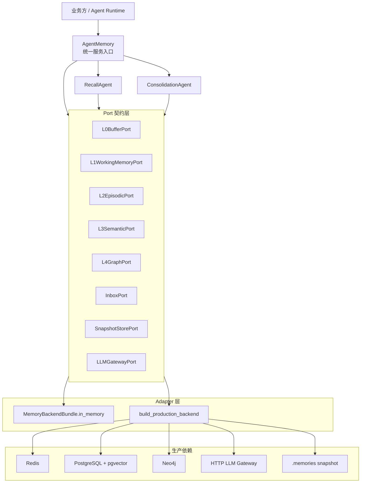
```mermaid
flowchart TB
    API["业务方 / Agent Runtime"]
    SVC["AgentMemory<br/>统一服务入口"]
    RA["RecallAgent"]
    CA["ConsolidationAgent"]

    subgraph PORT["Port 契约层"]
        P0["L0BufferPort"]
        P1["L1WorkingMemoryPort"]
        P2["L2EpisodicPort"]
        P3["L3SemanticPort"]
        P4["L4GraphPort"]
        PI["InboxPort"]
        PS["SnapshotStorePort"]
        PG["LLMGatewayPort"]
    end

    subgraph ADP["Adapter 层"]
        MEM["MemoryBackendBundle.in_memory"]
        PROD["build_production_backend"]
    end

    subgraph EXT["生产依赖"]
        REDIS["Redis"]
        PGV["PostgreSQL + pgvector"]
        NEO["Neo4j"]
        LLM["HTTP LLM Gateway"]
        SNAP[".memories snapshot"]
    end

    API --> SVC
    SVC --> RA
    SVC --> CA
    SVC --> PORT
    RA --> PORT
    CA --> PORT
    PORT --> MEM
    PORT --> PROD
    PROD --> REDIS
    PROD --> PGV
    PROD --> NEO
    PROD --> LLM
    PROD --> SNAP
```

**硬性依赖规则**：

| 模块 | 允许依赖 | 禁止依赖 |
|---|---|---|
| `service.py` | `ports.py`、`adapters.py`、领域模块 | 直接 import redis/psycopg/neo4j/http SDK |
| `agents.py` | L2/L3/L4 Port 能力、领域模型 | 直接创建存储实现 |
| `production_adapters.py` | 生产 SDK、序列化、连接健康检查 | F1–F5 业务规则 |
| `l0/l1/l2/l3/l4` | `models.py`、`config.py`、公式与本层索引 | 横向直接写其他层 |
| `tests` | 内存 Adapter、生产配置 fail-fast、Port 契约 | 依赖真实外部服务作为单测前置 |

## 13.2 Port/Adapter 映射

| Port | 内存 Adapter | 生产 Adapter | 生产职责 |
|---|---|---|---|
| `L0BufferPort` | `ConversationBuffer` | `RedisBackedConversationBuffer` | Redis LIST 保存租户会话窗口，SET 维护用户活跃会话索引 |
| `L1WorkingMemoryPort` | `WorkingMemoryManager` | 当前保持进程内，可后续替换 | 保持短期结构化上下文，避免过早落重型存储 |
| `L2EpisodicPort` | `EpisodicStore` | `PostgresBackedEpisodicStore` | L2 记录 write-through 到 `l2_episodic`，pgvector 承载生产 ANN |
| `L3SemanticPort` | `SemanticStore` | `PostgresBackedSemanticStore` | L3 fact 版本链、分区与证据哈希 write-through |
| `L4GraphPort` | `CognitiveGraph` | `Neo4jBackedCognitiveGraph` | L4 节点/边 MERGE 到 Neo4j，保留本地快照用于服务内诊断 |
| `InboxPort` | `InMemoryInbox` | `RedisBackedInbox` | 固化任务状态写入 Redis，支持多 worker 后续扩展 |
| `SnapshotStorePort` | `MemoryFileStore` | `MemoryFileStore` | `.memories` 作为审计与本地回放快照，生产可扩展对象存储 |
| `LLMGatewayPort` | `NoopLLMGateway` | `HttpLLMGateway` | `/decide_json`、`/embed`、`/health` 三类 HTTP 能力 |

## 13.3 配置与装配契约

```python
MemoryConfig(
    backend_mode="production",
    redis_url="redis://...",
    postgres_dsn="postgresql://...",
    neo4j_uri="neo4j://...",
    neo4j_user="...",
    neo4j_password="...",
    llm_gateway_url="https://...",
    persist_on_write=False,
)
```

| 配置项 | 默认值 | 生产建议 | 说明 |
|---|---|---|---|
| `backend_mode` | `memory` | `production` | 控制 `build_memory_backend()` 装配哪组 Adapter |
| `persist_on_write` | `true` | `false` | 关闭 observe/memorize 同步整租户 JSON flush，降低写路径 O(state) 开销 |
| `retrieval_candidate_hard_limit` | `1000` | 按租户容量调参 | 限制 L2 无 sparse 命中时的热点兜底候选规模 |
| `backend_connection_timeout_seconds` | `3.0` | `1.0–3.0` | 限制 Redis/PG/Neo4j/LLM Gateway 建连与健康检查耗时 |
| `redis_url/postgres_dsn/neo4j_*` | 空 | 必填 | production 模式缺失即 fail fast |
| `llm_gateway_url` | 空 | 必填 | 统一 LLM 决策与 embedding 出口 |

## 13.4 更新后的性能指标

| 链路 | 原瓶颈 | 优化后设计 | 预期效果 |
|---|---|---|---|
| observe/memorize | 每次同步写整租户 JSON 快照，O(tenant_state) | `persist_on_write=False` 只标 dirty，后台 flush | 写路径从状态规模相关降为近似 O(1) |
| L2 retrieve | 无 sparse 命中时可能全量扫描租户 active 记录 | 倒排索引优先 + `retrieval_candidate_hard_limit` 热点兜底 | 大租户下候选池有上界 |
| L3 semantic_search | 每次遍历全部 fact 后再过滤分区 | 维护 `tenant -> partition -> fact_key` 索引 | preference/procedural 分区查询更稳定 |
| 生产固化 | LLM SDK 分散调用，难以限流与审计 | `LLMGatewayPort` 收敛 `/decide_json` 与 `/embed` | 模型切换、限流、JSON 校验集中治理 |
| 运维诊断 | 只能看 L0–L4 数据快照 | `backend_diagnostics()` 暴露 Adapter 与外部依赖摘要 | 上线前可验证实际后端装配 |

## 13.5 实施验收标准

| 验收项 | 标准 |
|---|---|
| 解耦 | `AgentMemory` 可通过注入 `MemoryBackendBundle` 运行；服务层不直接依赖生产 SDK |
| 生产配置 | `backend_mode="production"` 缺少必填依赖时 fail fast |
| 本地回归 | 内存 Adapter 下 Ruff 与 Pytest 全量通过 |
| 功能链路 | observe → reflect → recall → forget_sweep 仍覆盖 L0–L4 |
| 文档一致性 | 本章、§0、§2.4、§6、§7、§9 与代码中的 Port/Adapter 命名一致 |
