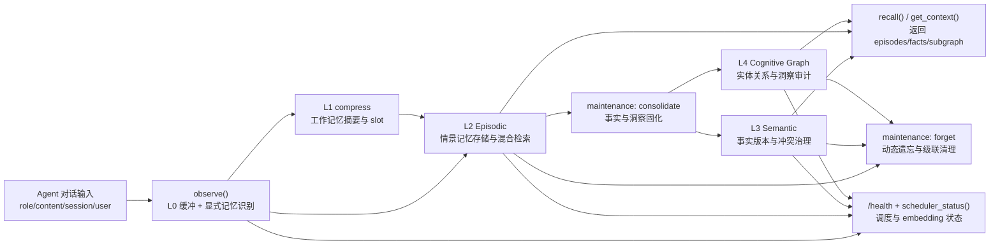
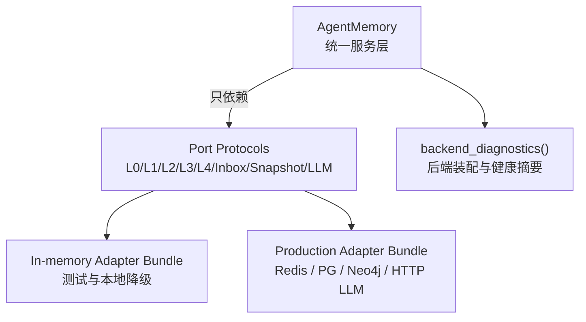
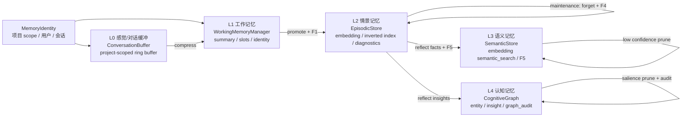
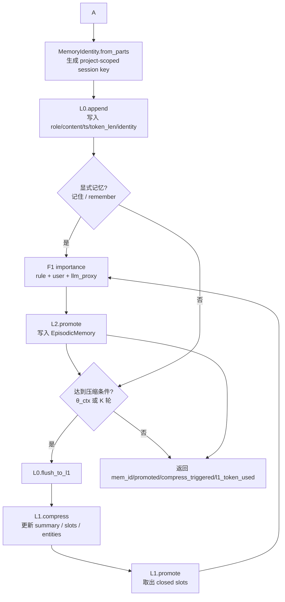
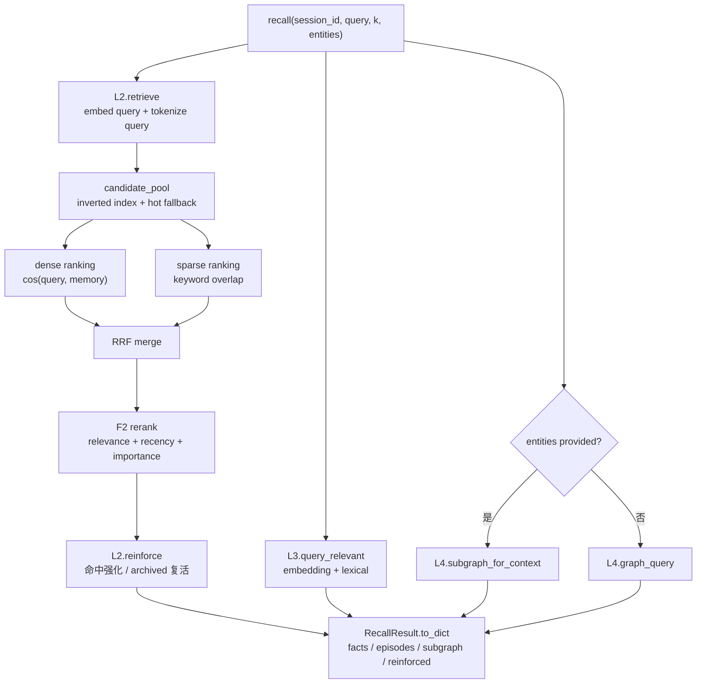
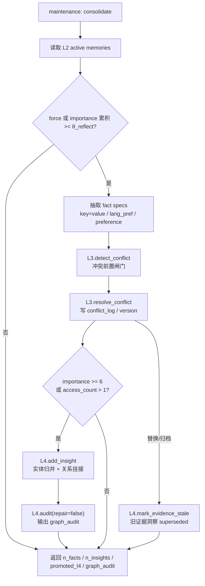
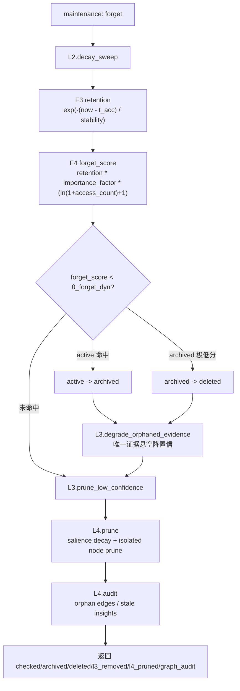
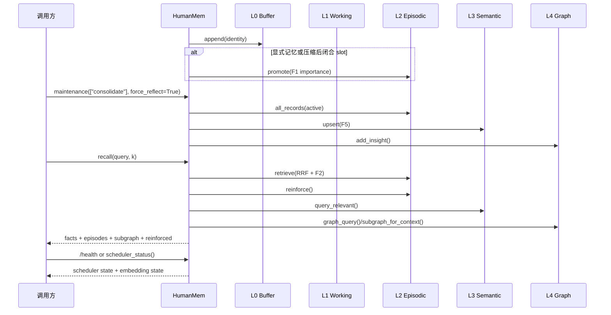

# Agent 记忆系统整体流程

本文档描述 `mem` 包中 Agent 记忆系统的运行路径。实现遵循技术设计方案中的 L0-L4 分层、F1-F5 公式、写入/读取/演化三链路，并已升级为 Port/Adapter 架构：`AgentMemory` 只依赖 `src/mem/memory/ports.py` 中的契约，默认使用内存 Adapter，生产模式通过 `src/mem/adapters/production.py` 接入 Redis、PostgreSQL/pgvector、Neo4j 与 HTTP LLM Gateway。推荐入口 `HumanMem` 不要求业务传入作用域信息，所有请求统一映射到内部 scope `human_mem_project`。

## memx 能力总览

`memx` 面向需要长期上下文、个性化偏好和可解释记忆治理的 Agent 场景，提供从对话观察到事实沉淀、从语义召回到认知图谱洞察的完整记忆闭环。调用方通常只需要接入 `HumanMem`，即可获得统一的写入、读取、固化、遗忘、调度状态和后端诊断能力。

核心能力：

- **多层记忆建模**: 使用 L0-L4 分层表达原始对话、工作摘要、情景片段、语义事实和认知洞察。
- **显式与隐式写入**: 支持用户显式表达“记住/remember”的即时写入，也支持对话缓冲达到阈值后的自动压缩与沉淀。
- **混合召回排序**: L2 使用 dense embedding、sparse token、RRF 融合和 F2 重排，L3 使用 embedding 与 lexical overlap 的语义事实检索。
- **事实冲突治理**: L3 对同 key 异值、时序更新、证据变更执行冲突检测、版本归档和 conflict log 记录。
- **认知图谱洞察**: L4 将高价值记忆连接为实体、关系和 insight，并通过 graph audit 发现孤儿边、低显著节点和过期洞察。
- **动态遗忘机制**: F3/F4 综合时间衰减、重要性、访问频次和稳定性，将低价值记忆归档或删除。
- **状态化调度**: `src/mem/scheduler/manager.py` 注册 `consolidate` 与 `forget` 两类任务，并保留运行次数、成功/失败次数、耗时与最近错误。
- **生产级后端替换**: Port/Adapter 架构允许本地使用内存实现，生产接入 Redis、PostgreSQL/pgvector、Neo4j 和 HTTP LLM Gateway。

能力编排流程：



典型使用场景：

- **个性化 Agent**: 记住用户语言、偏好、长期目标和常用约束，在后续会话中自动召回。
- **客服与运营助手**: 记录用户问题、处理进展、关键承诺和历史上下文，避免跨会话重复询问。
- **企业知识型 Agent**: 将高频情景沉淀为结构化事实，并在事实冲突时保留证据和版本轨迹。
- **研究与分析助手**: 从多轮观察中抽取实体关系，构建可审计的认知图谱和洞察链路。
- **长期任务管理**: 通过动态遗忘保留高价值记忆，归档过期或低价值片段，控制长期存储噪声。

能力与接口映射：

| 能力 | 主要接口 | 输入示例 | 输出要点 |
| --- | --- | --- | --- |
| 上下文召回 | `recall()` / `get_context()` | `query`, `k`, `entities` | `facts`, `episodes`, `subgraph`, `reinforced` |
| 事实固化 | `maintenance(["consolidate"])` / `reflect()` | `force_reflect` 或 `force` | `n_facts`, `n_insights`, conflict 信息 |
| 记忆检索 | `search()` | `query`, `k` | active 情景记忆列表 |
| 记忆更新 | `update()` | `mem_id`, `text`, `metadata` | 更新后的 memory 状态 |
| 记忆删除 | `forget()` / `maintenance(["forget"])` | `mem_id` 或任务名 | hard forget 或 archived/deleted 统计 |
| 调度状态 | `scheduler_status()` / `/health` | 无 | 任务状态、embedding 状态 |
| 后端诊断 | `backend_diagnostics()` / `architecture_snapshot()` | 无 | backend profile、L0-L4 容量与检索统计 |

## 场景化示例

### 记住用户偏好并跨会话召回

```python
from mem import HumanMem, MemoryConfig

memory = HumanMem(MemoryConfig(flush_turns=2))

memory.observe(
    "session-a",
    {"role": "user", "content": "请记住 user.lang_pref=zh，语言偏好是中文"},
)
memory.maintenance(tasks=["consolidate"], force_reflect=True)

result = memory.recall(
    "session-b",
    "用户偏好的回复语言是什么？",
)

assert result["facts"][0]["fact_key"] == "user.lang_pref"
assert result["facts"][0]["value"] == "zh"
```

### 处理事实变更与冲突记录

```python
from mem import AgentMemory, MemoryConfig
from mem.constants import PROJECT_MEMORY_SCOPE_ID

memory = AgentMemory(MemoryConfig())

memory.upsert_fact(
    {
        "scope_id": PROJECT_MEMORY_SCOPE_ID,
        "fact_key": "user.city",
        "value": "Shanghai",
        "confidence": 0.95,
        "evidence_ids": ["msg-1"],
    }
)
updated = memory.upsert_fact(
    {
        "scope_id": PROJECT_MEMORY_SCOPE_ID,
        "fact_key": "user.city",
        "value": "Beijing",
        "confidence": 0.96,
        "evidence_ids": ["msg-2"],
    }
)

assert updated["action"] == "pending"
assert "conflict_id" in updated
```

### 查看运行状态与后端健康

```python
from mem import HumanMem, MemoryConfig

memory = HumanMem(MemoryConfig(backend_mode="memory"))

diagnostics = memory.memory.backend_diagnostics()
snapshot = memory.architecture_snapshot()
status = memory.scheduler_status()

assert diagnostics["profile"] == "memory"
assert "l2" in snapshot
assert "l3" in snapshot
assert "l4" in snapshot
assert status["registered_tasks"] == ("consolidate", "forget")
```

## 后端解耦结构



解耦规则：

- `AgentMemory` 通过 `MemoryBackendBundle` 获取 L0-L4、inbox、snapshot、LLM Gateway 实例。
- `backend_mode="memory"` 使用 deterministic 内存实现，适合单元测试和本地功能验证。
- `backend_mode="production"` 要求显式配置 Redis/PG/Neo4j/LLM Gateway，缺失配置会 fail fast。
- `persist_on_write=False` 时写链路只标记 dirty，不同步写整作用域 JSON 快照，适合生产关键路径。

## 分层结构



## 写入链路




## 读取链路

`AgentMemory.recall()` 统一读取 L3、L2、L4。L2 内部使用 dense 与 sparse 两路排序，再通过 RRF 融合和 F2 重排；召回命中后调用 reinforce，更新 `ts_last_access`、`access_count` 与 `stability`，归档态记忆可被复活。

性能优化策略:

- L2 同时维护 `mem_id -> token_set` 与 `token -> mem_id set`，先通过倒排索引收敛 sparse 候选，再执行 dense/sparse 排序。
- dense 与 sparse 召回只保留 `k * retrieval_candidate_multiplier` 个候选；`_candidate_pool` 使用 sparse 命中优先、热点候选兜底，避免全量双排序拖慢关键路径。
- 无 dense 命中且无 sparse 命中的候选会被过滤，符合“无命中返回空”的接口边界。
- `search()` 默认只检索 active 记忆；`recall()` 可包含 archived 记忆并通过 reinforce 复活，二者语义分离。
- L2 `mem_id` 由内部项目 scope 与 `normalize(text)` 内容指纹派生，重复 promote 会合并 `source_ids` 而不是新增记录。
- `last_retrieval_stats()` 暴露最近一次检索的 `candidate_count / filtered_count / dense_ranked / sparse_ranked`，供 `architecture_snapshot()` 汇总。
- L3 `semantic_search()` 使用 embedding cosine + lexical overlap 的混合排序，不再只是字符串包含。



## 演化链路

`HumanMem.maintenance()` 通过 `MaintenanceTaskManager` 调度两类任务：`consolidate` 将 L2 中重要或频繁访问的情景记忆沉淀为 L3 事实与 L4 洞察；`forget` 负责动态遗忘、低置信事实清理和低显著度图节点剪枝。

一致性优化策略:

- L3 的 F5 已拆成 `detect_conflict()` 与 `resolve_conflict()` 两段，所有同 key 异值写入都会产生 `conflict_log`。
- `SemanticFact` 维护 `evidence_hash`、`valid_from`、`valid_until`，用于证据指纹和时序事实归档。
- 时序型 fact key 会执行 archive 语义，旧版本写入 `valid_until`，新版本成为当前事实。
- L2 遗忘返回 `archived_ids` / `deleted_ids`，Service 会对唯一证据悬空的 L3 fact 降低 confidence，再执行低置信清理。
- L3 事实替换或归档后，Service 会将引用旧证据的 L4 insight 标记为 `superseded`，避免图谱基于过期事实继续生效。
- `CognitiveGraph.audit()` 会检查孤儿边、低显著节点与 superseded insight；`forget` 任务会在 prune 后附带 graph audit 结果。
- `HumanMem.scheduler_status()` 与 `/health` 汇总调度任务状态；`architecture_snapshot()` 汇总 L0-L4 容量与检索诊断。





## 统一接口调用顺序



## 最小使用示例

```python
from mem import HumanMem, MemoryConfig

memory = HumanMem(MemoryConfig(flush_turns=2))

observed = memory.observe(
    "session-1",
    {"role": "user", "content": "请记住 user.lang_pref=zh，语言偏好是中文"},
)

memory.maintenance(tasks=["consolidate"], force_reflect=True)
result = memory.recall("session-1", "user.lang_pref", k=3)
snapshot = memory.architecture_snapshot()

assert observed["mem_id"] is not None
assert result["facts"][0]["fact_key"] == "user.lang_pref"
assert snapshot["scope_id"] == "human_mem_project"
```
