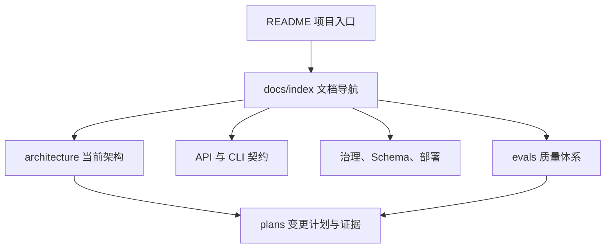

# MemX 架构文档

本目录描述 MemX 的当前实现架构、运行链路、设计决策和已知缺口。根目录的
`Agent 记忆系统技术设计方案.md` 保留完整理论推导；本目录以代码现状为准，负责把
目标架构映射到可定位、可验证的模块。

## 文档地图

| 文档 | 回答的问题 | 主要读者 |
| --- | --- | --- |
| [系统上下文](system-context.md) | MemX 位于什么边界，依赖谁，承诺什么 | 架构师、接入方 |
| [完整架构图](architecture-diagrams.md) | 上下文、容器、组件、数据面、控制面和部署如何关联 | 架构师、SRE |
| [完整 Mermaid 源图](memx-complete-architecture.mmd) | 可独立渲染的端到端系统、数据、演化与控制面总图 | 架构师、SRE |
| [组件与代码边界](components.md) | 每个目录负责什么，依赖方向如何约束 | 开发者、Reviewer |
| [记忆分类体系](memory-classification.md) | L0-L4 与四种语义类型如何正交组合 | 产品、算法、开发 |
| [数据结构与存储模型](data-models.md) | 每层字段、约束、索引和目标扩展是什么 | 开发、数据平台 |
| [运行链路](runtime-flows.md) | observe、recall、consolidate、forget 如何流动 | 开发者、SRE |
| [Consolidation 固化设计](consolidation.md) | 触发、状态、冲突、7 步目标管线和失败恢复 | 后端、算法、SRE |
| [Retrieval 检索设计](retrieval.md) | 在线 recall、三路融合、评分、降级和诊断 | 检索、后端、算法 |
| [架构验证与证据矩阵](verification.md) | 架构主张如何映射到 pytest、evals 与发布门禁 | Reviewer、测试、发布人员 |
| [架构决策](decisions.md) | 为什么采用 L0-L4、Port/Adapter、零 LLM 读路径 | 架构师、维护者 |
| [问题与路线图](gaps-and-roadmap.md) | 当前实现缺什么，风险和完成顺序是什么 | Owner、项目经理 |
| [评测体系](../evals.md) | 如何衡量记忆质量、延迟与回归 | 算法、测试、发布人员 |

## 文档分层

## 事实来源

1. 对外行为以 `src/mem/api.py`、`src/mem/cli` 和 `src/mem/server` 为准。
2. 领域边界以 `src/mem/memory/ports.py` 与 `src/mem/adapters` 为准。
3. 参数默认值以 `src/mem/config/settings.py` 为准。
4. 模型配置以项目根目录 `.env` 为本地入口，`.env.example` 为可提交模板。
5. 质量结论以 `uv run mem-eval --fail-on-regression` 和完整 pytest 结果为准。
6. 待办状态只在 `plans/00-platform-master-plan.md` 汇总，其他文档不复制状态数字。

## 当前架构结论

MemX 已实现可运行的 L0-L4 内存系统、分层召回、事实版本治理、图谱、快照、CLI、
HTTP API 与生产 Adapter 骨架。当前在线召回不调用生成式 LLM；本地默认使用确定性
embedding，生产模式可通过统一 runtime 接入 HTTP Gateway。固化仍以规则抽取为主，
embedding 版本双写、回填和索引切换尚未完成，详见
[问题与路线图](gaps-and-roadmap.md)。
