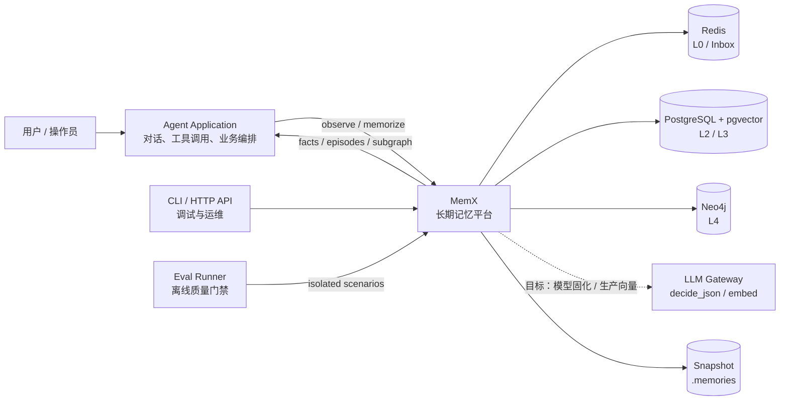
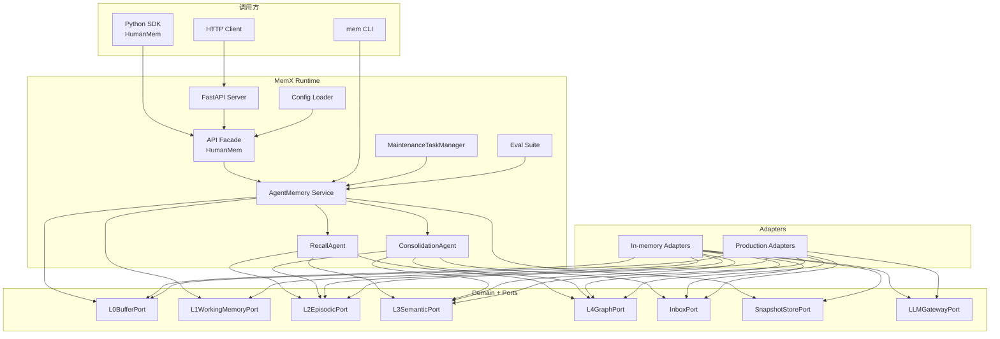
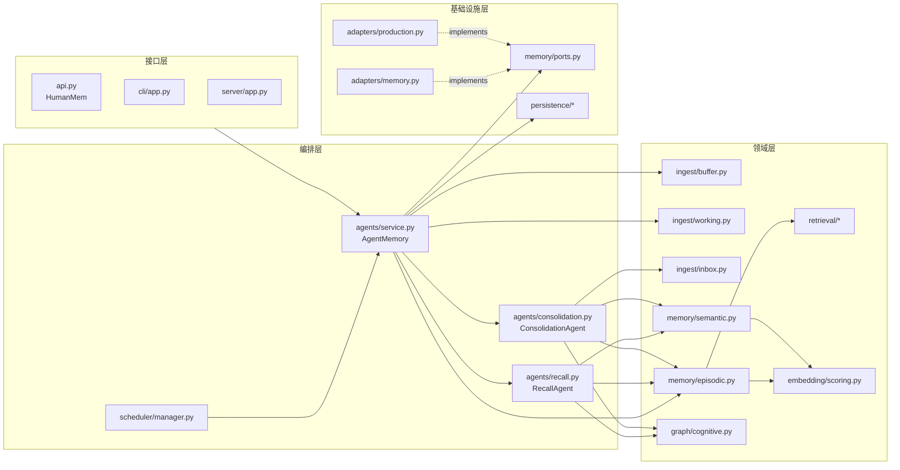
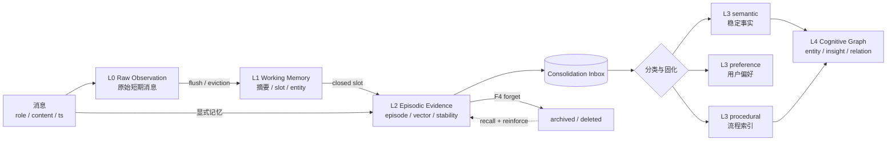
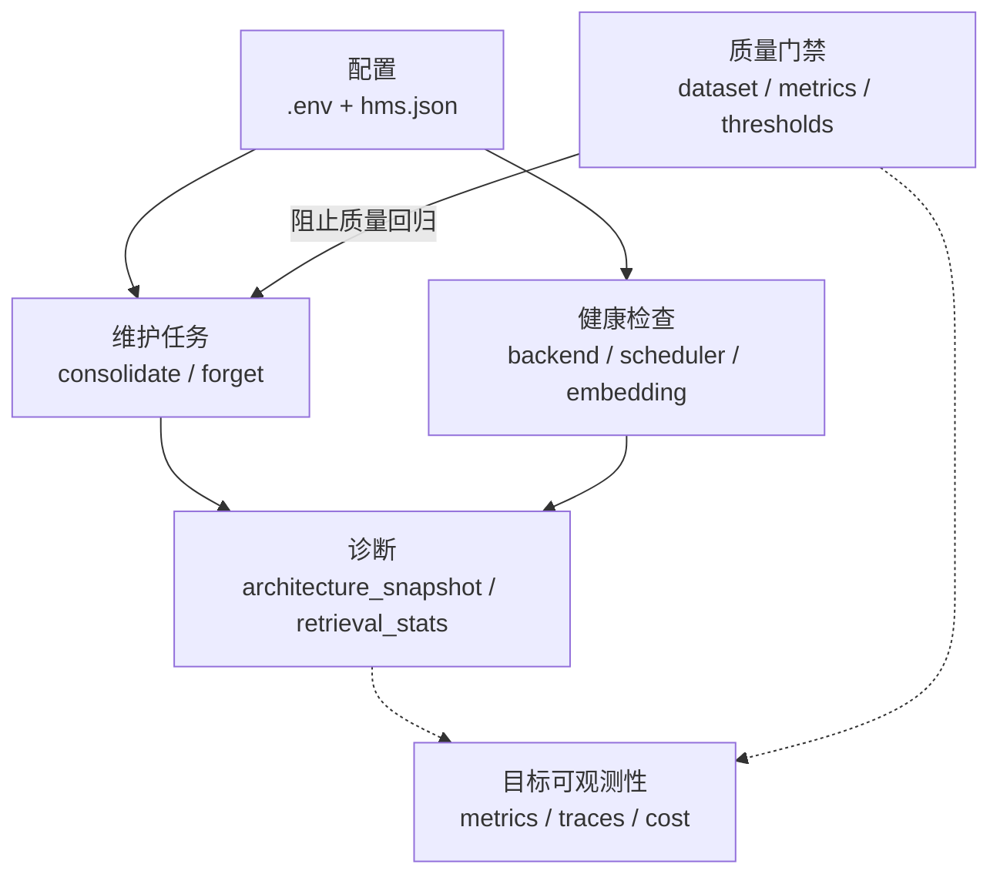
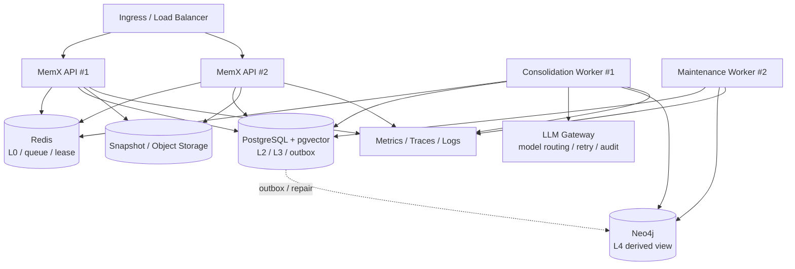
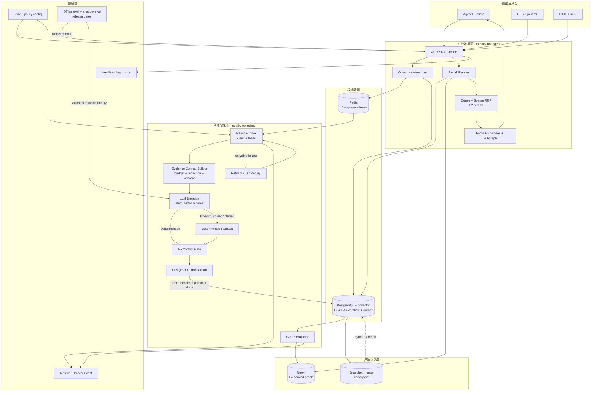

# 完整架构图

本文从系统边界、运行容器、代码组件、数据面、控制面和生产部署六个视角描述 MemX。
图中：

- 实线表示当前已有调用或数据流。
- 虚线表示异步、派生或目标能力。
- “当前”表示仓库代码已经接入主链路。
- “目标”表示已有 Port 或规划，但尚未接入主链路。

## 1. 系统上下文

MemX 不生成最终回答。它负责接收观察、维护记忆状态、返回与当前任务相关的证据和事实。
上层 Agent 决定如何将这些上下文用于回答或工具调用。

## 2. 容器视图

## 3. 代码组件视图

核心依赖不变式是：接口层依赖编排层，编排层依赖领域能力和 Port，Adapter 实现 Port。
领域模块不得反向 import FastAPI、CLI 或具体数据库 SDK。

## 4. 数据面：L0-L4 与四类记忆

L0-L4 是“放在哪里、组织到什么程度”；episodic、semantic、preference、procedural
是“内容是什么性质”。两者是正交维度，不应把 semantic 误解为只能出现在 L3。

## 5. 控制面

当前控制面已有配置、健康检查、运行快照、维护任务和离线 eval。生产级 metrics、trace、
成本归因和告警仍属于目标能力。

## 6. 生产部署拓扑

上图是目标生产拓扑。当前 Production Adapter 仍是本地行为加外部写穿，尚未完成远程
权威读取、queue lease、outbox 补偿和多实例一致性。

## 7. 当前与目标的边界

| 架构面 | 当前实现 | 目标实现 |
| --- | --- | --- |
| 在线 API | `HumanMem`、CLI、FastAPI | 多实例、限流、租户级配额 |
| L0 / Inbox | 内存实现；Redis write-through | Redis 权威读写、lease、DLQ |
| L2 / L3 | 内存实现；PG write-through | PostgreSQL/pgvector 权威读写 |
| L4 | 内存图；Neo4j write-through | outbox 驱动的可重建派生图 |
| LLM | Gateway Port 与 HTTP Adapter | 固化决策主链路、Schema fallback |
| Embedding | 本地 deterministic 64 维 | 模型版本化、双写、回填与切换 |
| Eval | 14 case 离线门禁，含结构与冲突断言 | 大规模、在线 shadow、成本门禁 |

## 8. 端到端参考架构

下图把在线数据面、异步演化面、权威存储、派生视图、控制面和失败恢复放在同一张图中。
它是目标生产架构，不表示所有虚线能力已经实现。

可独立渲染、包含 L0-L4 细节和质量闭环的完整 Mermaid 源文件见
[`memx-complete-architecture.mmd`](memx-complete-architecture.mmd)。

### 关键一致性边界

1. **在线读取**：L2/L3 以 PostgreSQL 为目标权威源，L4 是可重建派生视图。
2. **固化提交**：事实、冲突日志、graph outbox 和 inbox 完成状态必须在一个事务中提交。
3. **图谱投影**：Neo4j 写入在事务外执行，依靠 outbox ID 幂等重放。
4. **模型边界**：模型只能生成候选 decision，不能直接写 L3/L4，也不能绕过 F5。
5. **发布边界**：pytest 验证实现，离线 eval 验证记忆语义，shadow eval 验证模型变更。

## 9. 失败恢复矩阵

| 失败点 | 当前行为 | 目标恢复语义 | 必须观测 |
| --- | --- | --- | --- |
| API 写入前 | 请求失败，无状态变化 | 客户端安全重试 | request/error rate |
| L2 已写、inbox 未确认 | 当前依赖本地状态 | 事务或幂等补投 | orphan evidence count |
| Gateway timeout / 非法 JSON | 当前主链路不调用模型 | 规则 fallback，记录原因 | schema/fallback rate |
| L3 冲突 | F5 返回 action 并写日志 | pending 进入人工/策略流程 | conflict action count |
| L3 commit 后 worker 崩溃 | 当前无 lease | lease 到期后幂等重放 | lease expiry/replay count |
| Neo4j 不可用 | 当前 write-through 可能失败 | L3 成功，outbox 稍后补投 | outbox lag |
| Eval 门禁失败 | CLI 可返回非零 | 阻断发布并保存差异报告 | failed gate / dataset hash |
