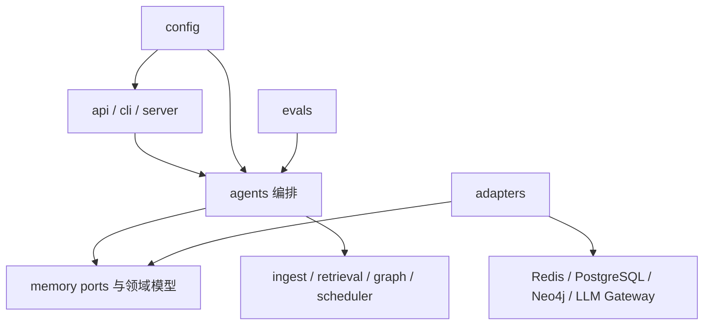

# 组件与代码边界

## 依赖方向



依赖只允许向内：接口层可以调用编排层，Adapter 可以实现 Port，领域模块不能反向依赖
FastAPI、CLI 或具体数据库客户端。

## 模块职责

| 模块 | 责任 | 关键入口 | 禁止承担 |
| --- | --- | --- | --- |
| `api.py` | 稳定应用 API、隐藏内部 scope | `HumanMem` | 存储实现和检索算法 |
| `agents/service.py` | L0-L4 门面与链路协调 | `AgentMemory` | 直接建立外部连接 |
| `agents/recall.py` | 召回计划、事实/episode/图拼装、强化 | `RecallAgent` | 无预算远程推理 |
| `agents/consolidation.py` | inbox 消费、L3/L4 写入 | `ConsolidationAgent` | 在线请求同步阻塞 |
| `memory/ports.py` | 外部能力契约 | L0-L4、Inbox、Snapshot、LLM Port | 具体 SDK |
| `adapters/memory.py` | 本地确定性实现与测试替身 | `MemoryBackendBundle.in_memory` | 网络访问 |
| `adapters/production.py` | 生产依赖装配与写穿 | `build_production_backend` | 业务规则 |
| `ingest` | L0 缓冲、L1 工作记忆、inbox | `ConversationBuffer` | 事实冲突裁决 |
| `retrieval` | 候选、dense/sparse/graph、RRF、重排 | `HybridSearchPipeline` | 数据写入 |
| `memory/semantic.py` | L3 版本、证据和冲突治理 | `SemanticStore` | Prompt 构造 |
| `graph` | L4 节点、边、审计与剪枝 | `CognitiveGraph` | 权威事实存储 |
| `persistence` | 快照、dirty 状态和恢复 | `PersistenceManager` | 在线检索排序 |
| `scheduler` | 有状态 maintenance 调度 | `MaintenanceTaskManager` | 常驻进程生命周期 |
| `config` | 默认值、dotenv、hms.json、路径校验 | `load_memory_config` | 运行时业务状态 |
| `evals` | 数据集、指标、门槛和报告 | `run_eval_suite` | 修改线上记忆 |

## 配置分层

```text
显式 overrides
      ↓
进程环境变量 MEMX_LLM_*
      ↓
项目根目录 .env
      ↓
hms.json 非模型策略
      ↓
MemoryConfig 默认值
```

模型相关字段只允许由 `.env`、进程环境或显式代码注入。`config set` 和 HTTP
`PATCH /config` 会拒绝将模型字段写入 `hms.json`；有效配置输出中的 API key 会脱敏。

## 扩展规则

1. 新存储先扩展 Port，再实现 memory 与 production 两种 Adapter。
2. 新召回策略进入 `retrieval`，通过统一结果结构暴露诊断，不在 API 层拼算法。
3. 新后台任务在 `scheduler` 注册，并提供幂等键、状态和失败恢复。
4. 新质量能力必须同时增加 dataset、metric、threshold、测试和文档。
5. 影响外部契约的变更必须更新 API 参考、能力矩阵和 plans 验收证据。
