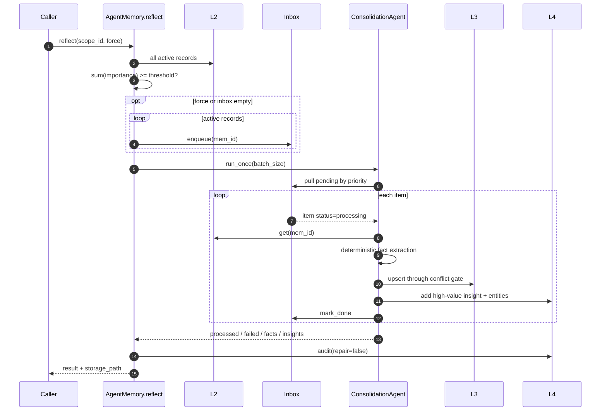
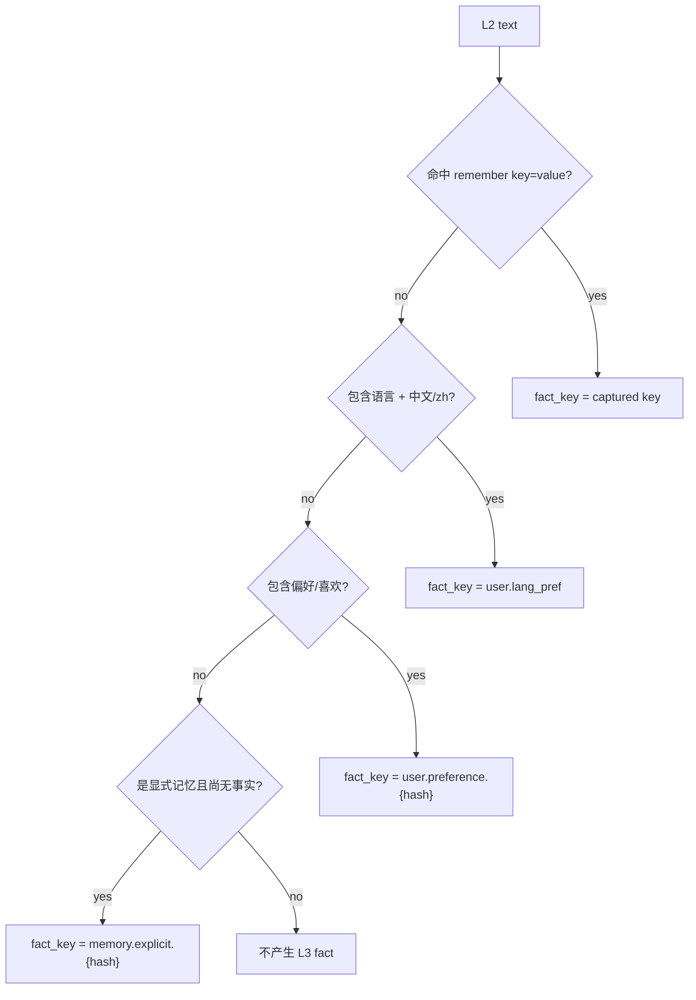
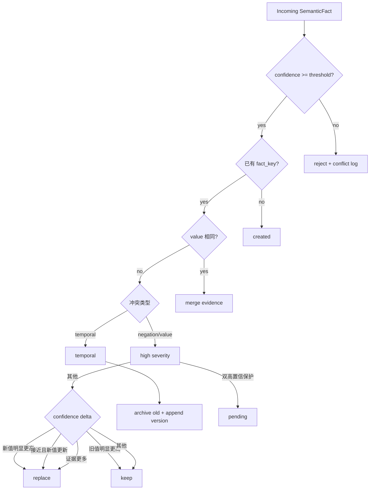
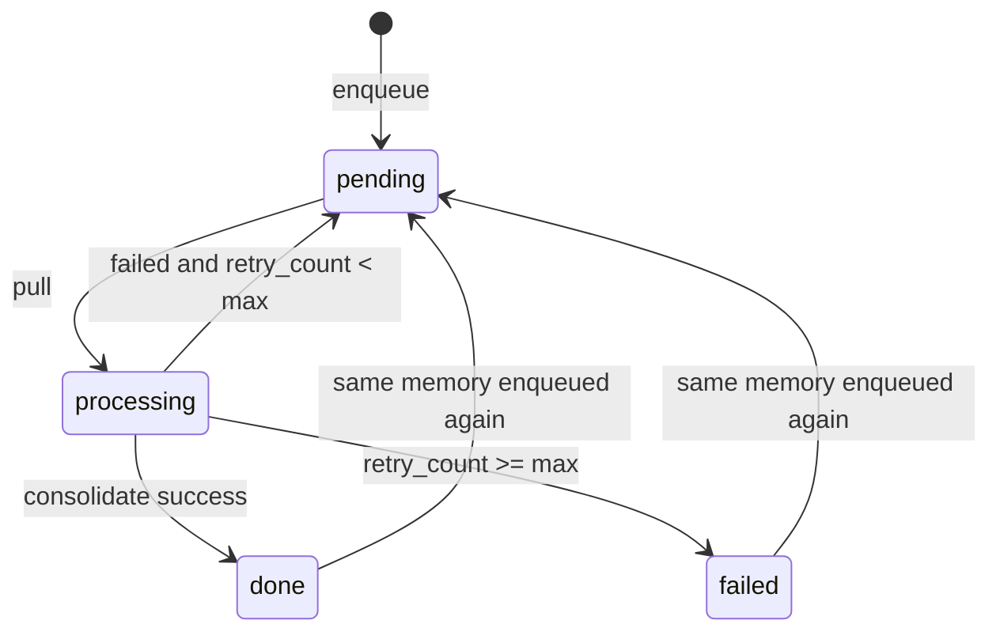
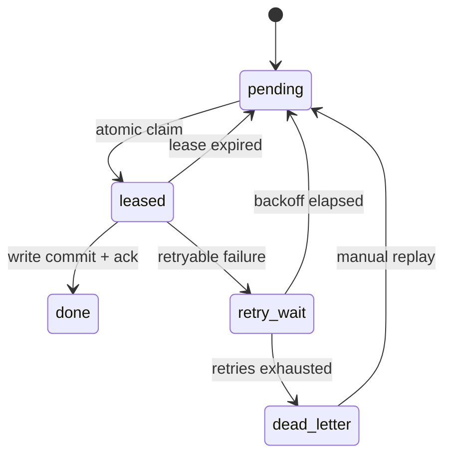
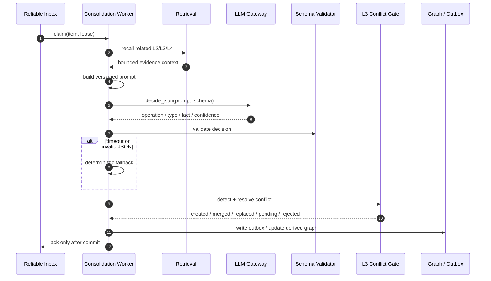

# Consolidation 固化设计

Consolidation 把 L2 情景证据提炼为 L3 事实和 L4 洞察。它必须位于异步路径，因为模型
决策、冲突治理和图谱更新都比在线 observe/recall 更昂贵。

## 1. 当前实现与目标设计

| 环节 | 当前实现 | 目标设计 |
| --- | --- | --- |
| 触发 | `reflect()` 或 scheduler `consolidate` | 事件驱动 + backlog/时间阈值 |
| 排队 | scope 分区 InMemory/Redis write-through inbox | 原子 claim、lease、退避、DLQ |
| 优先级 | `importance` 降序，再按入队时间 | `C(m)` 巩固强度 |
| 相关记忆 | 未在单条固化中召回 | L2/L3/L4 related recall |
| 分类/抽取 | key=value 和关键词规则 | LLM 严格 JSON + 规则 fallback |
| 冲突 | L3 F5 已实现 | 保留 F5，并增加模型决策审计 |
| L3 写入 | 已实现 | 增加事务/outbox |
| L4 更新 | 高价值 episode 生成 insight/entity | 关系、流程步骤与条件图式 |
| 收尾 | `mark_done` / `mark_failed` | 写入提交后 ack；崩溃可重放 |

## 2. 触发条件

### 写入触发

每次 `_promote_text()` 成功写入 L2 后执行：

```python
memory = l2.promote(...)
inbox.enqueue(memory, mem_type_hint=memory.mem_type)
persistence.mark_dirty(scope_id)
```

### reflect 阈值

```python
candidates = l2.all_records(scope_id, {MemoryStatus.ACTIVE})
importance_sum = sum(memory.importance for memory in candidates)

if not force and importance_sum < reflect_importance_threshold:
    return without_processing
```

`force=True` 时会确保 active L2 都进入 inbox，并把 batch size 扩展到当前 pending 数量。

### 调度触发

`MaintenanceTaskManager` 注册 `consolidate` 和 `forget`。当前只提供有状态 run-once 管理，
没有常驻进程、分布式锁和自动触发器。

## 3. 当前固化时序



## 4. 当前单条处理伪代码

```python
def consolidate(item: ConsolidationInboxItem) -> ConsolidationResult:
    memory = l2.get(item.mem_id, item.scope_id)
    if memory is None or memory.status == DELETED:
        raise KeyError("source memory not found or deleted")

    fact_count = 0
    for fact in deterministic_fact_extractor(memory):
        result = l3.upsert(scope_id=item.scope_id, **fact)
        mark_stale_evidence(result.get("superseded_evidence_ids", []))
        if result["action"] in {"created", "replaced", "archived", "merged"}:
            fact_count += 1

    promoted_l4 = []
    if memory.importance >= 6 or memory.access_count > 1:
        promoted_l4 = [l4.add_insight(...).node_id]

    inbox.mark_done(item.scope_id, item.item_id)
    return ConsolidationResult(fact_count, promoted_l4)
```

## 5. 当前事实抽取规则



候选置信度当前由 importance 线性派生：

```python
key_value_confidence = min(1.0, 0.60 + importance / 20)
language_confidence = min(1.0, 0.65 + importance / 20)
preference_confidence = min(1.0, 0.55 + importance / 20)
explicit_fallback_confidence = min(1.0, 0.55 + importance / 20)
```

## 6. L3 冲突闸门



裁决优先级：

1. 时序 key：归档旧版本，追加新版本。
2. 双方均高置信且是高严重冲突：`pending`，不静默覆盖。
3. 置信度差超过 `conflict_confidence_gap`：高者胜。
4. 差值在 epsilon 内且 incoming 更新：新值胜。
5. incoming 证据更多：新值胜。
6. 否则保留旧值。

## 7. Inbox 状态机

### 当前状态



当前问题：

- `processing` 没有 lease，worker 崩溃后无法自动释放。
- failed 是终态计数，没有独立 dead-letter 元数据和 replay API。
- L3、L4、Inbox 不在同一物理事务中。
- Redis Adapter 仍是本地状态加写穿，不是远程权威队列。

### 目标状态



## 8. 目标 7 步固化管线



七步定义：

| 步骤 | 输入 | 处理 | 输出 | 失败语义 |
| --- | --- | --- | --- | --- |
| 1. Recall related | inbox item | 召回相关 L2/L3/L4 | evidence bundle | 无结果也可继续 |
| 2. Build context | evidence bundle | 截断、去敏、版本化 prompt | model context | 超预算降级 |
| 3. Decide JSON | context + schema | 模型分类与操作决策 | decision | timeout/非法 JSON fallback |
| 4. Resolve conflicts | decision + current fact | F5 仲裁 | audited action | pending 不写新事实 |
| 5. Embed + write | accepted fact | 版本化 embedding 与事务写入 | L3 row | 失败回滚 |
| 6. Update graph | committed fact/evidence | outbox 或幂等图更新 | L4 delta | 可异步重放 |
| 7. Ack | committed result | 完成 queue item | done | ack 失败允许幂等重放 |

## 9. 目标 Decision Schema

```python
@dataclass(frozen=True)
class ConsolidationDecision:
    schema_version: str
    operation: Literal["new", "update", "merge", "skip"]
    memory_type: MemoryType
    partition: Literal["semantic", "preference", "procedural"]
    fact_key: str | None
    value: Any | None
    confidence: float
    temporal: bool
    entities: tuple[str, ...]
    relations: tuple["RelationDecision", ...]
    reason: str


@dataclass(frozen=True)
class RelationDecision:
    source: str
    target: str
    edge_type: Literal["cause", "belong", "temporal", "similar"]
    weight: float
```

约束：

- `confidence` 必须在 `[0, 1]`。
- `skip` 之外的事实决策必须有 `fact_key` 和 `value`。
- preference/procedural 必须写入同名 partition。
- 模型 decision 不能绕过 L3 conflict gate。
- relation 中的实体必须能回溯到本次 evidence。

## 10. 幂等与事务边界

建议幂等键：

```text
queue_idempotency_key =
    hash(scope_id + mem_id + pipeline_version)

fact_write_idempotency_key =
    hash(scope_id + fact_key + value + evidence_hash + schema_version)
```

推荐提交顺序：

```text
PostgreSQL transaction:
  1. lock/verify inbox lease
  2. insert/update L3 fact + conflict log
  3. insert graph outbox event
  4. mark inbox done
  5. commit

Graph projector:
  6. consume outbox
  7. idempotent MERGE into Neo4j
  8. mark outbox delivered
```

## 11. 可观测性

| 指标 | 维度 | 用途 |
| --- | --- | --- |
| `inbox_pending_total` | scope / priority | 发现积压 |
| `inbox_oldest_age_seconds` | scope | 发现 worker 停摆 |
| `consolidation_duration_ms` | step / result | 定位慢步骤 |
| `decision_schema_failure_rate` | model / schema_version | 发现模型不稳定 |
| `decision_fallback_rate` | reason | 判断规则降级比例 |
| `conflict_action_total` | action / type | 发现数据源冲突 |
| `graph_outbox_lag_seconds` | scope | 发现 L4 延迟 |
| `llm_tokens_total` | model / prompt_version | 成本归因 |

## 12. 验收场景

1. 同一 episode 重复投递 10 次，只产生一份事实版本。
2. worker 在 L3 commit 前崩溃，lease 到期后可重试。
3. worker 在 commit 后、ack 前崩溃，重试不重复写入。
4. Gateway 超时、限流、返回非 JSON 或 schema 不合法时使用规则 fallback。
5. 双高置信互斥事实进入 pending，不修改权威值。
6. 时序事实产生连续 `valid_from/valid_until` 版本链。
7. Neo4j 不可用时 L3 提交成功，outbox 最终补齐 L4。

当前可执行的确定性 eval 已覆盖时序版本、冲突审计、分区、类型、证据引用和重复写入；
lease、DLQ、Gateway fallback 与 outbox 恢复必须在对应生产能力实现后增加故障注入测试，
不能用现有内存模式结果替代。
