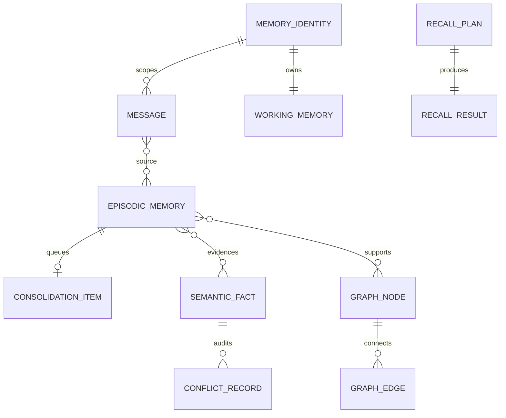

# 数据结构与存储模型

本文以当前 Python dataclass 为事实来源，展示 L0-L4、Inbox、冲突和召回结构。最后一节
单独列出目标扩展字段，避免把规划字段误认为已经存在。

## 1. 聚合关系



## 2. L0：身份与原始消息

```python
@dataclass(frozen=True)
class MemoryIdentity:
    scope_id: str = "default"
    session_id: str = "default"


@dataclass
class Message:
    turn_id: int
    role: Role                 # user | assistant | tool | system
    content: str
    ts: float
    token_len: int
    session_id: str
    scope_id: str = "default"
```

约束：

- `(scope_id, session_id, turn_id)` 唯一标识原始消息。
- `source_id = scope:{scope_id}:session:{session_id}:turn:{turn_id}`。
- `content` 非空，`token_len >= 0`。
- L0 是短期窗口，不是长期事实源；进入 L2 后才形成稳定 evidence ID。

## 3. L1：工作记忆

```python
@dataclass
class WorkingMemory:
    session_id: str
    rolling_summary: str = ""
    open_slots: list[dict[str, Any]] = field(default_factory=list)
    mentioned_entities: list[str] = field(default_factory=list)
    token_used: int = 0
    last_compress_ts: float = 0.0
    scope_id: str = "default"
```

`open_slots` 当前是结构化字典：

```python
OpenSlot = {
    "slot_id": str,           # "{session_id}:{turn_id}"
    "text": str,
    "status": "open" | "closed",
    "source_ids": list[str],
    "ts": float,
    "scope_id": str,
    "session_id": str,
    "user_emphasis": bool,
    "closed_reason": str,     # closed 时存在
    "closed_ts": float,       # closed 时存在
}
```

约束：

- `rolling_summary + slots + entities` 的估算 token 不超过 `working_memory_tokens`。
- closed slot 在 promote 后从 L1 移除。
- L1 可丢失并从上游重建，不作为长期权威数据。

## 4. L2：情景证据

```python
@dataclass
class EpisodicMemory:
    mem_id: str
    embedding: tuple[float, ...]
    text: str
    importance: int           # 0..10
    ts_create: float
    ts_last_access: float
    scope_id: str
    access_count: int = 0
    stability: float = 86_400.0
    status: MemoryStatus = ACTIVE
    source_ids: list[str] = field(default_factory=list)
    mem_type: MemoryType = EPISODIC
```

状态：

```python
class MemoryStatus(str, Enum):
    ACTIVE = "active"
    ARCHIVED = "archived"
    DELETED = "deleted"
```

索引结构：

```python
records: dict[scope_id, dict[mem_id, EpisodicMemory]]
token_index: dict[scope_id, dict[mem_id, frozenset[str]]]
inverted_index: dict[scope_id, dict[token, set[mem_id]]]
```

幂等规则：

```text
mem_id = hash(scope_id + normalized_text)
```

相同内容再次 promote 时复用 `mem_id`，合并 `source_ids`，取更高 importance，并在需要时
把类型从 episodic 提升为 preference/procedural。

## 5. L3：语义事实

```python
@dataclass
class SemanticFact:
    fact_key: str
    scope_id: str
    value: Any
    confidence: float
    evidence_ids: list[str] = field(default_factory=list)
    version: int = 1
    ts_update: float = 0.0
    embedding: tuple[float, ...] | None = None
    evidence_hash: str = ""
    is_temporal: bool = False
    valid_from: float | None = None
    valid_until: float | None = None
    mem_type: MemoryType = SEMANTIC
    partition: str = "semantic"
```

内存结构：

```python
facts: dict[
    scope_id,
    dict[fact_key, list[SemanticFact]],  # 按 version 排列
]

partition_index: dict[
    scope_id,
    dict[partition, set[fact_key]],
]
```

主键语义：

```text
(scope_id, partition, fact_key, version)
```

读取 `fact_key` 时返回版本链最后一项；时序事实更新会设置旧版本 `valid_until` 并追加新版本。

## 6. 冲突审计

```python
@dataclass
class ConflictRecord:
    conflict_id: str
    scope_id: str
    fact_key: str | None
    conflict_type: ConflictType
    severity: ConflictSeverity
    old_value: Any
    new_value: Any
    policy_hit: str
    action: ConflictAction
    resolved_to: Any
    ts: float
```

枚举：

```python
ConflictType = value | temporal | negation | source | graph
ConflictSeverity = high | mid | low
ConflictAction = replace | merge | archive | pending | reject | keep
```

任何不同值写入都会形成冲突分类与审计记录；低置信候选也以 `source/reject` 记录。

## 7. L4：认知图谱

```python
@dataclass
class GraphNode:
    node_id: str
    node_type: NodeType       # entity | concept | insight
    label: str
    scope_id: str
    salience: float = 0.5     # 0..1
    evidence_ids: list[str] = field(default_factory=list)
    status: InsightStatus = ACTIVE
    mem_type: MemoryType = SEMANTIC


@dataclass
class GraphEdge:
    source_id: str
    target_id: str
    edge_type: EdgeType       # cause | belong | temporal | similar
    scope_id: str
    weight: float = 0.5       # 0..1
```

图谱是派生读模型：

- `insight` 节点引用 L2 evidence。
- `entity/concept` 节点用于连接多个 insight。
- 旧证据失效时 insight 进入 `superseded`。
- audit 检查孤儿边，prune 清理低显著孤立节点。

## 8. Consolidation Inbox

```python
@dataclass
class ConsolidationInboxItem:
    item_id: str
    scope_id: str
    mem_id: str
    text: str
    priority: float
    ts_enqueue: float
    mem_type_hint: MemoryType = EPISODIC
    status: InboxStatus = PENDING
    retry_count: int = 0
    last_error: str | None = None
```

当前状态机：

```python
class InboxStatus(str, Enum):
    PENDING = "pending"
    PROCESSING = "processing"
    DONE = "done"
    FAILED = "failed"
```

`item_id = hash(scope_id + mem_id)`，保证同一 L2 证据只有一个稳定队列项。当前重试达到
`inbox_max_retries` 后进入 failed；尚未实现 lease、visibility timeout 和 dead-letter。

## 9. Retrieval 结构

```python
@dataclass(frozen=True)
class SearchRequest:
    query: str
    query_tokens: frozenset[str]
    query_embedding: Sequence[float]
    k: int
    include_archived: bool
    now_ts: float
    config: MemoryConfig


@dataclass(frozen=True)
class RetrievalCandidate:
    mem_id: str
    rank: int
    score: float
    route: str
    engine: str
    metadata: dict[str, Any]


@dataclass(frozen=True)
class RouteResult:
    route: str
    engine: str
    candidates: list[RetrievalCandidate]


@dataclass
class FusedCandidate:
    memory: EpisodicMemory
    rrf_score: float
    route_hits: list[str]
    route_scores: dict[str, float]
    route_ranks: dict[str, int]
    scores: dict[str, Any]
    combined_score: float
    rerank_score: float = 0.0
```

在线 `recall()` 的返回结构：

```python
@dataclass
class RecallResult:
    facts: list[SemanticFact]
    episodes: list[EpisodicMemory]
    subgraph: dict[str, list[dict[str, Any]]]
    reinforced: list[str]
    plan: RecallPlan | None


@dataclass
class RecallPlan:
    scope_id: str
    query: str
    k: int
    routes: list[str]
    include_preferences: bool = True
    include_graph: bool = True
```

## 10. 快照根结构

`AgentMemory._scope_state()` 输出的本地快照：

```python
ScopeSnapshot = {
    "scope_id": str,
    "memory_dir": str,
    "l0": dict,
    "l1": list[dict],
    "l2": list[EpisodicMemory],
    "l3": {
        "facts": list[SemanticFact],
        "conflicts": list[ConflictRecord],
    },
    "l4": {
        "nodes": list[GraphNode],
        "edges": list[GraphEdge],
    },
    "inbox": list[ConsolidationInboxItem],
    "persistence": dict,
    "architecture": dict,
}
```

## 11. 生产存储映射

| 领域结构 | 当前本地结构 | 生产目标 |
| --- | --- | --- |
| Message | dict + deque | Redis LIST/STREAM |
| WorkingMemory | dict | Redis HASH 或 PostgreSQL JSONB |
| EpisodicMemory | dict + token indexes | PostgreSQL + pgvector + FTS |
| SemanticFact | dict + version list | PostgreSQL versioned rows |
| ConflictRecord | list | PostgreSQL append-only table |
| GraphNode/Edge | dict/list | Neo4j |
| InboxItem | dict | Redis STREAM/ZSET 或可靠队列 |
| ScopeSnapshot | JSON file | Object Storage / backup volume |

## 12. 目标扩展字段

以下字段属于规划，不在当前 dataclass 中：

```python
@dataclass
class EmbeddingMetadata:
    model: str
    dimension: int
    version: str
    content_hash: str
    created_at: float


@dataclass
class ReliableInboxMetadata:
    lease_owner: str | None
    lease_expires_at: float | None
    next_retry_at: float | None
    dead_letter_reason: str | None
    pipeline_version: str


@dataclass
class ModelDecisionAudit:
    model: str
    prompt_version: str
    schema_version: str
    latency_ms: float
    token_usage: int
    fallback_reason: str | None
```

这些扩展分别由 MX-102、MX-103 和 MX-101 实现，迁移前必须提供向后兼容和回滚路径。
