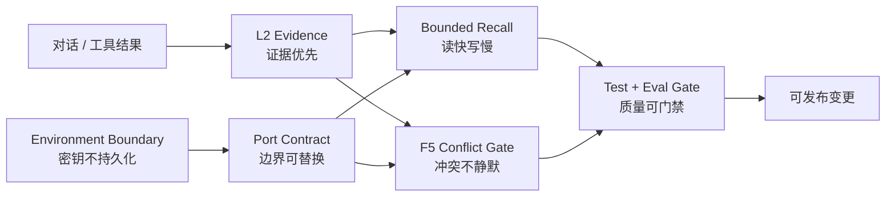

# 架构决策

## 设计原则约束链

六条原则分别约束数据来源、在线路径、依赖方向、事实写入、配置安全和发布过程。任何新增
能力都必须说明落在哪个控制点，以及由什么自动化信号验证。

| 原则 | 强制控制点 | 验证信号 |
| --- | --- | --- |
| 证据优先 | L3/L4 必须引用 L2 `evidence_ids` | fact contract eval、图谱审计 |
| 读快写慢 | recall 不同步调用远程 LLM，候选规模有界 | P95、候选诊断、fallback test |
| 边界可替换 | 编排层只依赖 Port，Adapter 隔离 SDK | dependency tests、adapter contract |
| 冲突不静默 | 所有不同值写入经过 F5 并记录 action | conflict log tests、conflict eval |
| 密钥不持久化 | 模型密钥仅来自环境或 Secret Manager | config tests、脱敏输出测试 |
| 质量可门禁 | pytest 与 evals 均通过才可发布 | coverage、quality thresholds |

## ADR-001：L0-L4 分层而非单一向量库

- 状态：已采用。
- 决策：原始对话、工作摘要、情景证据、语义事实和认知图谱分别承担 L0-L4 职责。
- 原因：不同数据拥有不同生命周期、一致性强度和查询方式；单一向量库无法可靠处理事实
  版本、证据追溯和图关系。
- 代价：跨层一致性、级联删除和观测成本上升。

## ADR-002：读路径默认零 LLM

- 状态：已采用。
- 决策：在线 recall 使用确定性路由、混合检索和规则重排，不同步调用远程模型。
- 原因：延迟、可用性和成本可预测，模型故障不会阻断读取。
- 代价：复杂意图拆解、跨语言改写和语义重排能力受限。
- 补偿：未来只允许有严格预算的可选增强，并始终保留确定性 fallback。

## ADR-003：Port/Adapter 隔离外部依赖

- 状态：已采用，生产语义仍需补齐。
- 决策：服务层面向 L0-L4、Inbox、Snapshot、LLM Port 编程，外部 SDK 只存在于 Adapter。
- 原因：本地测试不依赖基础设施，生产组件可替换，故障边界清楚。
- 代价：契约数量增加；write-through 骨架需要继续演进为权威远程读写。

## ADR-004：模型配置与策略配置分离

- 状态：已采用。
- 决策：Gateway URL、API key、模型名和请求超时来自 <code>.env</code> 或进程环境；
  算法阈值、容量、持久化策略继续由 <code>hms.json</code> 管理。
- 原因：密钥不应通过配置 API 持久化；模型部署变量与领域策略拥有不同发布周期。
- 代价：部署必须同时管理环境配置和策略配置，并理解优先级。

## ADR-005：离线确定性 evals 作为第一层门禁

- 状态：已采用。
- 决策：先用固定数据集验证写入、固化、召回、MRR 和延迟，再扩展在线模型评测。
- 原因：本地和 CI 可重复，无 API 成本，不受模型抖动影响，能快速定位核心回归。
- 代价：不能衡量真实模型的抽取质量、幻觉、语义漂移和成本。

## ADR-006：计划与代码状态分离

- 状态：已采用。
- 决策：<code>docs</code> 描述稳定架构和使用方式；<code>plans</code> 记录差距、顺序、
  验收与证据。
- 原因：避免在架构文档中复制易过期的进度数字。
- 代价：每次任务状态变化必须更新总计划和任务目录。

## 决策门槛

新增 ADR 应至少说明状态、背景、决策、被拒绝方案、代价、回滚条件和验证方式。涉及
公开 API、数据模型、跨层一致性、模型调用或安全边界的变更不得只写实现说明。
