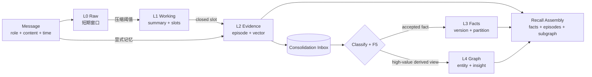
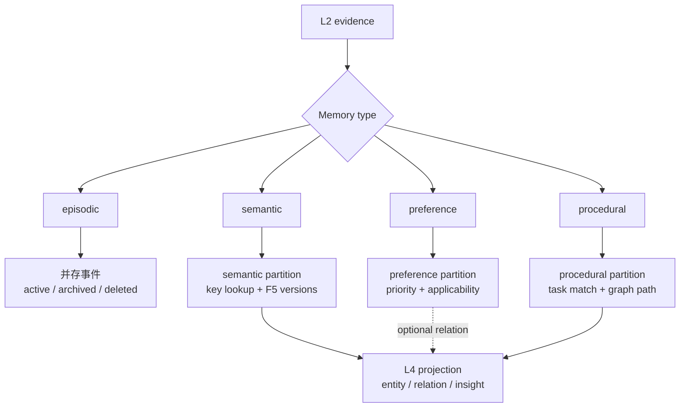
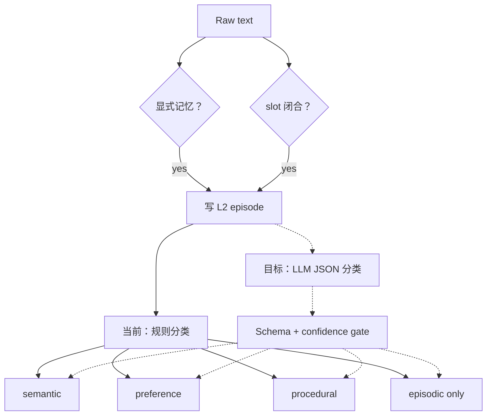

# 记忆分类体系

MemX 使用两个正交维度描述一条记忆：

1. **存储层级 L0-L4**：表示组织程度、持久性和主要存储形态。
2. **语义类型 MemoryType**：表示内容的认知角色和检索意图。

只使用其中一个维度会产生歧义。例如 preference 是语义类型，不是新的物理存储层；
它可以先以 L2 episode 作为证据，再固化为 L3 preference fact。

## 1. 二维分类矩阵

| 层级 \ 类型 | episodic 情景 | semantic 语义 | preference 偏好 | procedural 程序 |
| --- | --- | --- | --- | --- |
| L0 原始观察 | 原始事件消息 | 尚未提炼 | 偏好原话 | 流程原话 |
| L1 工作记忆 | 最近事件摘要 | 临时事实候选 | 当前会话偏好 slot | 未闭合任务/步骤 slot |
| L2 情景证据 | **主存储层** | 事实来源 episode | 偏好来源 episode | 流程来源 episode |
| L3 语义事实 | 通常不落 L3 | **semantic partition** | **preference partition** | **procedural partition** |
| L4 认知图谱 | 事件相关实体 | 实体/概念/洞察 | 可作为 insight 证据 | 步骤、依赖与流程关系 |

### L0-L4 升维与召回流程



这是一条有条件的升维链，不是五份数据的机械复制。L2 是证据根；L3/L4 只保存经过分类
和治理的派生结果；recall 汇聚三层结果，但不会用派生结果反向覆盖原始 evidence。

## 2. 四种语义类型

### episodic：发生过什么

- 内容：对话片段、任务事件、一次操作结果、带时间上下文的经历。
- 典型问题：“上次我们怎么处理部署失败的？”
- 主要字段：`text`、`ts_create`、`source_ids`、`embedding`。
- 生命周期：`active -> archived -> deleted`，归档后可被 recall + reinforce 复活。
- 冲突语义：事件可以并存，通常不因内容不同而互相覆盖。

示例：

```text
2026-09-04 用户在发布前执行了 lint、pytest 和 memory eval。
```

### semantic：稳定事实是什么

- 内容：用户属性、项目约束、领域事实、长期成立的陈述。
- 典型问题：“项目交付日期是什么？”
- 主键：`scope_id + partition + fact_key + version`。
- 冲突语义：同 key 不同值进入 F5；时序事实保留版本链。

示例：

```json
{
  "fact_key": "project.delivery.deadline",
  "value": "2026-10-01",
  "confidence": 0.95,
  "partition": "semantic"
}
```

### preference：用户更倾向什么

- 内容：语言、语气、格式、工具、界面、工作方式和禁忌。
- 典型问题：“按用户习惯应该如何输出？”
- 当前路由：RecallAgent 无条件优先读取 preference partition，再补普通相关事实。
- 当前冲突语义：复用 L3 通用版本/置信度规则。
- 目标冲突语义：支持可并存偏好、上下文条件、强度和显式覆盖。

示例：

```json
{
  "fact_key": "user.preference.editor",
  "value": "VSCode",
  "confidence": 0.9,
  "partition": "preference"
}
```

### procedural：如何完成某件事

- 内容：SOP、操作步骤、工具序列、条件分支、检查清单。
- 典型问题：“发布前按什么顺序执行？”
- 当前表示：L3 procedural fact + L4 insight/entity。
- 目标表示：步骤节点、条件节点和依赖边组成可执行小型 DAG。

示例：

```text
workflow.release = lint -> unit_test -> memory_eval -> deploy
```

### 类型分类与治理流程



分类输出决定治理策略，不改变 L2 原文。当前规则分类只识别显式 key 与关键词；目标模型
分类必须经过 Schema 校验和 confidence gate，并继续复用同一组分区与冲突不变式。

## 3. 当前分类代码

当前类型枚举是实际运行结构：

```python
class MemoryType(str, Enum):
    EPISODIC = "episodic"
    SEMANTIC = "semantic"
    PREFERENCE = "preference"
    PROCEDURAL = "procedural"
```

当前 L2 分类规则：

```python
def infer_memory_type(text: str) -> MemoryType:
    lowered = text.lower()
    if "preference." in lowered or "偏好" in text or "喜欢" in text:
        return MemoryType.PREFERENCE
    if "procedure." in lowered or "workflow." in lowered or "流程" in text:
        return MemoryType.PROCEDURAL
    return MemoryType.EPISODIC
```

当前 L3 分区规则：

```python
def partition_for(memory_type: MemoryType) -> str:
    if memory_type == MemoryType.PREFERENCE:
        return "preference"
    if memory_type == MemoryType.PROCEDURAL:
        return "procedural"
    return "semantic"
```

这套规则可重复、无模型成本，但只能覆盖显式关键词。自由文本分类、条件偏好、多标签记忆
和复杂流程识别仍需 MX-101 的结构化模型决策。

## 4. 分类输入与输出

建议把分类结果收敛为显式结构，而不是散落在文本规则中：

```python
@dataclass(frozen=True)
class MemoryClassification:
    # 目标结构，当前尚未实现为独立 dataclass。
    memory_type: MemoryType
    partition: str
    confidence: float
    fact_key: str | None
    temporal: bool
    entities: tuple[str, ...]
    reasons: tuple[str, ...]
    classifier_version: str
```

建议模型决策 JSON：

```json
{
  "memory_type": "preference",
  "partition": "preference",
  "confidence": 0.92,
  "fact_key": "user.response.format",
  "temporal": false,
  "entities": [
    "user",
    "response"
  ],
  "reasons": [
    "explicit preference statement",
    "stable across sessions"
  ],
  "classifier_version": "memory-classifier-v1"
}
```

## 5. 分类触发点



## 6. 类型与召回策略

| 类型 | 当前召回 | 推荐目标召回 | 排序重点 |
| --- | --- | --- | --- |
| episodic | L2 dense + sparse | dense + sparse + graph related | relevance、recency、importance |
| semantic | L3 semantic search | key lookup + semantic + evidence quality | exact key、confidence、freshness |
| preference | L3 partition 优先注入 | scope/context 条件过滤后优先注入 | explicitness、strength、recency |
| procedural | L3/L4 一般查询 | task match + graph path retrieval | applicability、step completeness |

## 7. 类型与冲突策略

| 类型 | 可否并存 | 版本策略 | 冲突示例 |
| --- | --- | --- | --- |
| episodic | 可以 | 以内容指纹去重，事件不互相覆盖 | 两次不同发布日期讨论 |
| semantic | 视 key 而定 | 普通事实置信度裁决；时序事实归档旧版本 | `device.os=iOS` → `Android` |
| preference | 通常可条件并存 | 当前通用 F5；目标增加 context/strength | 工作时简洁，教学时详细 |
| procedural | 可以多版本 | 按流程版本、适用条件和成功证据治理 | release-v1 与 release-v2 |

## 8. 不变式

1. 任一 L3/L4 记录必须能回溯到一个或多个 L2 `evidence_ids`。
2. `memory_type` 与 `partition` 必须一致，preference/procedural 不写入错误 namespace。
3. 类型改变不能修改原始 L2 文本和来源，只能更新分类元数据或产生新派生版本。
4. 低置信分类不得直接覆盖高置信事实。
5. 删除证据后必须降权、删除或标记引用它的派生事实和 insight。
