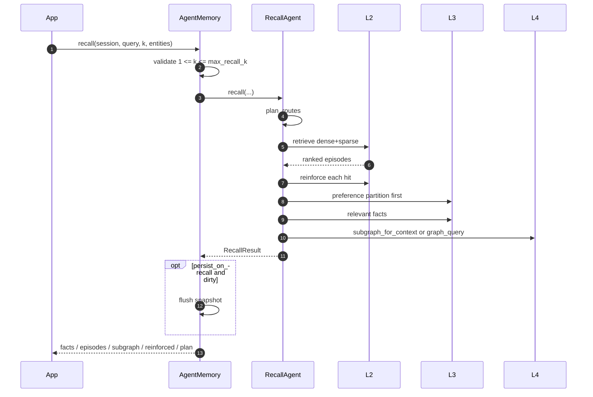
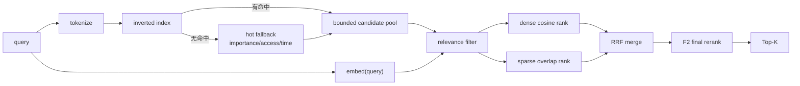
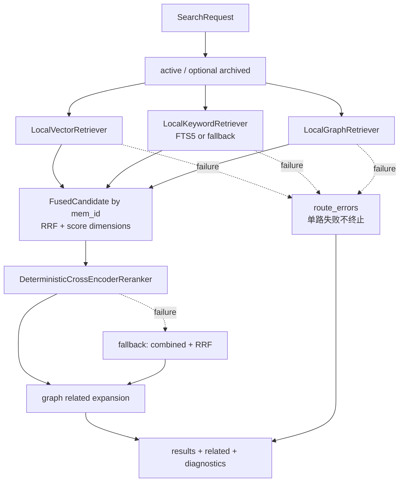

# Retrieval 检索设计

MemX 有两个相关但不同的检索入口：

1. **在线 `recall()`**：面向 Agent 上下文，聚合 L2 episodes、L3 facts 和 L4 subgraph。
2. **`HybridSearchPipeline`**：面向搜索/诊断，执行 vector、keyword、graph 三路 RRF 融合、
   重排和 related 扩展。

必须区分两者：当前在线 recall 的 L2 排名只融合 dense + sparse；L3 和 L4 独立召回后
组装到结果，不参与同一个 RRF 排名。三路统一 RRF 已存在于独立 HybridSearchPipeline。

## 1. 对外接口

| 接口 | 返回 | archived | 是否 reinforce | 典型用途 |
| --- | --- | --- | --- | --- |
| `recall(session_id, query, k)` | facts + episodes + subgraph + plan | 默认允许 | 是 | Agent 上下文 |
| `search(session_id, query, k)` | 统一服务搜索结果 | 仅 active | 取决于服务路径 | 精确搜索 |
| `get_context(session_id, query)` | prompt-ready string | 继承 recall | 是 | Prompt 拼装 |
| `HybridSearchPipeline.search()` | results + related + route diagnostics | 参数控制 | 否 | 全局搜索/诊断 |

## 2. 在线 Recall 总流程



`RecallPlan.routes` 当前主要用于诊断和结果解释，实际执行顺序由 RecallAgent 固定编排。

## 3. L2 Dense + Sparse 流程



### 候选池来源

| `candidate_source` | 条件 | 行为 |
| --- | --- | --- |
| `empty_query_hot_fallback` | query 无 token | 按 importance/access/time 取热点 |
| `no_sparse_match_hot_fallback` | 倒排索引无命中 | 使用热点兜底 |
| `sparse_only_bounded` | sparse 命中已达到上限 | 只使用命中集合 |
| `sparse_plus_hot_fallback` | sparse 命中不足 | 命中 + 热点补齐 |

候选上限：

```python
candidate_limit = max(
    k,
    min(
        k * retrieval_candidate_multiplier * 4,
        retrieval_candidate_hard_limit,
    ),
)
```

默认 `k <= 50`、`retrieval_candidate_multiplier=2`、hard limit `1000`。

## 4. 过滤与双路排序

对每个候选计算：

```python
dense_similarity = cosine(query_embedding, memory.embedding)
keyword_overlap = len(query_tokens & memory_tokens)

keep = (
    dense_similarity >= minimum_relevance_score
    or keyword_overlap > 0
)
```

保留候选分别进入：

```python
dense_rank = sort_by(dense_similarity, descending=True)
sparse_rank = sort_by(keyword_overlap, descending=True, require_overlap=True)
```

RRF：

```text
rrf_score(memory) =
    Σ route ∈ {dense, sparse} 1 / (rrf_k0 + rank_route(memory))
```

默认 `rrf_k0=60`。RRF 使用排名而不是原始分值，避免 cosine 与关键词分数尺度不一致。

## 5. F2 最终排序

基础实现：

```text
recency =
    recency_decay_per_hour ^
    ((now - ts_last_access) / 3600)

F2 =
    0.55 * cosine(query_embedding, memory.embedding)
  + 0.20 * recency
  + 0.25 * (importance / 10)
```

`HybridSearchPipeline.score_dimensions()` 使用更完整的 relevance：

```text
keyword_score = overlap / max(1, query_token_count)
graph_bonus = 0.1 if graph route hit else 0

relevance =
    min(1,
        0.7 * max(0, dense_similarity)
      + 0.3 * keyword_score
      + graph_bonus)

combined_score =
    w_rel * relevance
  + w_rec * recency
  + w_imp * importance_score
```

## 6. 命中强化

在线 recall 对每个 L2 命中执行：

```python
memory.ts_last_access = now
memory.access_count += 1
memory.stability *= reinforce_gamma

if memory.status == MemoryStatus.ARCHIVED:
    memory.status = MemoryStatus.ACTIVE
```

默认 `reinforce_gamma=1.5`。这会影响未来排序和遗忘，使经常被证明有用的记忆更稳定。

`persist_on_recall=False` 时只标记 dirty，避免召回关键路径同步写完整快照。

## 7. L3 Facts 召回

```python
facts = []
seen = set()

# 1. 偏好优先，不让偏好与普通事实争抢入口
for fact in l3.query_relevant(
    query="",
    partition="preference",
    k=min(k, max_recall_k),
):
    facts.append(fact)
    seen.add(fact.fact_key)

# 2. 再按 query 召回全部相关事实并按 fact_key 去重
for fact in l3.query_relevant(query, k=k):
    if fact.fact_key not in seen:
        facts.append(fact)

return facts[:k]
```

L3 相关度是词法命中数与 fact embedding cosine 的和：

```text
l3_score = lexical_match_count + cosine(query_embedding, fact.embedding)
```

当前 limitation：偏好分区使用空 query，因此优先取分区顺序中的前 k 条，而不是按当前
上下文进一步重排。目标设计应增加 preference applicability。

## 8. L4 图召回

在线 recall：

```python
if entities:
    subgraph = l4.subgraph_for_context(scope_id, entities, k)
elif query:
    subgraph = l4.graph_query(scope_id, query, k)
else:
    subgraph = {"nodes": [], "edges": []}
```

HybridSearchPipeline 的 graph route：

1. 用 query token 匹配 node label。
2. `node_score = salience + max(overlap, 1)`。
3. 把 node score 加到其 `evidence_ids` 指向的 L2 memory。
4. 沿一跳 edge 扩展邻居，衰减为：

```text
neighbor_score = 0.8 * seed_score * max(edge_weight, 0.01)
```

5. Top-K 主结果完成后，再沿图返回不在主结果中的 `related` memories。

## 9. 三路 HybridSearchPipeline



确定性 reranker：

```text
route_coverage = min(1, route_hit_count / 3)

rerank_score =
    0.75 * combined_score
  + 0.15 * rrf_score
  + 0.10 * route_coverage
```

它模拟 CrossEncoder Port 的契约，但不是机器学习 cross-encoder。

## 10. 检索数据结构

```python
SearchRequest(
    query="release workflow",
    query_tokens=frozenset({"release", "workflow"}),
    query_embedding=(...),
    k=8,
    include_archived=False,
    now_ts=...,
    config=MemoryConfig(...),
)

RetrievalCandidate(
    mem_id="m_123",
    rank=1,
    score=0.84,
    route="vector",
    engine="local_vector",
    metadata={"dense_similarity": 0.84},
)

FusedCandidate(
    memory=episodic_memory,
    rrf_score=0.048,
    route_hits=["graph", "keyword", "vector"],
    route_scores={"vector": 0.84, "keyword": 2.0, "graph": 1.5},
    route_ranks={"vector": 1, "keyword": 2, "graph": 1},
    scores={
        "relevance_score": 0.91,
        "recency_score": 0.98,
        "importance_score": 0.8,
        "combined_score": 0.8965,
    },
    combined_score=0.8965,
    rerank_score=0.779,
)
```

## 11. 输出契约

在线 recall：

```json
{
  "facts": [],
  "episodes": [],
  "subgraph": {
    "nodes": [],
    "edges": []
  },
  "reinforced": [],
  "plan": {
    "scope_id": "human_mem_project",
    "query": "release workflow",
    "k": 8,
    "routes": [
      "preference",
      "l3",
      "l2",
      "l4"
    ],
    "include_preferences": true,
    "include_graph": true
  }
}
```

HybridSearchPipeline：

```json
{
  "engine": "hybrid_rrf",
  "query": "release workflow",
  "candidate_count": 120,
  "fused_candidate_count": 18,
  "result_count": 8,
  "related_count": 5,
  "routes": {
    "vector": {
      "engine": "local_vector",
      "candidate_count": 16,
      "mem_ids": []
    }
  },
  "route_errors": {},
  "rerank_enabled": true,
  "rerank_error": null,
  "results": [],
  "related": []
}
```

## 12. 降级策略

| 故障 | 当前行为 | 目标行为 |
| --- | --- | --- |
| query 空 | 热点候选或空 payload | 按调用接口保持稳定 |
| sparse 无命中 | 热点候选补齐 | 保留 |
| FTS5 不可用 | keyword fallback | 记录 engine 与告警 |
| 单个 route 异常 | Pipeline 记录 `route_errors` | 熔断并继续健康路由 |
| reranker 异常 | combined + RRF 排序 | 保留并记录模型版本 |
| graph 不可用 | 在线 recall 返回空子图 | 标记 degraded，不影响 L2/L3 |
| embedding 不可用 | 当前本地 deterministic | 生产版本化 fallback 或 fail closed |

## 13. 诊断字段

L2 `last_retrieval_stats()`：

```python
{
    "scope_id": str,
    "query_tokens": list[str],
    "candidate_count": int,
    "filtered_count": int,
    "dense_ranked": int,
    "sparse_ranked": int,
    "candidate_source": str,
    "candidate_limit": int,
}
```

建议生产补充：

- route P50/P95/P99 latency。
- 每路召回率、独占命中率和 overlap。
- fallback rate、empty result rate、archived revival rate。
- embedding/reranker model version。
- 每个候选的 explain trace，但不得记录完整敏感原文。

## 14. 当前缺口

1. 在线 recall 与三路 HybridSearchPipeline 尚未收敛为同一个执行引擎。
2. 在线 L4 结果独立返回，不参与 L2 episode 的统一排序。
3. preference 优先注入缺少上下文适用性评分。
4. 本地 embedding 是 token hash，不代表生产语义质量。
5. deterministic reranker 不是训练过的 cross-encoder。
6. 生产索引版本、向量回填和模型切换尚未实现。
