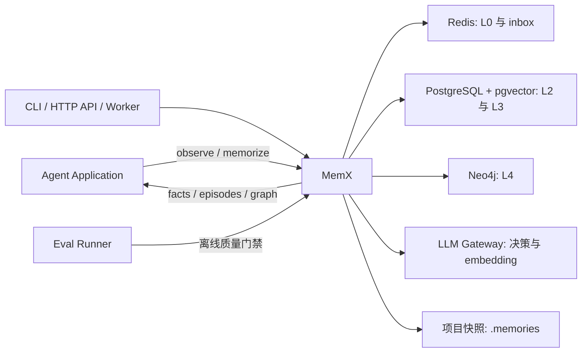

# 系统上下文

## 目标

MemX 为 Agent 提供跨轮次、跨会话的长期记忆能力。它不负责生成最终回答，而是负责把
原始对话转化为可召回证据、结构化事实和图关系，再将相关上下文返回给上层 Agent。

## 上下文边界

## 核心承诺

| 维度 | 当前承诺 | 非目标 |
| --- | --- | --- |
| 接口 | `HumanMem` 提供单项目 scope 的稳定入口 | 不承担聊天 UI 与模型回答生成 |
| 延迟 | recall 默认不调用远程 LLM，候选规模有硬上限 | 不保证任意数据规模下无索引扫描 |
| 一致性 | L3 保存事实版本、证据和冲突日志 | 当前不提供跨多实例分布式事务 |
| 可替换性 | 服务层依赖 Port，Adapter 负责外部系统 | 不允许领域层直接 import 数据库 SDK |
| 隐私 | 模型密钥只从进程环境或本地 `.env` 读取 | 不通过配置 API 或 `hms.json` 写入密钥 |
| 质量 | 离线 evals 对召回、固化和延迟设门槛 | 尚未覆盖真实模型漂移与人工偏好判断 |

## 信任边界

1. API 输入是不可信数据，必须经过 Pydantic、领域校验和路径校验。
2. `.env`、数据库 DSN 与 Gateway token 属于机密配置，不进入日志、API 返回或提交。
3. LLM Gateway 输出是不可信结构化数据，目标实现必须做 JSON Schema 校验和降级。
4. L2 episode 是证据层，L3 fact 是经治理的事实层，L4 insight 不能反向覆盖证据。
5. 外部存储失败不能静默成功；关键写入需要明确重试、幂等和死信语义。

## 部署形态

### 本地与测试

`backend_mode=memory` 使用进程内 Adapter 和确定性 embedding。该模式无外部网络依赖，
适用于单元测试、演示和离线 evals。

### 生产目标

`backend_mode=production` 装配 Redis、PostgreSQL/pgvector、Neo4j 和 HTTP LLM Gateway。
当前实现属于 write-through 生产骨架，尚未完成多实例一致性、远程向量主路径和真实
LLM 固化决策，因此不能把“能连接依赖”等同于“已具备生产就绪语义”。
