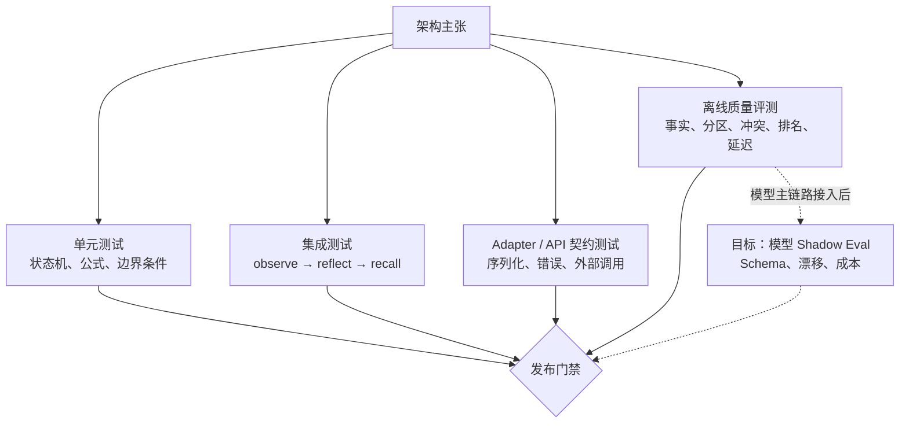

# 架构验证与证据矩阵

本文把架构主张映射到可执行验证。它解决两个问题：

1. 文档中的“已实现”必须能定位到代码和自动化证据。
2. pytest 与 evals 的职责必须分开，避免用覆盖率代替记忆质量。

## 1. 验证分层



## 2. 证据矩阵

| 架构主张 | 实现位置 | pytest 证据 | eval 证据 | 当前结论 |
| --- | --- | --- | --- | --- |
| L2 重复写入幂等 | `memory/episodic.py` | `test_l2_idempotent_promote_grace_and_active_occupancy` | `duplicate-idempotency` | 已验证 |
| preference 独立分区并优先召回 | `agents/recall.py`, `memory/semantic.py` | `test_l3_conflict_resolution_versions_and_pruning` | language/editor/response/terminal preference | 已验证 |
| procedural 写入正确分区 | `agents/service.py` | 服务与类型测试 | release/backup/incident workflow | 已验证 |
| 时序事实保留版本链 | `memory/semantic.py` | `test_l3_conflict_resolution_versions_and_pruning` | device/location/job temporal update | 已验证 |
| 冲突动作可审计 | `memory/semantic.py` | 冲突裁决测试 | `conflict_expectation_rate` | 已验证 |
| L3/L4 可追溯到 L2 evidence | `agents/consolidation.py` | 图谱与固化测试 | `fact_contract_rate` 的 evidence 断言 | L3 已验证，L4 由 pytest 验证 |
| recall 候选规模有界 | `retrieval/candidate_pool.py` | retrieval pipeline tests | P95 与 MRR 基线 | 小数据已验证 |
| 单路失败可降级 | `retrieval/pipeline.py` | reranker/route fallback tests | 尚无故障注入 eval | 部分验证 |
| inbox retry 状态正确 | `ingest/inbox.py` | `test_inbox_lifecycle_and_memory_type_refresh` | consolidation success rate | 单进程已验证 |
| lease / DLQ / replay | 尚未实现 | 无 | 无 | 目标能力 |
| 模型 JSON 决策与 fallback | Port 已有，主链路未接入 | Adapter 测试 | 无真实模型 eval | 目标能力 |
| 多实例远程权威读写 | Production Adapter 骨架 | write-through mock tests | 无 | 目标能力 |

## 3. 核心离线 Eval 契约

`evals/datasets/core-memory.jsonl` 当前包含 14 个独立场景，覆盖：

- preference：语言、编辑器、回复格式、终端工具；
- procedural：发布、备份、故障响应流程；
- semantic：交付日期、团队 owner、API contract；
- temporal：设备系统、城市、职位更新；
- idempotency：重复写入不破坏事实与 episode 召回。

每个 `expected_facts` 除 key/value 外还可声明：

```json
{
  "key": "user.preference.editor",
  "value": "VSCode",
  "partition": "preference",
  "mem_type": "preference",
  "min_version": 1,
  "min_evidence_count": 1
}
```

时序或冲突场景还可声明：

```json
{
  "expected_conflicts": [
    {
      "key": "device.os",
      "action": "archive",
      "conflict_type": "temporal"
    }
  ]
}
```

## 4. 指标解释

| 指标 | 验证内容 | 不能证明 |
| --- | --- | --- |
| `fact_recall` | 期望 key/value 能被召回 | 分区、类型和来源是否正确 |
| `fact_contract_rate` | 分区、类型、版本、证据数满足契约 | 事实本身是否符合真实世界 |
| `conflict_expectation_rate` | 冲突类型和裁决动作符合预期 | 人工判断是否接受 pending |
| `episode_hit_rate` | 原始证据文本仍可召回 | 大规模语义检索质量 |
| `fact_mrr` / `episode_mrr` | 正确结果排序位置 | 生产数据分布下的 nDCG |
| `p95_recall_latency_ms` | 本地小集算法回归 | 生产网络、数据库和并发 SLO |

## 5. 本地与 CI 命令

```bash
uv run ruff check src/mem tests examples scripts
uv run pytest
uv run mem-eval \
  --dataset evals/datasets/core-memory.jsonl \
  --thresholds evals/thresholds.json \
  --output .memories/evals/core-memory.json \
  --fail-on-regression
```

发布证据至少包含：测试结果、覆盖率、dataset 名称与 hash、全部指标、失败门槛和生成时间。
真实模型接入后，还必须记录 model、prompt/schema version、token、成本和 fallback 原因。
