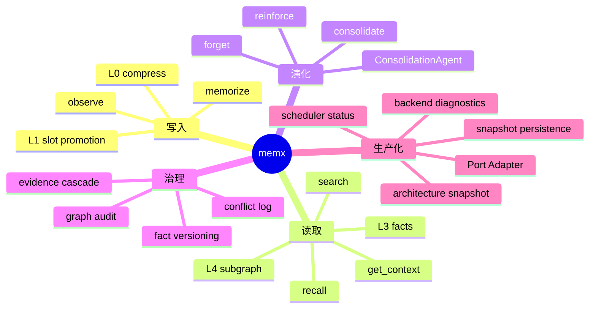
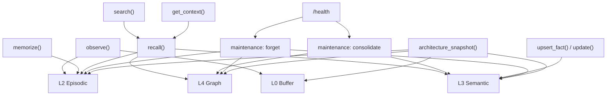

# memx 能力矩阵

本文档从产品能力、工程能力和治理能力三个视角描述 `memx` 的能力边界，帮助接入方判断应该调用哪个接口、关注哪些配置，以及如何验证功能是否生效。

## 总体能力图

## 产品能力

| 能力 | 说明 | 推荐接口 | 成功信号 |
| --- | --- | --- | --- |
| 用户偏好记忆 | 记住语言、风格、禁忌、常用约束 | `observe()` / `memorize()` + `maintenance(["consolidate"])` | `recall()` 返回 `partition=preference` 的事实 |
| 跨会话上下文 | 在新 session 中召回旧 session 记忆 | `recall()` / `get_context()` | 返回与当前 query 相关的 `facts` 和 `episodes` |
| 事实更新 | 同一事实发生变更时保留版本轨迹 | `upsert_fact()` / `update()` | 返回 `created`、`replaced`、`archived` 或 `pending` |
| 情景检索 | 基于自然语言查找历史片段 | `search()` | 返回 active 状态的 `episodes` |
| 认知洞察 | 从高价值记忆生成实体关系和 insight | `reflect()` 或 `maintenance(["consolidate"])` | `promoted_l4` 非空或 `l4.nodes` 增加 |
| Prompt 上下文 | 拼装可直接输入 Agent 的上下文字符串 | `get_context()` | 输出包含 Summary、Facts、Episodes |

## 工程能力

| 能力 | 设计目的 | 关键配置 | 观测方式 |
| --- | --- | --- | --- |
| L0 原始缓冲 | 控制短期消息窗口，避免 prompt 无限增长 | `raw_window_turns`, `raw_ttl_seconds` | `architecture_snapshot()["l0_sessions"]` |
| L1 压缩摘要 | 将多轮对话压缩为滚动摘要和 slot | `flush_turns`, `theta_ctx_ratio`, `working_memory_tokens` | `observe()["compress_triggered"]` |
| L2 混合召回 | 限制候选规模并融合语义与关键词排序 | `retrieval_candidate_multiplier`, `minimum_relevance_score` | `last_retrieval_stats()` |
| L3 冲突治理 | 对事实版本、证据、置信度进行裁决 | `confidence_threshold`, `conflict_confidence_gap` | `conflict_log()` |
| L4 图谱审计 | 清理孤儿边、低显著节点和过期洞察 | `graph_salience_decay`, `graph_prune_threshold` | `reflect()` / `maintenance(["forget"])` 的 `graph_audit` 结果 |
| 调度状态 | 观察后台巩固和遗忘任务状态 | `MaintenanceTaskManager` | `/health` / `scheduler_status()` |
| 持久化快照 | 将项目状态写入 `.memories` | `persist_on_write`, `persist_on_recall`, `memory_dir` | `flush()` / `read_stored_state()` |

## 接口能力映射

## 场景推荐

| 场景 | 最小调用序列 | 注意事项 |
| --- | --- | --- |
| 对话中显式记忆 | `observe()` -> `maintenance(["consolidate"])` -> `recall()` | 用户说“记住/remember”时会立即进入 L2 |
| 后台批量固化 | `memorize()` -> `maintenance(["consolidate"])` | `force_reflect=False` 时受 `reflect_importance_threshold` 控制 |
| 检索只看 active 记忆 | `search()` | `search()` 不复活 archived 记忆 |
| 召回允许复活归档记忆 | `recall(include_archived=True)` | 召回命中会执行 reinforce |
| 强制删除敏感记忆 | `forget(mode="hard", mem_id=..., force=True)` | 高重要性记忆需要显式 `force=True` |
| 运维巡检 | `backend_diagnostics()` -> `/health` -> `scheduler_status()` | 查看调度任务状态、embedding 状态和后端摘要 |

## 能力边界

- `memx` 当前不在在线召回关键路径中调用真实 LLM，默认使用确定性 `NoopLLMGateway` 与本地 embedding。
- `reflect()` 是固化动作，不等同于简单查询；生产环境建议通过 `MaintenanceTaskManager` 调度 `consolidate`，不要每次请求同步执行。
- 推荐入口 `HumanMem` 不要求业务传入作用域信息，内部统一使用 `human_mem_project` scope。
- `search()` 默认只查 active L2 记忆；需要事实、图谱和 archived 复活时应使用 `recall()`。
- L3 冲突返回 `pending` 时表示系统发现需要人工或上层策略确认的事实冲突，不应直接认为更新失败。
- `.memories` 快照适合本地与测试环境，生产权威存储应优先使用 PostgreSQL/pgvector、Redis 和 Neo4j Adapter。
