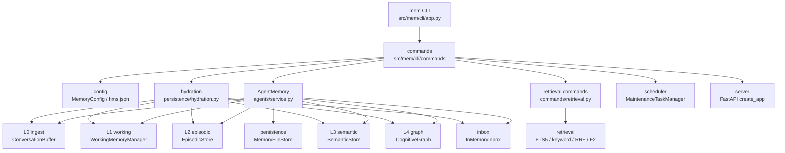
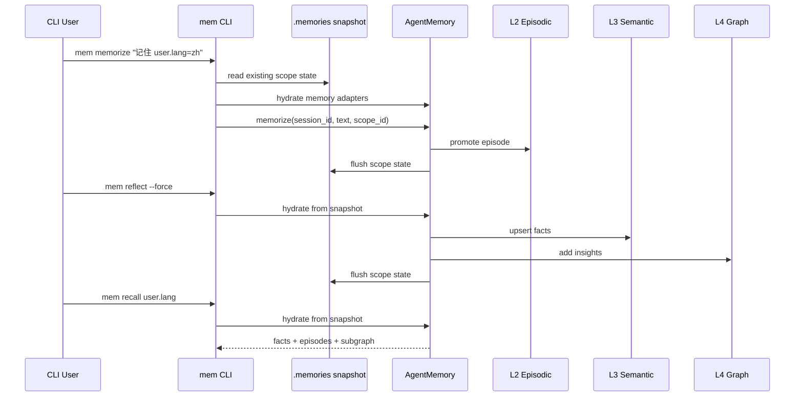

# MemX CLI 使用说明

`mem` CLI 将 `src/mem` 内分散的配置、写入、召回、固化、遗忘、图谱、持久化和 HTTP 服务能力统一暴露为命令行入口。安装包后可使用 `mem` 或 `memx`，源码环境中也可使用 `uv run mem` 或 `uv run python -m mem`。

## 模块结构与调用链

CLI 入口位于 `src/mem/cli/` 包内。`app.py` 负责全局参数和子命令注册，`context.py` 负责加载配置和恢复快照，`commands/` 目录按能力域拆分具体命令实现。CLI 不直接实现核心记忆算法，实际写入、召回、检索、调度和服务能力仍由现有模块提供。



写入和读取链路如下：



## 全局参数

| 参数 | 用途 |
| --- | --- |
| `--config PATH` | 指定 `hms.json` 配置文件路径。 |
| `--memory-dir DIR` | 覆盖 `MemoryConfig.memory_dir`，必须是项目内 `.memories/...` 相对路径。 |
| `--session-id ID` | 会话 ID，默认 `cli-session`。 |
| `--scope-id ID` | 记忆作用域，默认 `human_mem_project`。 |
| `--backend-mode memory|production` | 覆盖后端模式。 |
| `--persist-on-write` / `--no-persist-on-write` | 覆盖写入时持久化策略。CLI 会在命令结束前 flush dirty scope，保证多进程命令可串联。 |
| `--no-load-state` | 跳过本地 memory backend 的快照恢复，适合诊断空白状态。 |

## 核心命令

### 写入与观察

```bash
uv run mem observe user 记住 cli.lang_pref=zh，语言偏好是中文
uv run mem memorize 记住 cli.topic=memory --importance 8
printf 'user: 记住 cli.batch=ok\nassistant: 已记录' | uv run mem ingest
```

- `observe <role> <content...>`: 进入 L0，触发显式记忆提升和必要的 L1 压缩。
- `memorize <text...> [--importance N]`: 直接写入 L2 情景记忆，并将固化任务放入 inbox。
- `ingest`: 从标准输入或文件批量读取消息，转换为 memories 结构，并按指定方式存储。

### 批量消息导入

`ingest` 用于把普通消息批量转换为 memories 数据结构。转换后的单条结构包含
`role`、`content`、`session_id`、`scope_id`、`source`，可选包含 `ts` 和 `metadata`。

```bash
printf 'user: 记住 ingest.lang_pref=zh\nassistant: acknowledged' \
  | uv run mem --memory-dir .memories/ingest-demo ingest --input-format text

uv run mem --memory-dir .memories/ingest-demo ingest \
  --input ./messages.jsonl \
  --input-format jsonl \
  --default-role user \
  --store-as observe \
  --output ./converted-memories.json \
  --output-format json
```

输入参数：

| 参数 | 用途 |
| --- | --- |
| `--input PATH` | 从文件读取消息；省略时从标准输入读取。 |
| `--input-format auto\|text\|json\|jsonl` | 输入格式，默认自动识别。 |
| `--default-role user\|assistant\|tool\|system` | 文本行或 JSON 项缺省角色，默认 `user`。 |
| `--store-as observe\|memorize\|none` | 存储方式，默认 `observe`。 |
| `--importance N` | `--store-as memorize` 时指定 L2 importance。 |
| `--output PATH` | 将转换后的 memories 写入文件；省略时内联返回到 CLI JSON payload。 |
| `--output-format json\|jsonl` | 转换结果文件格式，默认 `json`。 |
| `--pretty` | 对 JSON 转换结果使用缩进格式。 |

支持的输入示例：

```text
user: 记住 user.lang_pref=zh
assistant: 已记录
普通文本行会使用 --default-role
```

```json
[
  {"role": "user", "content": "记住 user.lang_pref=zh", "ts": 1710000000},
  {"role": "assistant", "text": "已记录", "metadata": {"channel": "cli"}}
]
```

```jsonl
{"role":"user","content":"记住 user.lang_pref=zh"}
{"role":"assistant","message":"已记录"}
```

存储语义：

- `observe`: 每条消息进入 L0，显式记忆会按现有规则提升到 L2，并写入 `.memories/scopes/<scope>/memory-state.json`。
- `memorize`: 每条消息正文直接写入 L2，适合已经清洗好的批量记忆文本。
- `none`: 只做格式转换和输出，不写入 `.memories`。

错误处理：

- 输入文件不存在、路径不是文件、JSON/JSONL 非法、消息缺少内容或角色非法时，命令返回 `ok=false`。
- 未提供 `--input` 且未通过管道传入标准输入时，命令提示提供输入来源。

### 召回与上下文

```bash
uv run mem recall cli.lang_pref -k 5
uv run mem recall 语言偏好 --entity cli --active-only
uv run mem search 中文 -k 5
uv run mem context cli.lang_pref
```

- `recall <query...>`: 返回 L3 facts、L2 episodes 和 L4 subgraph，可包含 archived 记忆。
- `search <query...>`: 只搜索 active 记忆。
- `context [query...]`: 输出可直接放入 Agent prompt 的上下文文本。

### 检索诊断

```bash
uv run mem retrieval fts5 cli.lang_pref -k 5
uv run mem retrieval fts5 cli.lang_pref --all-scopes --include-archived
uv run mem retrieval keywords cli.lang_pref -k 5
uv run mem retrieval rerank cli.lang_pref -k 5
uv run mem retrieval relevance cli.lang_pref --mem-id <mem_id>
uv run mem retrieval score cli.lang_pref --all-scopes -k 5
```

- `retrieval fts5`: 运行 `hybrid_rrf` 检索流水线。请求同时进入向量路、关键词路和图谱路，按 memory ID 执行 RRF 融合，再计算时效性、重要性和相关性三维综合分，默认通过确定性 cross-encoder fallback 重排序，最后返回 Top-K `results` 与后置图谱扩展得到的 `related`。关键词路仍使用临时 SQLite FTS5；当本地 SQLite 不支持 FTS5 时，会自动降级为关键词 fallback。
- `retrieval keywords`: 使用 retrieval tokenizer 和 sparse overlap 做关键词排序，同时暴露 `keyword_overlap` 与热点排序信号。
- `retrieval rerank`: 展示 candidate pool 来源、dense rank、sparse rank、RRF 融合结果和最终 F2 rerank。
- `retrieval relevance`: 输出 dense similarity、keyword overlap、minimum relevance threshold 与 `passes_relevance`。
- `retrieval score`: 输出 F2 分数组成，包括语义相关、近因性、重要性权重和最终 `f2_score`。
- `--all-scopes`: 扫描当前 `memory_dir/scopes/*/memory-state.json`，用于全局检索；默认只读取当前 `--scope-id`。

### 固化、遗忘与更新

```bash
uv run mem reflect --force
uv run mem forget decay
uv run mem forget hard <mem_id> --force
uv run mem update fact cli.lang_pref cn --confidence 0.95
uv run mem update mem <mem_id> 更新后的记忆正文 --importance 9
```

- `reflect [--force]`: 消费 inbox，将 L2 episode 固化为 L3 facts 和 L4 insights。
- `forget decay|expire|hard`: 执行动态遗忘、过期删除或指定记忆硬删除。
- `update fact`: 新增或更新 L3 fact，走 F5 冲突治理。
- `update mem`: 更新 L2 记忆正文或重要性。

### 运维与诊断

```bash
uv run mem snapshot
uv run mem snapshot --full
uv run mem state
uv run mem flush
uv run mem diagnostics
uv run mem maintenance status
uv run mem maintenance run consolidate forget --force-reflect
uv run mem graph audit
uv run mem graph query cli -k 5
```

- `snapshot`: 输出 L0-L4、inbox、persistence、backend 摘要。
- `state`: 读取当前 scope 的持久化快照摘要。
- `flush`: 显式持久化当前 scope。
- `diagnostics`: 输出 Port/Adapter 组合和 LLM Gateway 健康信息。
- `maintenance run`: 调用调度任务管理器，支持 `consolidate` 和 `forget`。
- `graph audit/query`: 审计或查询 L4 认知图谱。

### 配置与服务

```bash
uv run mem config show
uv run mem config show --effective
uv run mem --config ./hms.json config set max_recall_k=20 persist_on_write=true
uv run mem --config ./hms.json serve --host 127.0.0.1 --port 8000
```

- `config show`: 查看 `hms.json` 原始配置。
- `config show --effective`: 查看合并默认值后的有效配置。
- `config set KEY=VALUE`: 校验并写入配置，VALUE 会优先按 JSON 标量解析。
- `serve`: 启动已有 FastAPI HTTP API。

## 输出与错误处理

所有业务命令输出统一为 JSON：

```json
{
  "ok": true,
  "command": "recall",
  "message": "recall completed",
  "payload": {
    "facts": [],
    "episodes": [],
    "subgraph": {"nodes": [], "edges": []}
  }
}
```

命令执行异常会被转为 `ok=false`，并在 `payload.error_type` 中给出异常类型。参数解析错误由 `argparse` 展示帮助信息并返回非零退出码。

## 最小功能验证

```bash
uv run mem --memory-dir .memories/cli-demo memorize 记住 cli.lang_pref=zh
uv run mem --memory-dir .memories/cli-demo reflect --force
uv run mem --memory-dir .memories/cli-demo recall cli.lang_pref -k 3
uv run mem --memory-dir .memories/cli-demo snapshot
```

第三条命令应返回包含 `cli.lang_pref` 的 facts 或 episodes，第四条命令应显示 `l2_active`、`l3_facts`、`l4_nodes` 等计数。
