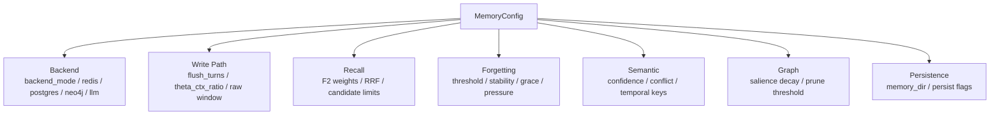

# 配置参考

`MemoryConfig` 是 `memx` 的统一配置入口。配置可以分为后端、写入压缩、召回排序、遗忘治理、图谱、固化、持久化七类。推荐入口 `HumanMem` 会统一映射到内部 scope `human_mem_project`，业务侧不需要配置作用域维度。

## 配置分组

## 后端配置

| 参数 | 默认值 | 说明 |
| --- | --- | --- |
| `backend_mode` | `"memory"` | `memory` 使用本地内存 Adapter，`production` 使用外部依赖 |
| `redis_url` | `None` | 生产 Redis 地址 |
| `postgres_dsn` | `None` | 生产 PostgreSQL DSN |
| `neo4j_uri` | `None` | 生产 Neo4j URI |
| `neo4j_user` | `None` | Neo4j 用户名 |
| `neo4j_password` | `None` | Neo4j 密码 |
| `llm_gateway_url` | `None` | HTTP LLM Gateway 地址 |
| `llm_api_key` | `None` | LLM Gateway 鉴权 token |
| `backend_connection_timeout_seconds` | `3.0` | 外部依赖连接超时时间 |

## 写入与压缩

| 参数 | 默认值 | 说明 |
| --- | --- | --- |
| `theta_ctx_ratio` | `0.60` | L0 token 占 L1 容量比例超过该值时触发压缩 |
| `flush_turns` | `8` | L0 累积消息轮数达到该值时触发压缩 |
| `working_memory_tokens` | `2000` | L1 工作记忆目标容量 |
| `raw_window_turns` | `32` | L0 原始消息环形窗口容量 |
| `raw_ttl_seconds` | `3600.0` | L0 原始消息 TTL |

调优建议：

- 会话很长时降低 `flush_turns`，更早压缩到 L1。
- 需要更多短期上下文时提高 `working_memory_tokens`。
- 对延迟敏感的在线服务应避免过高的 L0 窗口。

## 召回排序

| 参数 | 默认值 | 说明 |
| --- | --- | --- |
| `max_recall_k` | `50` | `recall/search` 返回数量上限 |
| `f2_weight_relevance` | `0.55` | F2 相关性权重 |
| `f2_weight_recency` | `0.20` | F2 近因性权重 |
| `f2_weight_importance` | `0.25` | F2 重要性权重 |
| `recency_decay_per_hour` | `0.99` | 近因分每小时衰减系数 |
| `rrf_k0` | `60` | RRF 融合平滑常量 |
| `retrieval_candidate_multiplier` | `2` | 候选数量相对 k 的倍数 |
| `retrieval_candidate_hard_limit` | `1000` | 单次检索候选硬上限 |
| `minimum_relevance_score` | `0.05` | 最低语义相关度 |

调优建议：

- 需要更强语义匹配时提高 `f2_weight_relevance`。
- 需要更偏近期对话时提高 `f2_weight_recency`。
- 需要保护高价值记忆时提高 `f2_weight_importance`。
- 召回结果过少时可降低 `minimum_relevance_score` 或提高候选倍数。

## 遗忘治理

| 参数 | 默认值 | 说明 |
| --- | --- | --- |
| `episodic_capacity` | `100000` | 项目 scope 内 L2 active 容量上限 |
| `forget_threshold` | `0.15` | 动态遗忘基础阈值 |
| `new_memory_grace_seconds` | `86400.0` | 新记忆保护窗口 |
| `initial_stability_seconds` | `86400.0` | 初始稳定度 |
| `reinforce_gamma` | `1.50` | 命中召回后的稳定度放大系数 |
| `pressure_kappa` | `0.50` | 容量压力增益 |
| `occupancy_baseline` | `0.80` | 容量压力基线 |
| `stability_importance_lambda` | `0.50` | 重要性对稳定度的加成 |

调优建议：

- 记忆过快消失时降低 `forget_threshold` 或提高 `initial_stability_seconds`。
- 低价值记忆堆积时提高 `forget_threshold` 或降低 `occupancy_baseline`。
- 高频使用记忆应通过 `recall()` 命中获得 reinforce，而不是手动提高所有 importance。

## 语义事实与冲突

| 参数 | 默认值 | 说明 |
| --- | --- | --- |
| `confidence_threshold` | `0.30` | L3 事实最低置信度 |
| `conflict_confidence_epsilon` | `0.05` | 近似同置信度容忍区间 |
| `conflict_confidence_gap` | `0.20` | 明确替换或保留的置信差 |
| `orphan_evidence_confidence_penalty` | `0.10` | 唯一证据失效时的置信度惩罚 |
| `temporal_fact_keys` | `("device.os", "location.city", "job.title")` | 时序事实 key |

调优建议：

- 结构化事实源质量高时可提高 `confidence_threshold`。
- 冲突过多进入 pending 时可提高 `conflict_confidence_gap` 的策略稳定性要求，或增加人工审核流程。
- 位置、职位、设备等随时间变化的信息应加入 `temporal_fact_keys`。

## 图谱与固化

| 参数 | 默认值 | 说明 |
| --- | --- | --- |
| `graph_salience_decay` | `0.80` | L4 节点显著度衰减系数 |
| `graph_prune_threshold` | `0.05` | L4 孤立低显著节点剪枝阈值 |
| `similarity_merge_threshold` | `0.92` | 相似事件合并阈值预留 |
| `consolidation_batch_size` | `50` | 每次固化任务批量 |
| `inbox_max_retries` | `3` | inbox 单条任务最大重试次数 |

## 持久化

| 参数 | 默认值 | 说明 |
| --- | --- | --- |
| `persist_on_write` | `True` | 写入后是否同步持久化快照 |
| `persist_on_recall` | `False` | 召回强化后是否同步持久化快照 |
| `memory_dir` | `.memories` | 快照目录 |

生产建议：

- 在线服务设置 `persist_on_write=False`。
- 召回路径保持 `persist_on_recall=False`。
- 通过后台任务调用 `maintenance(tasks=["consolidate", "forget"])`，并按需调用 `flush()` 写入项目级快照。

## 调度任务管理

调度任务管理实现位于 `src/mem/scheduler/manager.py`。该模块只注册两类任务：

| 任务 | 配置影响 | 说明 |
| --- | --- | --- |
| `consolidate` | `reflect_importance_threshold`, `consolidation_batch_size`, `inbox_max_retries` | 将 L2 固化到 L3/L4 |
| `forget` | `forget_threshold`, `new_memory_grace_seconds`, `graph_prune_threshold` | 执行动态遗忘、事实清理和图谱剪枝 |

`/health` 会返回 `scheduler` 与 `embedding` 状态，可用于巡检和告警。
