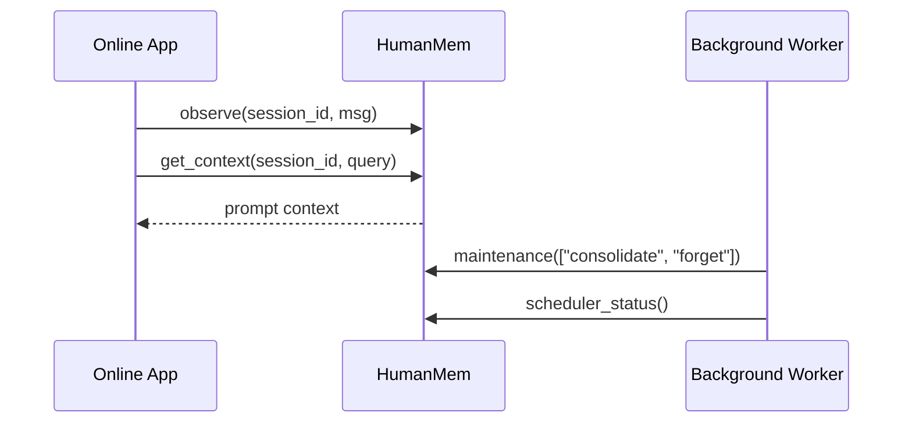

# 示例手册

本文档提供 `memx` 的常见接入示例。示例默认使用推荐入口 `HumanMem`，所有记忆都会映射到内部单一 scope `human_mem_project`。

## 示例 1: 偏好记忆与跨会话召回

```python
from mem import HumanMem, MemoryConfig

memory = HumanMem(MemoryConfig(flush_turns=2))

memory.observe(
    "session-a",
    {"role": "user", "content": "请记住 user.lang_pref=zh，语言偏好是中文"},
)
memory.maintenance(tasks=["consolidate"], force_reflect=True)

result = memory.recall("session-b", "用户偏好的回复语言是什么？")

assert result["facts"][0]["fact_key"] == "user.lang_pref"
assert result["facts"][0]["value"] == "zh"
```

## 示例 2: 使用 `memorize()` 从设置页写入

```python
from mem import HumanMem, MemoryConfig

memory = HumanMem(MemoryConfig())

created = memory.memorize(
    "settings",
    "user.prefers_dark_mode=true",
    importance=8,
)

assert created["mem_id"]
assert created["importance"] == 8
```

## 示例 3: 拼装 Agent Prompt 上下文

```python
from mem import HumanMem, MemoryConfig

memory = HumanMem(MemoryConfig())

memory.memorize(
    "session-a",
    "记住 user.lang_pref=zh，回答时优先使用中文",
)
memory.maintenance(tasks=["consolidate"], force_reflect=True)


assert "Verified Facts:" in context or "Relevant Episodes:" in context
```

## 示例 4: 更新 L2 情景记忆

```python
from mem import HumanMem, MemoryConfig

memory = HumanMem(MemoryConfig())

created = memory.memorize("session-a", "记住项目默认使用 pytest")
updated = memory.update(
    {
        "mem_id": created["mem_id"],
        "text": "记住项目默认使用 pytest，并要求覆盖率大于 90%",
        "importance": 9,
    }
)

assert updated["action"] == "updated"
```

## 示例 5: 只搜索 active 记忆

```python
from mem import HumanMem, MemoryConfig

memory = HumanMem(MemoryConfig())

memory.memorize("session-a", "记住项目使用 Ruff 做静态检查")
result = memory.search("session-b", "静态检查工具", k=3)

assert "episodes" in result
```

## 示例 6: 执行状态化调度任务

```python
from mem import HumanMem, MemoryConfig

memory = HumanMem(MemoryConfig())

memory.memorize("session-a", "临时记忆: 本轮调试端口是 8080")
result = memory.maintenance(tasks=["consolidate", "forget"], force_reflect=True)
status = memory.scheduler_status()

assert result["tasks"]["consolidate"]["ok"] is True
assert status["registered_tasks"] == ("consolidate", "forget")
```

## 示例 7: 后端诊断和架构快照

```python
from mem import HumanMem, MemoryConfig

memory = HumanMem(MemoryConfig(backend_mode="memory"))

diagnostics = memory.memory.backend_diagnostics()
snapshot = memory.architecture_snapshot()

assert diagnostics["profile"] == "memory"
assert snapshot["scope_id"] == "human_mem_project"
assert "l2" in snapshot
```

## 示例 8: 显式持久化快照

```python
from mem import HumanMem, MemoryConfig

memory = HumanMem(MemoryConfig(persist_on_write=False))

memory.memorize("session-a", "记住 user.lang_pref=zh")
path = memory.flush()
state = memory.read_stored_state()

assert path.endswith("memory-state.json")
assert state is not None
```

## 示例 9: HTTP 健康检查

```python
from fastapi.testclient import TestClient

from mem.server.app import create_app

client = TestClient(create_app())
payload = client.get("/health").json()

assert payload["status"] == "ok"
assert payload["scheduler"]["registered_tasks"] == ["consolidate", "forget"]
assert payload["embedding"]["status"] == "ok"
```

## 组合范式

常见线上请求可以拆成在线链路和后台链路：


