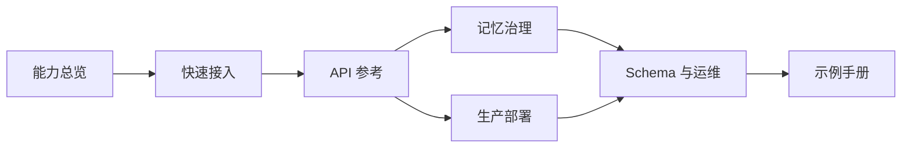
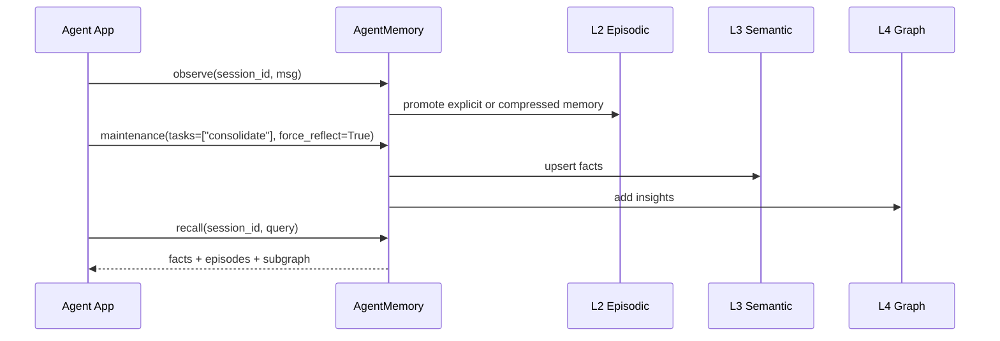

# memx 文档索引

`memx` 是面向 Agent 的长期记忆系统，文档按“先理解能力、再接入接口、最后治理和部署”的路径组织。当前项目采用单一内部 scope `human_mem_project`，业务接入时不需要维护作用域信息。

## 阅读路径

## 文档目录

| 文档 | 适合读者 | 内容重点 |
| --- | --- | --- |
| [完整使用指南](usage.md) | 首次接入、应用开发、运维 | 安装、embedding 选择、SDK、CLI、HTTP 服务和验证 |
| [架构文档](architecture/README.md) | 架构设计、开发、SRE | 完整架构图、分类、数据结构、固化、检索、决策和路线图 |
| [架构 HTML Slider](architecture-slider.html) | 评审、分享、项目同步 | 自包含详细架构演示，支持桌面、移动端与打印 |
| [架构验证矩阵](architecture/verification.md) | Reviewer、测试、发布人员 | 架构主张到 pytest、evals 和发布门禁的证据追踪 |
| [Agent 记忆系统整体流程](agent-memory-flow.md) | 架构设计、平台工程 | L0-L4 分层、写入链路、读取链路、演化链路 |
| [能力矩阵](capability-matrix.md) | 产品、架构、接入方 | 能力边界、接口映射、典型使用场景 |
| [API 参考](api-reference.md) | SDK 接入方、后端工程 | `AgentMemory` 方法、参数、返回结构、错误边界 |
| [CLI 使用说明](cli.md) | 本地调试、运维、测试工程 | 命令入口、模块调用链、参数说明、功能验证 |
| [示例手册](examples-cookbook.md) | 应用开发、测试工程 | 偏好记忆、上下文拼装、事实变更、删除、诊断示例 |
| [记忆治理](memory-governance.md) | 平台工程、数据治理 | 冲突处理、动态遗忘、图谱审计、证据级联 |
| [配置参考](configuration-reference.md) | 后端工程、SRE | `MemoryConfig` 参数、调优建议、生产推荐 |
| [生产部署](production-deployment.md) | SRE、后端工程 | Port/Adapter、Redis、PostgreSQL/pgvector、Neo4j、LLM Gateway |
| [存储与 Schema](storage-schema.md) | 数据平台、DBA | L0-L4 参考 DDL、索引、数据生命周期 |
| [评测体系](evals.md) | 算法、测试、发布人员 | 数据集、指标、门槛、报告和扩展路线 |

## 核心概念

- **L0 原始观察**: 保存短期对话消息，负责原始输入接收和压缩触发。
- **L1 工作记忆**: 保存滚动摘要、未闭合 slot 和会话实体。
- **L2 情景记忆**: 保存可检索的 episode，支持 dense/sparse 混合召回、强化、更新和遗忘。
- **L3 语义事实**: 保存结构化事实、版本链、证据指纹和冲突日志。
- **L4 认知图谱**: 保存实体、关系和 insight，支持图谱上下文和审计修复。
- **Port/Adapter**: 服务层只依赖 Port 契约，本地默认内存 Adapter，生产可替换为外部存储。
- **调度任务管理**: `src/mem/scheduler/manager.py` 负责状态化调度，只注册 `consolidate` 和 `forget` 两类任务。

## 最小接入闭环

## 推荐接入顺序

1. 本地使用 `MemoryConfig(backend_mode="memory")` 跑通 `observe -> reflect -> recall`。
2. 按环境选择 `local` 或 `gateway` embedding，并核对向量维度。
3. 根据业务 SLA 选择是否同步持久化，生产关键路径建议设置 `persist_on_write=False`。
4. 配置生产 Adapter 依赖，并使用 `backend_diagnostics()` 做启动前健康检查。
5. 定期调用 `maintenance(tasks=["consolidate", "forget"])`，并通过 `/health` 观察调度任务与 embedding 状态。
