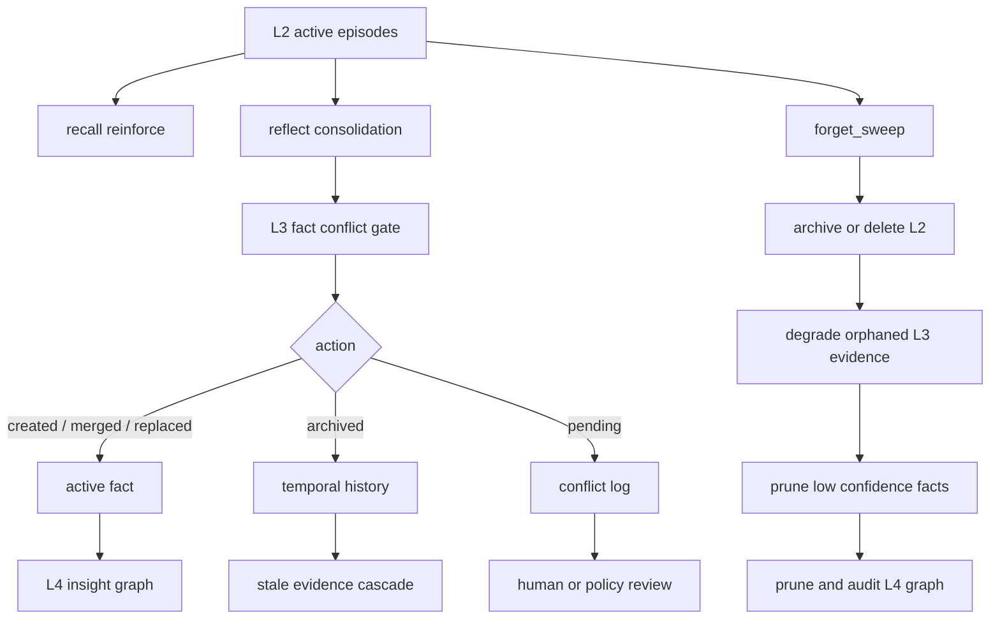
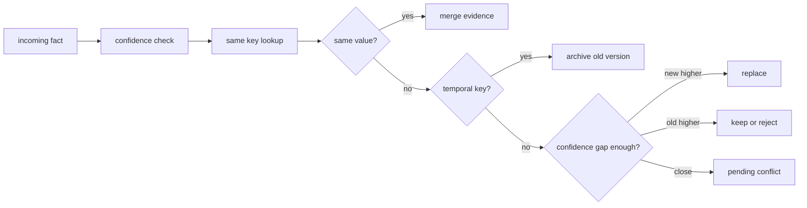

# 记忆治理

`memx` 的治理目标是让长期记忆既能增长，又能被验证、修正、归档和删除。治理链路覆盖 L2 情景记忆、L3 语义事实和 L4 认知图谱，避免系统长期运行后出现噪声堆积、事实冲突和过期洞察。

## 治理闭环



## L2 情景记忆治理

L2 保存原始或压缩后的 episode，是长期记忆的证据层。每条记忆包含 `importance`、`stability`、`access_count`、`status`、`source_ids` 等字段。

关键机制：

- **去重合并**: 推荐入口 `HumanMem` 会将所有写入映射到 `human_mem_project`，`mem_id` 由内部 scope 与归一化文本稳定派生，重复 promote 会合并证据来源。
- **混合检索**: dense 与 sparse 双路召回进入 RRF，再由 F2 按相关性、近因性和重要性重排。
- **命中强化**: `recall()` 命中 L2 后调用 reinforce，更新访问时间、访问次数和稳定度。
- **状态演化**: 低分 active 记忆进入 archived，极低分 archived 记忆进入 deleted。
- **关键保护**: 新写入记忆受 `new_memory_grace_seconds` 保护，避免刚写入即被遗忘。

动态遗忘公式的工程含义：

| 因子 | 配置 | 影响 |
| --- | --- | --- |
| 时间衰减 | `initial_stability_seconds` | 越久未访问，retention 越低 |
| 重要性 | `stability_importance_lambda` | 高 importance 记忆更抗遗忘 |
| 访问强化 | `reinforce_gamma` | 被召回越多，稳定度越高 |
| 容量压力 | `occupancy_baseline`, `pressure_kappa` | 容量越接近上限，遗忘越积极 |
| 基础阈值 | `forget_threshold` | 低于阈值会归档或删除 |

## L3 事实冲突治理

L3 事实使用 `fact_key + partition + version` 表达结构化知识，所有写入先经过冲突检测。



冲突结果：

| action | 说明 | 处理建议 |
| --- | --- | --- |
| `created` | 新 fact_key 首次写入 | 直接使用 |
| `merged` | 同值事实合并证据 | 使用最新置信度和证据 |
| `replaced` | 新事实置信度明显更高 | 关注 `superseded_evidence_ids` |
| `archived` | 时序事实归档旧版本 | 查询时使用最新 active 版本 |
| `pending` | 置信度接近或冲突类型复杂 | 交给人工或上层策略确认 |
| `reject` | 新事实置信度不足或证据不合格 | 记录但不进入 active fact |

建议治理策略：

- 偏好类事实使用稳定 key，如 `user.lang_pref`、`user.tone_pref`、`user.avoid_topic`。
- 时序类事实加入 `temporal_fact_keys`，让系统归档旧版本而不是覆盖历史。
- 外部系统同步事实时提供稳定 `evidence_ids`，便于后续级联审计。
- 对 `pending` 冲突建立人工审核或业务策略回写机制。

## L4 图谱治理

L4 保存实体、关系和 insight，主要用于增强上下文解释力，而不是替代 L3 事实。

治理动作：

- **新增 insight**: 高 importance 或多次访问的 L2 记忆会被固化为 L4 insight。
- **证据级联**: L3 替换或归档旧证据后，引用旧证据的 insight 会被标记为 `superseded`。
- **显著度剪枝**: 调度任务 `forget` 会按 salience 衰减清理低显著节点。
- **孤儿边审计**: 巩固和遗忘链路会附带图谱一致性审计结果。

图谱审计可通过底层 `AgentMemory` 执行；推荐服务入口以 `/health` 和 `scheduler_status()` 作为运维状态入口：

```python
status = memory.scheduler_status()

assert status["registered_tasks"] == ("consolidate", "forget")
```

## 推荐调度任务

| 任务 | 建议频率 | 目的 |
| --- | --- | --- |
| `consolidate` | 每 5-30 分钟或按 inbox 积压触发 | 将 L2 固化到 L3/L4 |
| `forget` | 每日或容量压力升高时 | 归档低价值 L2、清理 L3/L4 |
| `/health` | 服务巡检、告警、压测 | 返回调度任务状态和 embedding 状态 |

调度任务管理实现位于 `src/mem/scheduler/manager.py`。该模块保留每个任务的 `run_count`、`success_count`、`error_count`、最近开始/结束时间、耗时和最近错误。

## 质量指标

- `conflict_log` 增长率: 用于发现上游事实源不一致。
- `pending` 冲突比例: 长期过高说明策略不明确或证据质量不足。
- L2 `occupancy`: 接近 1 表示需要提高遗忘频率或扩容。
- L2 `last_retrieval.filtered_count`: 过高说明 query 或候选过滤策略需要优化。
- L4 `orphan_edges`: 非 0 表示图谱引用完整性异常。
- L3 `l3_degraded`: 持续增长说明证据层频繁被归档或删除。
