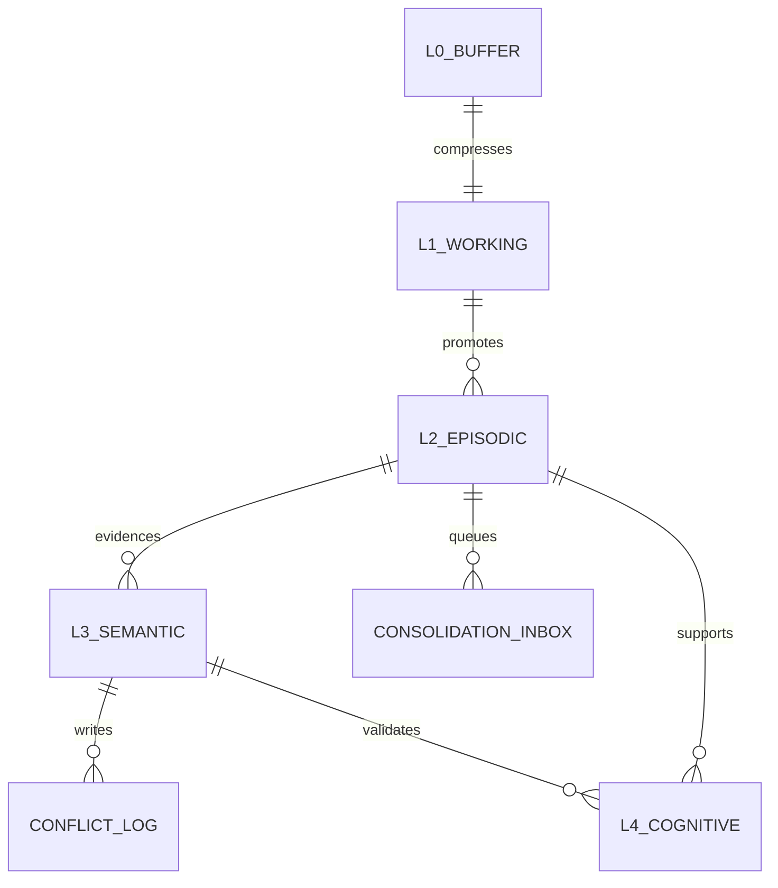
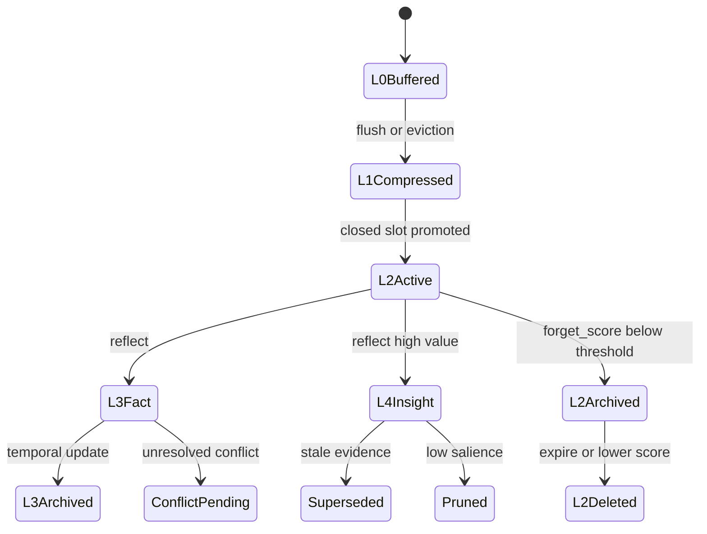

# 存储与 Schema

本文档说明 `memx` 的数据分层、参考 Schema、索引设计和生命周期。当前项目通过 `src/mem/schemas/ddl.py` 提供参考 DDL；生产部署可以按实际数据库规范等价实现。

## 数据分层



## L0 原始消息

用途：

- 保存短期对话原始消息。
- 推荐入口按单一项目 scope `human_mem_project` 写入；底层表结构保留 `scope_id` 字段作为兼容存储键。
- 当达到 `raw_window_turns`、`raw_ttl_seconds` 或压缩阈值时进入 L1。

关键字段：

| 字段 | 说明 |
| --- | --- |
| `scope_id` | 内部 scope 主键的一部分；推荐值为 `human_mem_project` |
| `session_id` | 会话 ID |
| `turn_id` | 会话内消息序号 |
| `role` | `user`、`assistant`、`tool`、`system` |
| `content` | 原始消息内容 |
| `token_len` | 估算 token 数 |

## L1 工作记忆

用途：

- 保存 rolling summary。
- 保存 open slots 和 mentioned entities。
- 控制 Agent prompt 中短期上下文体积。

关键字段：

| 字段 | 说明 |
| --- | --- |
| `rolling_summary` | 压缩后的会话摘要 |
| `open_slots` | 尚未闭合的记忆候选 |
| `mentioned_entities` | 当前会话提及实体 |
| `token_used` | 工作记忆估算 token |
| `last_compress_ts` | 最近压缩时间 |

## L2 情景记忆

用途：

- 保存可检索 episode。
- 作为 L3 facts 和 L4 insights 的证据来源。
- 支持 active、archived、deleted 状态演化。

关键字段：

| 字段 | 说明 |
| --- | --- |
| `mem_id` | 内容指纹生成的记忆 ID |
| `embedding` | 向量表示 |
| `text` | 情景记忆正文 |
| `importance` | 0-10 重要性 |
| `ts_last_access` | 最近访问时间 |
| `access_count` | 被召回次数 |
| `stability` | 遗忘曲线稳定度 |
| `status` | `active`、`archived`、`deleted` |
| `source_ids` | 原始消息或上游来源 |
| `mem_type` | `episodic`、`semantic`、`preference`、`procedural` |

推荐索引：

- `embedding vector_cosine_ops` 用于 dense 检索。
- `(scope_id, status, mem_type, importance)` 用于候选过滤和后台清理；推荐入口下 `scope_id` 固定映射为 `human_mem_project`。
- 倒排 token 索引可由应用层或搜索引擎维护，用于 sparse 候选收敛。

## L3 语义事实

用途：

- 保存结构化事实。
- 支持 fact 版本链、证据指纹、有效期和冲突治理。

关键字段：

| 字段 | 说明 |
| --- | --- |
| `fact_key` | 事实键，如 `user.lang_pref` |
| `partition` | 事实分区，如 `semantic`、`preference` |
| `value` | JSON 值 |
| `confidence` | 置信度 |
| `evidence_ids` | 支撑证据 |
| `version` | 版本号 |
| `evidence_hash` | 证据指纹 |
| `is_temporal` | 是否时序事实 |
| `valid_from` / `valid_until` | 时序事实有效期 |

推荐索引：

- `(scope_id, partition, fact_key, version DESC)` 用于读取最新事实。
- `(scope_id, mem_type, partition)` 用于按类型召回和治理。

## L4 认知图谱

用途：

- 保存实体、关系和 insight。
- 支持 query 相关子图召回。
- 支持孤儿边、低显著节点和过期 insight 审计。

推荐约束：

- 节点 ID 唯一约束。
- `(scope_id, salience)` 索引用于显著度剪枝。

## Conflict Log

用途：

- 记录 L3 冲突检测和裁决结果。
- 支持人工审核、策略回放和数据质量分析。

关键字段：

| 字段 | 说明 |
| --- | --- |
| `conflict_id` | 冲突唯一 ID |
| `fact_key` | 冲突事实键 |
| `conflict_type` | `value`、`temporal`、`negation`、`source`、`graph` |
| `severity` | `high`、`mid`、`low` |
| `old_value` / `new_value` | 冲突前后值 |
| `policy_hit` | 命中的治理策略 |
| `action` | `replace`、`merge`、`archive`、`pending`、`reject`、`keep` |

## Consolidation Inbox

用途：

- 将 L2 到 L3/L4 的固化任务异步化。
- 支持重试、失败记录和批量 worker 消费。

关键字段：

| 字段 | 说明 |
| --- | --- |
| `item_id` | 队列项 ID |
| `scope_id` | 内部项目 scope ID |
| `mem_id` | 来源 L2 记忆 |
| `priority` | 固化优先级 |
| `status` | `pending`、`processing`、`done`、`failed` |
| `retry_count` | 重试次数 |
| `last_error` | 最近失败原因 |

## 生命周期



## 快照路径

本地和测试环境默认将项目 scope 状态写入：

```text
.memories/scopes/human_mem_project/memory-state.json
```

相关接口：

- `storage_path()` 返回当前项目 scope 的快照相对路径。
- `flush()` 显式写入当前项目 scope 快照。
- `read_stored_state()` 读取当前项目 scope 快照。
